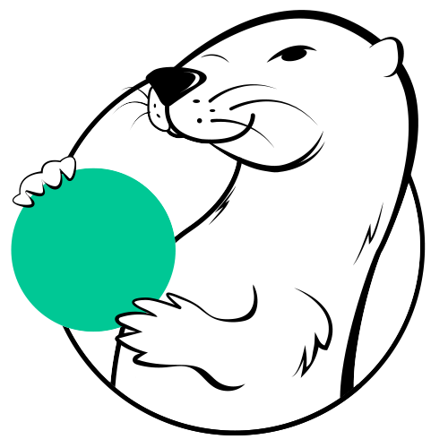

<p align="center">
  
</p>
<h2 align="center">
  Solace Agent Mesh
</h2>
<h4 align="center">Open-source framework for building event driven multi-agent AI systems</h3>

<p align="center">
  <a href="https://github.com/SolaceLabs/solace-agent-mesh/issues/new" target="_blank">
    
  </a>
  <a href="https://solacelabs.github.io/solace-agent-mesh/docs/documentation/getting-started/introduction/" target="_blank">
    
  </a>
</p>
<p align="center">
  <a href="https://github.com/SolaceLabs/solace-agent-mesh/blob/main/LICENSE">
    
  </a>
  <a href="https://pypi.org/project/solace-agent-mesh">
    
  </a>
  <a href="https://pypi.org/project/solace-agent-mesh">
    
  </a>
</p>
<p align="center">
    <a href="#-key-features">Key Features</a> •
    <a href="#-quick-start-5-minutes">Quickstart</a> •
     <a href="https://solacelabs.github.io/solace-agent-mesh/docs/documentation/getting-started/introduction/" target="_blank">Documentation</a>
</p>


---

Whether you're prototyping an 🤖 AI assistant or deploying a 🌎 production-grade solution, **Solace Agent Mesh (SAM)** provides the infrastructure to:
  - Connect AI agents to real-world data sources and systems.
  - Add gateways to expose capabilities via REST, a browser-based UI, Slack, and many more.
  - Monitor and debug every interaction in real time.
  - Scale from local development to distributed, enterprise deployments.

---

## ✨ Key Features 
- ⚙️ **[Modular, Event-Driven Architecture](https://solacelabs.github.io/solace-agent-mesh/docs/documentation/getting-started/component-overview)** – All components communicate via events through a central event mesh, enabling loose coupling and high scalability.
- 🤖 **[Composable Agents](https://solacelabs.github.io/solace-agent-mesh/docs/documentation/concepts/agents)** – Combine specialized AI agents to solve complex, multi-step workflows.
- 🌐 **[Flexible Interfaces](https://solacelabs.github.io/solace-agent-mesh/docs/documentation/concepts/gateways)** – Interact with SAM via the REST API, browser UI, or [Slack Integration](https://solacelabs.github.io/solace-agent-mesh/docs/documentation/tutorials/slack-integration).
- 🧠 **[Built-in Orchestration](https://solacelabs.github.io/solace-agent-mesh/docs/documentation/concepts/orchestrator)** – Tasks are automatically broken down and delegated across agents by a built-in orchestrator.
- 📊 **[Live Observability](https://solacelabs.github.io/solace-agent-mesh/docs/documentation/deployment/observability)** – Monitor, trace, and debug agent interactions and workflows in real time. <!-- 🔗 Missing link -->
- 🧩 **[Plugin-Extensible](https://solacelabs.github.io/solace-agent-mesh/docs/documentation/concepts/plugins)** – Add your own agents, gateways, or services with minimal boilerplate.
- 🏢 **[Production-Ready](https://solacelabs.github.io/solace-agent-mesh/docs/documentation/deployment/deploy)** – Backed by [Solace’s enterprise-grade event broker](https://solace.com/products/event-broker/) for reliability and performance.
- 🔧 **[Services](https://solacelabs.github.io/solace-agent-mesh/docs/documentation/concepts/services)** – Learn about the services that facilitate interactions within the Solace Agent Mesh.

---

## 🚀 Quick Start (5 minutes)

Set up Solace Agent Mesh in just a few steps.

### ⚙️ System Requirements

To run Solace Agent Mesh locally, you’ll need:

- **Python 3.10+**
- **pip** (comes with Python)
- **OS**: MacOS, Linux, or Windows (with [WSL](https://learn.microsoft.com/en-us/windows/wsl/))
- **LLM API key** (any major provider or custom endpoint)

### 💻 Setup Steps

```bash
# 1. (Optional) Create and activate a Python virtual environment
python3 -m venv venv
source venv/bin/activate

# 2. Install the Solace Agent Mesh
pip install solace-agent-mesh

# 3. Initialize a new project
mkdir my-agent-mesh && cd my-agent-mesh
solace-agent-mesh init        # Follow the steps in the interactive init

# 4. Build and run the project
solace-agent-mesh run -b      # Shortcut for `build` + `run`
```

#### Once running:

- Open the Web UI at [http://localhost:5001](http://localhost:5001) to talk with a chat interface.
<details>
  <summary>Use the REST API directly via curl</summary>

  ```bash
  curl --location 'http://127.0.0.1:5050/api/v1/request' \
    --form 'prompt="What is the capital of France?"' \
    --form 'stream="false"'
  ```

</details>


---

## ➡️ What’s Next?

Looking to go further? Check out our tutorials for deeper integrations and real-world examples:

- 💬 [Slack Integration](https://solacelabs.github.io/solace-agent-mesh/docs/documentation/tutorials/slack-integration) – Use Slack to chat with your agents directly.
- 🗃️ [SQL Database Integration](https://solacelabs.github.io/solace-agent-mesh/docs/documentation/tutorials/sql-database) – Connect agents to real-time structured data sources.

📚 Full documentation → [solacelabs.github.io/solace-agent-mesh](https://solacelabs.github.io/solace-agent-mesh)

---

## 📦 Release Notes

Stay up to date with the latest changes, features, and fixes.  
See [CHANGELOG.md](CHANGELOG.md) for a full history of updates.

---

## 👥 Contributors

Solace Agent Mesh is built with the help of our amazing community.  
Thanks to everyone who has contributed ideas, code, and time to make this project better.  
👀 View the full list of contributors → [GitHub Contributors](https://github.com/SolaceLabs/solace-agent-mesh/graphs/contributors)

---

## 📄 License

This project is licensed under the **Apache 2.0 License**.  
See the full license text in the [LICENSE](LICENSE) file.
