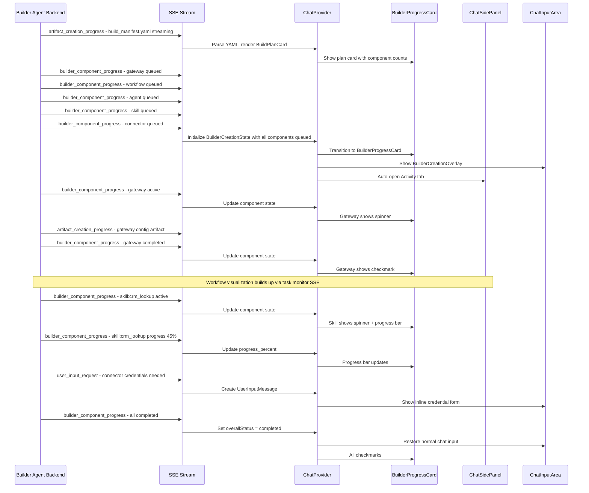
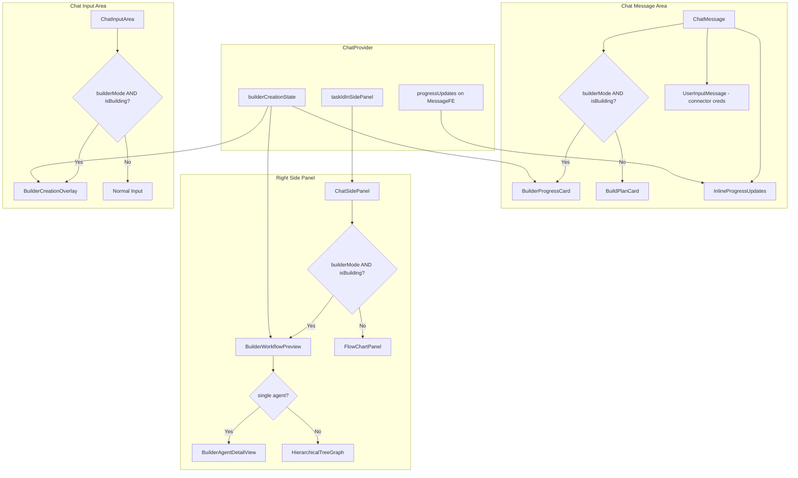

# Builder UI Progress & Visualization Enhancements — Architectural Design

> **Status:** Draft  
> **Date:** 2026-04-08  
> **Scope:** Builder mode only — changes are gated behind `builderMode` state in ChatProvider

---

## Table of Contents

1. [Overview & Goals](#1-overview--goals)
2. [Existing Architecture Summary](#2-existing-architecture-summary)
3. [New & Modified Types](#3-new--modified-types)
4. [Component Architecture](#4-component-architecture)
5. [Data Flow — SSE Events to Progress States](#5-data-flow--sse-events-to-progress-states)
6. [State Management Changes](#6-state-management-changes)
7. [Right Panel Workflow Visualization During Creation](#7-right-panel-workflow-visualization-during-creation)
8. [Connector Credential Inline Request Flow](#8-connector-credential-inline-request-flow)
9. [Chat Input Disabled / Replacement State](#9-chat-input-disabled--replacement-state)
10. [Click-to-View Object Configuration — Optional](#10-click-to-view-object-configuration--optional)
11. [Component Hierarchy Diagram](#11-component-hierarchy-diagram)
12. [Implementation Phases](#12-implementation-phases)

---

## 1. Overview & Goals

Usability testing revealed that the builder UI lacks adequate feedback during object creation. Users cannot tell:

- Which objects are being created, which are done, and which are queued
- How the workflow graph is forming in real-time
- That skills — which can take minutes — are still generating
- Why they are asked for connector credentials at deploy time instead of creation time
- Why the chat input is disabled during creation

This design addresses all six findings with an incremental approach that maximizes reuse of existing components.

### Design Principles

1. **Leverage existing components** — [`InlineProgressUpdates`](src/lib/components/chat/InlineProgressUpdates.tsx), [`FlowChartPanel`](src/lib/components/activities/FlowChart/FlowChartPanel.tsx), [`BuildPlanCard`](src/lib/components/chat/artifact/BuildPlanCard.tsx), [`A2UISurfaceRenderer`](src/lib/components/chat/hil/A2UIRenderer.tsx)
2. **Incremental delivery** — each phase is independently shippable
3. **Builder-mode gated** — all changes are conditional on `builderMode` from [`ChatProvider`](src/lib/providers/ChatProvider.tsx)
4. **Backend-compatible** — use existing SSE event types where possible; new events are additive

---

## 2. Existing Architecture Summary

### Key Components

| Component | File | Role |
|-----------|------|------|
| `BuildPlanCard` | [`artifact/BuildPlanCard.tsx`](src/lib/components/chat/artifact/BuildPlanCard.tsx) | Parses streaming YAML manifest, shows component counts with icons |
| `InlineProgressUpdates` | [`chat/InlineProgressUpdates.tsx`](src/lib/components/chat/InlineProgressUpdates.tsx) | Vertical timeline with dots — green for completed, spinner for active |
| `ChatSidePanel` | [`chat/ChatSidePanel.tsx`](src/lib/components/chat/ChatSidePanel.tsx) | Right panel with Activity/Files/Sources tabs, renders `FlowChartPanel` |
| `ChatProvider` | [`providers/ChatProvider.tsx`](src/lib/providers/ChatProvider.tsx) | Central state: `builderMode`, `progressUpdates`, SSE event processing |
| `ChatInputArea` | [`chat/ChatInputArea.tsx`](src/lib/components/chat/ChatInputArea.tsx) | Input with `builderMode` prop, `inputAreaLeftSlot` extension point |
| `ChatMessage` | [`chat/ChatMessage.tsx`](src/lib/components/chat/ChatMessage.tsx) | Renders `BuildPlanCard` for build manifests, `InlineProgressUpdates` at top |
| `FlowChartPanel` | [`activities/FlowChart/FlowChartPanel.tsx`](src/lib/components/activities/FlowChart/FlowChartPanel.tsx) | Full workflow visualization with pan/zoom, node click details |
| `UserInputMessage` | [`chat/hil/UserInputMessage.tsx`](src/lib/components/chat/hil/UserInputMessage.tsx) | Renders A2UI surfaces for human-in-the-loop questions |
| `A2UISurfaceRenderer` | [`chat/hil/A2UIRenderer.tsx`](src/lib/components/chat/hil/A2UIRenderer.tsx) | Generic renderer for A2UI v0.9 surfaces — Card, TextField, Button, Tabs |

### Key SSE Event Types Handled in ChatProvider

| Event Type | Current Behavior |
|------------|-----------------|
| `agent_progress_update` | Creates `ProgressUpdate` with `type: "status"`, shown in `InlineProgressUpdates` |
| `artifact_creation_progress` | Tracks artifact streaming — in-progress/completed/failed/cancelled |
| `thinking_content` | Accumulates thinking tokens, shown as expandable in timeline |
| `user_input_request` | Creates `MessageFE` with `userInputRequest`, rendered by `UserInputMessage` |
| `tool_invocation_start` | Currently no-op — status handled via `agent_progress_update` |
| `tool_result` | Not currently processed for progress display |

### Key Types

- [`ProgressUpdate`](src/lib/types/fe.ts:144) — `type: "status" | "tool_call" | "tool_result" | "artifact" | "delegation" | "thinking"`, `text`, `timestamp`, `expandableContent`
- [`MessageFE`](src/lib/types/fe.ts:157) — `progressUpdates?: ProgressUpdate[]`, `userInputRequest?`, `builderMode` not on message
- [`VisualizerStep`](src/lib/types/activities.ts:252) — Full workflow step with type, data, nesting
- [`A2UISurface`](src/lib/types/fe.ts:207) — Surface definition with components and dataModel

---

## 3. New & Modified Types

### 3.1 New: `BuilderComponentProgress`

Represents the creation state of a single builder component — an agent, workflow, skill, connector, or gateway.

```typescript
// src/lib/types/builder.ts (new file)

export type BuilderComponentState = "queued" | "active" | "completed" | "failed" | "skipped";

export interface BuilderComponentProgress {
  /** Unique ID for this component, e.g. "skill:web_search" */
  id: string;
  /** Component type from the build manifest */
  type: "gateway" | "workflow" | "agent" | "skill" | "connector";
  /** Display name for the component */
  name: string;
  /** Current creation state */
  state: BuilderComponentState;
  /** Optional status text, e.g. "Generating skill configuration..." */
  statusText?: string;
  /** Timestamp when state last changed */
  lastUpdated: number;
  /** For skills: estimated progress 0-100, if available */
  progressPercent?: number;
}
```

### 3.2 New: `BuilderCreationState`

Aggregate state for the entire build session, stored in ChatProvider.

```typescript
export interface BuilderCreationState {
  /** Whether a build is currently in progress */
  isBuilding: boolean;
  /** Parsed components from the build manifest */
  components: BuilderComponentProgress[];
  /** The build manifest filename for correlation */
  manifestFilename?: string;
  /** Overall build status */
  overallStatus: "idle" | "planning" | "building" | "completed" | "failed";
}
```

### 3.3 Extended: `ProgressUpdate`

Add an optional `componentId` field to link progress updates to specific builder components.

```typescript
// Extend existing ProgressUpdate in src/lib/types/fe.ts
export interface ProgressUpdate {
  type: "status" | "tool_call" | "tool_result" | "artifact" | "delegation" | "thinking"
    | "builder_component"; // NEW
  text: string;
  timestamp: number;
  expandableContent?: string;
  isExpandableComplete?: boolean;
  /** NEW: Links this update to a specific builder component */
  builderComponentId?: string;
  /** NEW: Builder component state change */
  builderComponentState?: BuilderComponentState;
}
```

### 3.4 New SSE Event: `builder_component_progress`

A new SSE data part type emitted by the Builder agent during creation.

```typescript
// Backend emits this as a data part with type: "builder_component_progress"
interface BuilderComponentProgressEvent {
  type: "builder_component_progress";
  component_id: string;       // e.g. "skill:web_search"
  component_type: string;     // "skill" | "agent" | "workflow" | "connector" | "gateway"
  component_name: string;     // Display name
  state: string;              // "queued" | "active" | "completed" | "failed" | "skipped"
  status_text?: string;       // Optional human-readable status
  progress_percent?: number;  // Optional 0-100 for long-running items like skills
}
```

---

## 4. Component Architecture

### 4.1 New Component: `BuilderProgressCard`

**Replaces/enhances** `BuildPlanCard` during active creation. Shows each component with its state indicator.

**File:** `src/lib/components/chat/artifact/BuilderProgressCard.tsx`

**Props:**
```typescript
interface BuilderProgressCardProps {
  /** Components from BuilderCreationState */
  components: BuilderComponentProgress[];
  /** Whether the build is still in progress */
  isBuilding: boolean;
  /** Callback when a completed component is clicked — opens config dialog */
  onComponentClick?: (componentId: string) => void;
}
```

**Rendering logic:**
- Groups components by type using existing `COMPONENT_TYPE_ORDER`
- Each component row shows:
  - **Queued:** Gray circle outline icon
  - **Active:** Animated spinner — reuse `Loader2` from lucide with `animate-spin`
  - **Completed:** Green checkmark circle — `CheckCircle2` from lucide
  - **Failed:** Red X circle — `XCircle` from lucide
  - **Skipped:** Gray dash
- Skills in active state show an optional progress bar below the status text
- Component name + optional status text on the right
- Completed components are clickable if `onComponentClick` is provided

**Visual layout:**
```
┌─────────────────────────────────────────┐
│ ⏳ Creating: My Sales Bot               │
│                                         │
│  ✅  Gateway: webui                     │
│  ✅  Workflow: sales_pipeline           │
│  🔄  Agent: sales_agent                │
│      Configuring agent parameters...    │
│  ○   Skill: crm_lookup                  │
│  ○   Skill: email_sender                │
│  ○   Connector: salesforce              │
└─────────────────────────────────────────┘
```

### 4.2 Modified Component: `BuildPlanCard`

The existing `BuildPlanCard` continues to render during the **planning phase** — while the YAML manifest is streaming. Once the manifest is complete and building begins, `BuilderProgressCard` takes over.

**Change:** Add a prop `onBuildStart` callback that `ChatMessage` uses to transition from plan card to progress card.

### 4.3 Modified Component: `InlineProgressUpdates`

Minimal changes — the existing component already handles the timeline well. In builder mode, the `BuilderProgressCard` replaces the need for individual timeline items for component creation. However, `InlineProgressUpdates` still shows for non-component events like thinking, tool calls, etc.

### 4.4 New Component: `BuilderCreationOverlay`

**File:** `src/lib/components/chat/BuilderCreationOverlay.tsx`

Replaces the chat input area during active building. Shows a status summary instead of the disabled input.

**Props:**
```typescript
interface BuilderCreationOverlayProps {
  /** Current build state */
  creationState: BuilderCreationState;
  /** Cancel callback */
  onCancel: () => void;
}
```

**Rendering:**
```
┌─────────────────────────────────────────────────┐
│  🔄 Building your application...                │
│  3 of 6 components created                      │
│                                    [Stop Build] │
└─────────────────────────────────────────────────┘
```

### 4.5 Modified Component: `ChatMessage`

**File:** [`chat/ChatMessage.tsx`](src/lib/components/chat/ChatMessage.tsx)

Changes in the `getChatBubble` function where `build-plan` parts are rendered:

```typescript
// Current (line ~918):
} else if ((part as any).kind === "build-plan") {
    const bp = part as any;
    return <BuildPlanCard filename={bp.filename} isComplete={bp.isComplete} />;
}

// New: When builderCreationState has components and is building,
// render BuilderProgressCard instead of/alongside BuildPlanCard
} else if ((part as any).kind === "build-plan") {
    const bp = part as any;
    if (builderCreationState?.isBuilding && builderCreationState.components.length > 0) {
        return <BuilderProgressCard
            components={builderCreationState.components}
            isBuilding={builderCreationState.isBuilding}
            onComponentClick={onComponentClick}
        />;
    }
    return <BuildPlanCard filename={bp.filename} isComplete={bp.isComplete} />;
}
```

### 4.6 Modified Component: `ChatSidePanel`

**File:** [`chat/ChatSidePanel.tsx`](src/lib/components/chat/ChatSidePanel.tsx)

In builder mode during active creation, the Activity tab auto-opens and shows the workflow visualization building up in real-time. This requires:

1. Auto-expand the side panel when building starts
2. Auto-switch to the Activity tab
3. The existing `FlowChartPanel` already handles incremental step rendering via `processedSteps` — it auto-fits when new steps are added

---

## 5. Data Flow — SSE Events to Progress States

### 5.1 Event Flow Diagram



### 5.2 SSE Event Processing in ChatProvider

New case in the SSE data part switch statement at approximately [line 1084](src/lib/providers/ChatProvider.tsx:1084):

```typescript
case "builder_component_progress": {
    if (!builderMode) break;

    const {
        component_id,
        component_type,
        component_name,
        state,
        status_text,
        progress_percent,
    } = data as BuilderComponentProgressEvent;

    setBuilderCreationState(prev => {
        const components = [...(prev?.components || [])];
        const existingIdx = components.findIndex(c => c.id === component_id);

        const updatedComponent: BuilderComponentProgress = {
            id: component_id,
            type: component_type as BuilderComponentProgress["type"],
            name: component_name,
            state: state as BuilderComponentState,
            statusText: status_text,
            lastUpdated: Date.now(),
            progressPercent: progress_percent,
        };

        if (existingIdx >= 0) {
            components[existingIdx] = updatedComponent;
        } else {
            components.push(updatedComponent);
        }

        const allDone = components.every(
            c => c.state === "completed" || c.state === "failed" || c.state === "skipped"
        );

        return {
            isBuilding: !allDone,
            components,
            manifestFilename: prev?.manifestFilename,
            overallStatus: allDone
                ? components.some(c => c.state === "failed") ? "failed" : "completed"
                : "building",
        };
    });

    // Also add to inline progress updates for the timeline
    if (inlineActivityTimelineEnabledRef.current) {
        const progressUpdate: ProgressUpdate = {
            type: "builder_component",
            text: `${component_name}: ${status_text || state}`,
            timestamp: Date.now(),
            builderComponentId: component_id,
            builderComponentState: state as BuilderComponentState,
        };
        appendProgressUpdate(progressUpdate);
    }

    break;
}
```

### 5.3 Mapping Existing Events to Builder Progress

For **backward compatibility** — if the backend does not yet emit `builder_component_progress` events — the frontend can infer component states from existing events:

| Existing Event | Inference |
|---------------|-----------|
| `artifact_creation_progress` with `application/vnd.sam-*` mime type | Component artifact being created — mark component as active |
| `artifact_creation_progress` status `completed` for SAM config | Mark corresponding component as completed |
| `agent_progress_update` with status text mentioning component names | Update status text on matching component |

This fallback logic lives in a helper function `inferBuilderComponentState()` called from the existing `artifact_creation_progress` handler when `builderMode` is true.

---

## 6. State Management Changes

### 6.1 New State in ChatProvider

```typescript
// In ChatProvider, alongside existing state declarations (~line 177):

// Builder Creation Progress
const [builderCreationState, setBuilderCreationState] = useState<BuilderCreationState>({
    isBuilding: false,
    components: [],
    overallStatus: "idle",
});
```

### 6.2 Context Value Extension

Add to the ChatContext value object at approximately [line 3310](src/lib/providers/ChatProvider.tsx:3310):

```typescript
/** Builder creation progress state */
builderCreationState,
setBuilderCreationState,
```

### 6.3 Reset on New Session

When `sessionId` changes or a new chat starts, reset the builder creation state:

```typescript
// In the session change effect:
setBuilderCreationState({
    isBuilding: false,
    components: [],
    overallStatus: "idle",
});
```

### 6.4 Auto-Open Side Panel

When `builderCreationState.isBuilding` transitions from `false` to `true`:

```typescript
useEffect(() => {
    if (builderMode && builderCreationState.isBuilding) {
        setIsSidePanelCollapsed(false);
        setActiveSidePanelTab("activity");
    }
}, [builderMode, builderCreationState.isBuilding]);
```

---

## 7. Right Panel Workflow Visualization During Creation

> **Visual Reference:** This section is based on the screenshot of the right panel workflow visualization during builder creation. The visualization appears in the **existing Activity tab** of [`ChatSidePanel`](src/lib/components/chat/ChatSidePanel.tsx) — it is **not** a new tab. During active building, it temporarily replaces the normal workflow visualization and reverts back when building completes.

### 7.1 Current Behavior

The Activity tab in [`ChatSidePanel`](src/lib/components/chat/ChatSidePanel.tsx) already renders `FlowChartPanel` with `processedSteps` from `visualizedTask`. The `FlowChartPanel` auto-fits when new steps are added and the user has not manually interacted.

The key gap: during builder creation, the `taskIdInSidePanel` is set but the task monitor may not have events yet because the builder agent is creating configs, not executing a workflow.

### 7.2 Design: Builder Workflow Preview

During building, the right panel shows a **hierarchical component tree** derived from the build manifest — not from task execution events. This is a growing tree visualization that shows the planned topology with real-time creation status on each node.

**Approach:** Create a new component `BuilderWorkflowPreview` that converts `BuilderCreationState.components` into a hierarchical node card tree.

**File:** `src/lib/components/chat/artifact/BuilderWorkflowPreview.tsx`

```typescript
interface BuilderWorkflowPreviewProps {
    components: BuilderComponentProgress[];
    isBuilding: boolean;
    /** Optional: currently blocked reason, e.g. waiting for connector credentials */
    blockedReason?: string;
    /** Optional: pending user input request to render inline in the workflow tree */
    pendingInputRequest?: {
        surface: A2UISurface;
        /** The component ID this input request is associated with */
        forComponentId: string;
    };
    /** Callback when user submits an inline input form */
    onInputSubmit?: (surfaceId: string, data: Record<string, unknown>) => void;
    /** Callback when user cancels/skips an inline input form */
    onInputCancel?: (surfaceId: string) => void;
}
```

#### 7.2.1 Node Card Specification

Each component in the tree is rendered as a **card** with a consistent three-row internal layout:

```
┌──────────────────────────────────────────────┐
│  🌐  EventMeshGateway           ✅           │  ← Row 1: Type icon + Name (bold) + Status icon
│      Gateway  ┌──────┐                       │  ← Row 2: Type label + "New" badge (teal pill)
│               │ New  │                       │
│               └──────┘                       │
│  ▓▓▓▓▓▓▓▓▓▓▓▓▓▓▓▓▓▓▓▓▓▓▓▓▓▓░░░░░░░░░░░░░  │  ← Row 3: Progress bar
└──────────────────────────────────────────────┘
```

**Row 1 — Header Row:**
| Element | Position | Details |
|---------|----------|---------|
| Type icon | Left-aligned | Icon representing the component type — e.g., globe for Gateway, bot for Agent, puzzle for Skill, plug for Connector |
| Component name | Center, bold | The display name of the component, e.g., "EventMeshGateway", "SalesAgent" |
| Status icon | Right-aligned | State-dependent icon — see Node States below |

**Row 2 — Metadata Row:**
| Element | Position | Details |
|---------|----------|---------|
| Type label | Left-aligned, muted text | Lowercase type string: "Gateway", "Agent", "Skill", "Connector", "Workflow" |
| "New" badge | Inline after type label | Teal/green pill badge with text "New" — indicates this is a newly created component. Uses `bg-teal-100 text-teal-700 dark:bg-teal-900 dark:text-teal-300` styling with `rounded-full px-2 py-0.5 text-xs font-medium` |

**Row 3 — Progress Bar:**
| Element | Details |
|---------|---------|
| Progress bar | Full-width bar within the card. For completed nodes: fully filled in green. For active nodes: animated indeterminate or percentage-based fill. For queued nodes: empty gray placeholder bar. Uses `h-1.5 rounded-full` styling. |

**Card Container Styling:**
```typescript
// Base card styles
const cardBase = "rounded-lg border p-3 transition-all duration-300";

// State-specific border and opacity
const cardStateStyles: Record<BuilderComponentState, string> = {
    completed: "border-border bg-card opacity-100",
    active:    "border-teal-500 ring-1 ring-teal-500/30 bg-card opacity-100",
    "input-required": "border-amber-500 ring-1 ring-amber-500/30 bg-card opacity-100",
    queued:    "border-border bg-card opacity-50",
    failed:    "border-destructive ring-1 ring-destructive/30 bg-card opacity-100",
    skipped:   "border-border bg-card opacity-40",
};
```

#### 7.2.2 Node States and Status Icons

| State | Status Icon (Right side) | Border Style | Opacity | Description |
|-------|-------------------------|--------------|---------|-------------|
| **Completed** | Green checkmark — `CheckCircle2` from lucide, `text-green-500` | Default border | 100% | Component has been successfully created |
| **Active** | Animated spinner — `Loader2` from lucide with `animate-spin`, `text-teal-500` | Teal highlighted border with subtle ring | 100% | Component is currently being created |
| **Input Required** | Info/pause icon — `CirclePause` from lucide, `text-amber-500` | Amber highlighted border with subtle ring | 100% | Build is paused waiting for user input (e.g., connector credentials) |
| **Queued** | Empty circle outline — `Circle` from lucide, `text-muted-foreground` | Default border | 50% | Component is waiting to be created |
| **Failed** | Red X circle — `XCircle` from lucide, `text-destructive` | Red border with subtle ring | 100% | Component creation failed |
| **Skipped** | Gray dash — `MinusCircle` from lucide, `text-muted-foreground` | Default border | 40% | Component was skipped (e.g., user skipped connector credentials) |

#### 7.2.3 Status Labels Between Nodes

When the build is **paused** — for example, waiting for connector credentials — a **status label** appears between the last completed node and the blocked node. This is a key UX element that communicates *why* the build is paused.

**Visual layout:**
```
┌──────────────────────────────────────────────┐
│  🌐  EventMeshGateway           ✅           │  ← Completed
└──────────────────────────────────────────────┘
                    │
                    │  (vertical connecting line)
                    │
         → ⟳ Waiting for answers                  ← Status label (between nodes)
                    │
                    │
┌──────────────────────────────────────────────┐
│  🔌  SalesforceConnector        ⏸️           │  ← Input Required (amber border)
│      Connector  ┌──────┐                     │
│                 │ New  │                     │
│                 └──────┘                     │
│  ░░░░░░░░░░░░░░░░░░░░░░░░░░░░░░░░░░░░░░░░  │
└──────────────────────────────────────────────┘
```

**Status Label Specification:**

```typescript
interface StatusLabel {
    /** Icon: spinner for waiting, warning for error, etc. */
    icon: "spinner" | "warning" | "info";
    /** Human-readable text, e.g. "Waiting for answers" */
    text: string;
    /** Position: rendered between two specific node cards */
    afterComponentId: string;
}
```

**Rendering:**
- Displayed as an inline label centered on the connecting line between two nodes
- Uses `text-sm text-muted-foreground` styling
- Spinner icon uses `Loader2` with `animate-spin` at `w-3.5 h-3.5`
- Arrow prefix: `→` character before the spinner icon
- Background: subtle pill/badge style — `bg-muted rounded-full px-3 py-1`
- The status label is derived from the `blockedReason` prop or from the active component's `statusText` when its state is `input-required`

#### 7.2.4 Inline Question Form in Workflow Panel

When the build is paused waiting for user input (e.g., choosing a connector type, selecting configuration options), an **inline question form** appears directly within the workflow visualization panel — below the blocked node card and connected by the same vertical line.

**Visual layout (from screenshot):**
```
┌──────────────────────────────────────────────┐
│  🌐  EventMeshGateway           ✅           │  ← Completed node (blue/purple border)
└──────────────────────────────────────────────┘
                    │
                    ↓  (downward arrow connector)
                    │
┌──────────────────────────────────────────────┐
│  ┌────────┐ ┌────────┐                       │  ← Small node card header
│  │ icon   │ │ name   │                       │     (icon + name placeholders)
│  └────────┘ └────────┘                       │
│                                              │
│  ▓▓▓▓▓▓▓▓▓▓▓▓▓▓▓▓▓▓▓▓▓▓▓▓▓▓▓▓▓▓▓▓▓▓▓▓▓▓  │  ← Progress bar
│                                              │
│  ○  Radio button option 1                    │  ← Radio button group
│                                              │     (user selects one)
│  ○  Radio button option 2                    │
│                                              │
│  ○  Radio button option 3                    │
│                                              │
│                     [Cancel]  [  Next  ]     │  ← Action buttons
│                                teal/dark     │     Cancel = ghost, Next = primary
└──────────────────────────────────────────────┘
```

**Key Design Details:**

1. **Embedded in the tree:** The question form is rendered as part of the workflow tree, not as a separate overlay or modal. It appears below the node that triggered the question, connected by the same vertical line/arrow.
2. **Node card header:** The top of the form shows a compact version of the node card — just the icon and name — to provide context for what component the question relates to.
3. **Progress bar:** A gray placeholder progress bar appears below the header, indicating the component is mid-creation.
4. **Input controls:** The form supports various input types depending on the question:
   - **Radio buttons** — for single-choice questions (e.g., "Which connector type?")
   - **Text fields** — for credential input (e.g., API keys)
   - **Checkboxes** — for multi-select options
5. **Action buttons:**
   - **Cancel** — ghost/text button, left-aligned in the button row. Skips the question (defers to later).
   - **Next** — primary button, teal/dark blue (`bg-teal-700 text-white`), right-aligned. Submits the answer and continues the build.
6. **Reuses A2UI:** The inline form is rendered using the existing [`A2UISurfaceRenderer`](src/lib/components/chat/hil/A2UIRenderer.tsx) — the backend sends a `user_input_request` with an A2UI surface, and the workflow panel renders it inline rather than in the chat.

**Implementation Note:**
```typescript
// In BuilderWorkflowPreview, when a component has state "input-required"
// and there is a pending userInputRequest for that component:
{component.state === "input-required" && pendingInputRequest && (
    <div className="mt-2 border rounded-lg p-4 bg-card">
        <A2UISurfaceRenderer
            surface={pendingInputRequest.surface}
            onSubmit={handleInputSubmit}
            onCancel={handleInputCancel}
        />
    </div>
)}
```

#### 7.2.5 Hierarchical Tree Layout

The visualization uses a **hierarchical top-to-bottom tree layout** — not a simple linear list. The layout mirrors the logical component hierarchy of the SAM application being built.

**Layout Structure:**

```
                    ┌─────────────────┐
                    │  Gateway        │
                    │  (top level)    │
                    └────────┬────────┘
                             │
                        ┌────┴────┐
                        │  Avatar │  ← Central orchestrator icon (not a card)
                        │  Icon   │
                        └────┬────┘
                             │
                ┌────────────┼────────────┐
                │            │            │
         ┌──────┴──────┐ ┌──┴───────┐ ┌──┴───────┐
         │  Agent A    │ │ Agent B  │ │ Agent C  │   ← Agents side-by-side
         └──────┬──────┘ └──┬───────┘ └──┬───────┘
                │           │            │
           ┌────┴────┐  ┌──┴──┐     ┌───┴───┐
           │         │  │     │     │       │
        ┌──┴──┐  ┌──┴──┐ ┌──┴──┐ ┌──┴──┐ ┌──┴──┐
        │Map 1│  │Skl 1│ │Skl 2│ │Skl 3│ │Con 1│   ← Children below parents
        └─────┘  └─────┘ └─────┘ └─────┘ └─────┘
```

**Layout Rules:**

1. **Gateway** is always at the top of the tree
2. **Central orchestrator avatar** — a small circular icon (bot/brain icon) — sits between the gateway and the agent row. This is a decorative element, not a clickable card.
3. **Agents** are arranged **side-by-side in a horizontal row** below the orchestrator
4. **Child components** (skills, maps, connectors) are arranged below their parent agent, also side-by-side when multiple exist
5. **Connecting lines** — thin gray lines (`border-border` color, `1px` width) connect parent nodes to child nodes:
   - Vertical lines drop from parent to child level
   - Horizontal lines span across siblings at the same level
   - Lines use a tree-branch pattern: vertical from parent → horizontal bar → vertical drops to each child
6. **Spacing:** `gap-4` between sibling nodes horizontally, `gap-6` between hierarchy levels vertically

**Connecting Line Implementation:**
```typescript
// Connecting lines are rendered as absolutely-positioned divs or SVG paths
// between node cards. The tree layout calculates positions based on:
// - Parent node center-bottom point
// - Child node center-top point
// - Horizontal distribution of siblings

interface TreeLayoutNode {
    component: BuilderComponentProgress;
    children: TreeLayoutNode[];
    /** Calculated position for rendering */
    x: number;
    y: number;
    width: number;
    height: number;
}
```

#### 7.2.6 Component Type Icons

| Component Type | Icon | Lucide Icon Name |
|---------------|------|-----------------|
| Gateway | 🌐 Globe | `Globe` |
| Agent | 🤖 Bot | `Bot` |
| Skill | 🧩 Puzzle | `Puzzle` |
| Connector | 🔌 Plug | `Plug` |
| Workflow | 🔀 GitBranch | `GitBranch` |
| Map | 🗺️ Map | `Map` |

### 7.3 Integration with ChatSidePanel

> **Key point:** This visualization reuses the **existing Activity tab** in [`ChatSidePanel`](src/lib/components/chat/ChatSidePanel.tsx). It does not create a new tab. During active building, `BuilderWorkflowPreview` temporarily replaces the normal `FlowChartPanel` content. When building completes, the Activity tab reverts to showing the standard workflow visualization.

In [`ChatSidePanel`](src/lib/components/chat/ChatSidePanel.tsx), modify the Activity tab content:

```typescript
// In the Activity tab content (~line 250):
<TabsContent value="activity" className="m-0 h-full">
    <div className="h-full">
        {builderMode && builderCreationState?.isBuilding ? (
            // During builder creation: show the builder workflow preview
            // This REPLACES the normal FlowChartPanel in the same Activity tab
            <BuilderWorkflowPreview
                components={builderCreationState.components}
                isBuilding={builderCreationState.isBuilding}
                blockedReason={
                    builderCreationState.components.find(
                        c => c.state === "input-required"
                    )?.statusText
                }
                pendingInputRequest={
                    pendingUserInput
                        ? {
                            surface: pendingUserInput.surface,
                            forComponentId: pendingUserInput.componentId,
                        }
                        : undefined
                }
                onInputSubmit={handleUserInputSubmit}
                onInputCancel={handleUserInputCancel}
            />
        ) : (
            // Normal mode: existing FlowChart visualization
            // ... existing code ...
        )}
    </div>
</TabsContent>
```

### 7.4 Post-Creation Transition

Once building completes and the user runs the created workflow, the Activity tab seamlessly transitions to the real `FlowChartPanel` showing live execution data. No special handling needed — the existing `taskIdInSidePanel` mechanism handles this.

The transition is:
1. **During building:** Activity tab shows `BuilderWorkflowPreview` (hierarchical node card tree)
2. **Building completes:** `builderCreationState.isBuilding` becomes `false`
3. **User runs workflow:** `taskIdInSidePanel` is set, Activity tab shows `FlowChartPanel` with live execution data

### 7.5 Post-Build Completion UI in Chat Area

> **Visual Reference:** Based on the screenshot showing the chat area after a successful build completes.

When the build finishes successfully, the **chat area** shows a completion summary with expandable action plan sections and a test workflow prompt. This appears as a standard chat message from the assistant.

**Visual layout (from screenshot):**
```
  >  Approved Action Plan  ✅          ← Expandable section, green checkmark badge
  >  Completed action plan  ✅         ← Expandable section, green checkmark badge

  ┌──────────────────────────────────────────────┐
  │  Your Response                               │
  │                                              │
  │  ▓▓▓▓▓▓▓▓▓▓▓▓▓▓▓▓▓▓▓▓▓▓▓▓                 │  ← User's previous response
  │                                              │     (summarized/redacted)
  │  ▓▓▓▓▓▓▓▓▓▓▓▓▓▓▓▓▓▓▓▓▓▓▓▓▓▓▓▓▓▓▓▓▓▓▓▓    │
  │                                              │
  └──────────────────────────────────────────────┘

  Your workflow is created and deployed! Would you
  like to test it? I can generate some sample input
  and show you what you would receive at the end.

                              [  Test Workflow  ]   ← Primary button (teal/dark blue)
```

**Key Elements:**

1. **Expandable Action Plan Sections:**
   - **"Approved Action Plan"** — collapsible `>` chevron with green checkmark badge (`CheckCircle2`, `text-green-500`). Expands to show the build manifest/plan that was approved.
   - **"Completed action plan"** — collapsible `>` chevron with green checkmark badge. Expands to show the final list of created components with their statuses.
   - These reuse the existing expandable section pattern from [`InlineProgressUpdates`](src/lib/components/chat/InlineProgressUpdates.tsx).

2. **"Your Response" Card:**
   - Shows a summary of the user's previous input/response (e.g., connector credentials they provided, options they selected).
   - Rendered as a card with `bg-muted` background, `rounded-lg`, `p-4` padding.
   - Content is the user's submitted data, displayed as gray placeholder blocks when redacted.

3. **Completion Message:**
   - Standard assistant text message: "Your workflow is created and deployed! Would you like to test it?"
   - Offers to generate sample input for testing.

4. **"Test Workflow" Button:**
   - Primary action button — `bg-teal-700 text-white hover:bg-teal-800` (matches the "Next" button styling from the inline question form).
   - Right-aligned below the completion message.
   - Clicking triggers a new chat message that invokes the created workflow with sample data.
   - This is rendered via an A2UI surface from the backend, not a hardcoded frontend button.

**Implementation Note:** The post-build completion UI is entirely driven by the backend assistant response — it sends a standard message with expandable sections and an A2UI surface containing the "Test Workflow" button. No new frontend components are needed; this uses existing [`InlineProgressUpdates`](src/lib/components/chat/InlineProgressUpdates.tsx) for the expandable sections and [`A2UISurfaceRenderer`](src/lib/components/chat/hil/A2UIRenderer.tsx) for the test button.

### 7.6 Single-Agent Expanded View

When the user is creating a **single agent** — not a full workflow with multiple agents — the right panel shows an **expanded detail view** of that agent instead of the hierarchical tree graph described in Section 7.2. This provides a richer, more informative visualization that takes advantage of the available panel space when there is only one top-level agent to display.

#### 7.6.1 Conditional Rendering Logic

The decision of which view to render lives in [`BuilderWorkflowPreview`](src/lib/components/chat/artifact/BuilderWorkflowPreview.tsx). The logic is:

```typescript
// In BuilderWorkflowPreview render:
const agentComponents = components.filter(c => c.type === "agent");
const isSingleAgentCreation = agentComponents.length === 1;

if (isSingleAgentCreation) {
    const agent = agentComponents[0];
    const agentChildren = components.filter(
        c => c.type === "skill" || c.type === "connector"
    );
    return (
        <BuilderAgentDetailView
            agent={agent}
            connectors={agentChildren.filter(c => c.type === "connector")}
            skills={agentChildren.filter(c => c.type === "skill")}
            isBuilding={isBuilding}
            onOpenAgent={onComponentClick}
        />
    );
}

// Otherwise, render the hierarchical tree graph (Section 7.2)
return <HierarchicalTreeGraph components={components} ... />;
```

**Detection criteria:**
- `builderCreationState.components` contains exactly **one** component with `type: "agent"`
- The remaining components are children of that agent — skills, connectors, and optionally a gateway
- When multiple agents exist, or a workflow component is present, the hierarchical tree graph from Section 7.2 is used instead

#### 7.6.2 New Component: `BuilderAgentDetailView`

**File:** `src/lib/components/chat/artifact/BuilderAgentDetailView.tsx`

**Props:**
```typescript
interface BuilderAgentDetailViewProps {
    /** The single agent component being created */
    agent: BuilderComponentProgress;
    /** Connector components belonging to this agent */
    connectors: BuilderComponentProgress[];
    /** Skill components belonging to this agent */
    skills: BuilderComponentProgress[];
    /** Whether the build is still in progress */
    isBuilding: boolean;
    /** Callback when "Open Agent" link is clicked */
    onOpenAgent?: (componentId: string) => void;
    /** Agent description text from the build manifest or agent config */
    description?: string;
    /** Agent instructions text from the agent config */
    instructions?: string;
}
```

#### 7.6.3 Expanded Card Layout

The expanded agent card fills the right panel and is organized into distinct sections stacked vertically. Each section is separated by subtle spacing.

**Visual layout:**

```
┌──────────────────────────────────────────────────────────────┐
│                                                              │
│  🤖  AgentName                              Open Agent →     │  ← Header Row
│                                                              │
│  ▓▓▓▓▓▓▓▓▓▓▓▓▓▓▓▓▓▓▓▓▓▓▓▓▓▓▓▓▓▓▓▓▓▓▓▓▓▓▓▓▓▓▓▓▓▓▓▓▓▓▓▓  │  ← Description
│  ▓▓▓▓▓▓▓▓▓▓▓▓▓▓▓▓▓▓▓▓▓▓▓▓▓▓▓▓▓▓▓▓▓▓▓▓▓▓▓▓▓▓▓▓▓▓▓▓▓▓▓▓  │     (multi-line text)
│  ▓▓▓▓▓▓▓▓▓▓▓▓▓▓▓▓▓▓▓▓▓▓▓▓▓▓▓▓                            │
│                                                              │
│  Instructions                                                │  ← Section label
│  ▓▓▓▓▓▓▓▓▓▓▓▓▓▓▓▓▓▓▓▓▓▓▓▓▓▓▓▓▓▓▓▓▓▓▓▓▓▓▓▓▓▓▓▓▓▓▓▓▓▓▓▓  │  ← Instructions text
│  ▓▓▓▓▓▓▓▓▓▓▓▓▓▓▓▓▓▓▓▓▓▓▓▓▓▓▓▓▓▓▓▓▓▓▓▓▓▓▓▓▓▓▓▓▓▓▓▓▓▓▓▓  │     (multi-line text)
│  ▓▓▓▓▓▓▓▓▓▓▓▓▓▓▓▓▓▓▓▓▓▓▓▓▓▓▓▓▓▓▓▓▓▓▓▓▓▓▓▓▓▓▓▓▓▓▓▓▓▓▓▓  │
│                                                              │
│  Connectors                                                  │  ← Section label
│  ┌─┬────────────────────────────────────────────────────┐    │
│  │▎│  ○  ConnectorName                        ┌─────┐  │    │  ← Sub-card with
│  │▎│     ▓▓▓▓▓▓▓▓▓▓▓▓▓▓▓▓▓▓▓▓▓▓▓▓▓▓▓▓       │ New │  │    │     blue left border
│  │▎│                                          └─────┘  │    │
│  └─┴────────────────────────────────────────────────────┘    │
│  ┌─┬────────────────────────────────────────────────────┐    │
│  │▎│  ○  ConnectorName2                       ┌─────┐  │    │  ← Another connector
│  │▎│     ▓▓▓▓▓▓▓▓▓▓▓▓▓▓▓▓▓▓▓▓▓▓▓▓▓▓▓▓       │ New │  │    │     sub-card
│  │▎│                                          └─────┘  │    │
│  └─┴────────────────────────────────────────────────────┘    │
│                                                              │
│  Skills                                                      │  ← Section label
│  ┌─┬────────────────────────────────────────────────────┐    │
│  │▎│  ○  SkillName                            ┌─────┐  │    │  ← Skill sub-card
│  │▎│     ▓▓▓▓▓▓▓▓▓▓▓▓▓▓▓▓▓▓▓▓▓▓▓▓▓▓▓▓       │ New │  │    │     with blue left
│  │▎│                                          └─────┘  │    │     border
│  └─┴────────────────────────────────────────────────────┘    │
│  ┌─┬────────────────────────────────────────────────────┐    │
│  │▎│  ○  SkillName2                           ┌─────┐  │    │
│  │▎│     ▓▓▓▓▓▓▓▓▓▓▓▓▓▓▓▓▓▓▓▓▓▓▓▓▓▓▓▓       │ New │  │    │
│  │▎│                                          └─────┘  │    │
│  └─┴────────────────────────────────────────────────────┘    │
│  ┌─┬────────────────────────────────────────────────────┐    │
│  │▎│  ○  SkillName3                           ┌─────┐  │    │
│  │▎│     ▓▓▓▓▓▓▓▓▓▓▓▓▓▓▓▓▓▓▓▓▓▓▓▓▓▓▓▓       │ New │  │    │
│  │▎│                                          └─────┘  │    │
│  └─┴────────────────────────────────────────────────────┘    │
│                                                              │
└──────────────────────────────────────────────────────────────┘
```

#### 7.6.4 Header Row

| Element | Position | Details |
|---------|----------|---------|
| Agent type icon | Left-aligned | `Bot` icon from lucide — same as Section 7.2.6 icon mapping |
| Agent name | Left, after icon, bold | `font-semibold text-base` — the display name from `agent.name` |
| "Open Agent" link | Right-aligned | Teal/green text link — `text-teal-600 dark:text-teal-400 hover:underline cursor-pointer text-sm font-medium`. Includes a right arrow indicator: `→` or `ExternalLink` icon from lucide at `w-3.5 h-3.5` |

**"Open Agent" link behavior:**
- Calls `onOpenAgent(agent.id)` when clicked
- Navigates to the agent's detail/configuration page, or opens the `ComponentConfigDialog` from Section 10.2
- Only rendered when the agent is in `completed` state — while building, the link is hidden or disabled with `opacity-40 pointer-events-none`
- Ties into the "click created objects to view full configuration" requirement from Section 10

```typescript
// Header row rendering
<div className="flex items-center justify-between">
    <div className="flex items-center gap-2">
        <Bot className="w-5 h-5 text-muted-foreground" />
        <span className="font-semibold text-base">{agent.name}</span>
    </div>
    {agent.state === "completed" && onOpenAgent && (
        <button
            onClick={() => onOpenAgent(agent.id)}
            className="flex items-center gap-1 text-sm font-medium text-teal-600 dark:text-teal-400 hover:underline"
        >
            Open Agent
            <ExternalLink className="w-3.5 h-3.5" />
        </button>
    )}
</div>
```

#### 7.6.5 Description Area

- Displays the agent's description text sourced from the build manifest or agent configuration
- Rendered as `text-sm text-muted-foreground` paragraph text
- Multiple lines, wrapping naturally within the card
- While the description is still loading or unavailable, show animated placeholder bars using `bg-muted rounded h-3 animate-pulse` at varying widths — 100%, 100%, 75% — to indicate content is forthcoming
- Spacing: `mt-4` below the header row

```typescript
<div className="mt-4 space-y-1.5">
    {description ? (
        <p className="text-sm text-muted-foreground">{description}</p>
    ) : (
        // Placeholder skeleton bars
        <>
            <div className="h-3 bg-muted rounded animate-pulse w-full" />
            <div className="h-3 bg-muted rounded animate-pulse w-full" />
            <div className="h-3 bg-muted rounded animate-pulse w-3/4" />
        </>
    )}
</div>
```

#### 7.6.6 Instructions Section

- **Section label:** `"Instructions"` — rendered as `text-xs font-medium text-muted-foreground uppercase tracking-wide`
- Displays the agent's instruction text from the agent configuration
- Same text styling as the description area: `text-sm text-muted-foreground`
- Same placeholder skeleton pattern when loading
- Spacing: `mt-6` below the description area

```typescript
<div className="mt-6">
    <h4 className="text-xs font-medium text-muted-foreground uppercase tracking-wide mb-2">
        Instructions
    </h4>
    {instructions ? (
        <p className="text-sm text-muted-foreground">{instructions}</p>
    ) : (
        <div className="space-y-1.5">
            <div className="h-3 bg-muted rounded animate-pulse w-full" />
            <div className="h-3 bg-muted rounded animate-pulse w-full" />
            <div className="h-3 bg-muted rounded animate-pulse w-5/6" />
        </div>
    )}
</div>
```

#### 7.6.7 Connectors Section

- **Section label:** `"Connectors"` — same styling as Instructions label
- Each connector is rendered as a **sub-card** with a distinctive left border accent
- Sub-cards are stacked vertically with `gap-2` spacing
- Spacing: `mt-6` below the instructions section

**Sub-card specification:**

```
┌─┬──────────────────────────────────────────────────────┐
│▎│  ○  ConnectorName                          ┌─────┐  │
│▎│     ▓▓▓▓▓▓▓▓▓▓▓▓▓▓▓▓▓▓▓▓▓▓▓▓▓▓▓▓▓▓       │ New │  │
│▎│                                            └─────┘  │
└─┴──────────────────────────────────────────────────────┘
```

| Element | Details |
|---------|---------|
| Left border accent | `border-l-2 border-teal-500` — a 2px teal/blue vertical bar on the left edge of the sub-card |
| Icon | Gray circle — `Circle` from lucide, `w-4 h-4 text-muted-foreground`. Replaced by state icon when building: spinner for active, checkmark for completed — same icons as Section 7.2.2 |
| Connector name | `text-sm font-medium` — the display name from the `BuilderComponentProgress.name` |
| Description | `text-xs text-muted-foreground` — placeholder bars when loading, actual description when available |
| "New" badge | Teal pill badge — `bg-teal-100 text-teal-700 dark:bg-teal-900 dark:text-teal-300 rounded-full px-2 py-0.5 text-xs font-medium`. Right-aligned. Indicates this is a newly created connector. |
| Card container | `rounded-md border border-border bg-card p-3 pl-0` — the `pl-0` allows the left border accent to sit flush |

**Sub-card state mapping:**

| `BuilderComponentState` | Icon | Left Border Color | Badge |
|------------------------|------|-------------------|-------|
| `queued` | `Circle` gray outline | `border-teal-500` | "New" teal pill |
| `active` | `Loader2` with `animate-spin`, `text-teal-500` | `border-teal-500` | "New" teal pill |
| `completed` | `CheckCircle2`, `text-green-500` | `border-green-500` | "New" teal pill |
| `failed` | `XCircle`, `text-destructive` | `border-destructive` | — |
| `input-required` | `CirclePause`, `text-amber-500` | `border-amber-500` | "New" teal pill |

```typescript
interface SubCardProps {
    component: BuilderComponentProgress;
    description?: string;
}

function SubCard({ component, description }: SubCardProps) {
    const borderColor = {
        queued: "border-teal-500",
        active: "border-teal-500",
        completed: "border-green-500",
        failed: "border-destructive",
        skipped: "border-border",
        "input-required": "border-amber-500",
    }[component.state];

    return (
        <div className={`rounded-md border border-border bg-card p-3 border-l-2 ${borderColor}`}>
            <div className="flex items-start justify-between">
                <div className="flex items-center gap-2">
                    <StateIcon state={component.state} className="w-4 h-4" />
                    <span className="text-sm font-medium">{component.name}</span>
                </div>
                {component.state !== "failed" && (
                    <span className="bg-teal-100 text-teal-700 dark:bg-teal-900 dark:text-teal-300 rounded-full px-2 py-0.5 text-xs font-medium">
                        New
                    </span>
                )}
            </div>
            <div className="mt-1.5 ml-6">
                {description ? (
                    <p className="text-xs text-muted-foreground">{description}</p>
                ) : (
                    <div className="h-2.5 bg-muted rounded animate-pulse w-3/4" />
                )}
            </div>
        </div>
    );
}
```

#### 7.6.8 Skills Section

- **Section label:** `"Skills"` — same styling as Connectors label
- Sub-cards use the **identical layout and styling** as the Connectors sub-cards from Section 7.6.7
- Each skill sub-card shows: state icon, skill name, description placeholder, and "New" teal pill badge
- Sub-cards are stacked vertically with `gap-2` spacing
- Spacing: `mt-6` below the connectors section
- Skills in `active` state may additionally show a progress bar below the description — reusing the same `progressPercent` bar from Section 7.2.1

```typescript
<div className="mt-6">
    <h4 className="text-xs font-medium text-muted-foreground uppercase tracking-wide mb-2">
        Skills
    </h4>
    <div className="space-y-2">
        {skills.map(skill => (
            <SubCard key={skill.id} component={skill} />
        ))}
    </div>
</div>
```

#### 7.6.9 Outer Card Container

The entire expanded view is wrapped in a scrollable container that fills the right panel:

```typescript
<div className="h-full overflow-y-auto p-4">
    <div className="rounded-lg border border-border bg-card p-5 shadow-sm">
        {/* Header Row — Section 7.6.4 */}
        {/* Description — Section 7.6.5 */}
        {/* Instructions — Section 7.6.6 */}
        {/* Connectors — Section 7.6.7 */}
        {/* Skills — Section 7.6.8 */}
    </div>
</div>
```

**Container styling:**
- Outer: `h-full overflow-y-auto p-4` — fills the Activity tab area, scrolls when content overflows
- Inner card: `rounded-lg border border-border bg-card p-5 shadow-sm` — consistent with other card components in the design system

#### 7.6.10 Data Sources

The expanded view pulls data from multiple sources:

| Data | Source | Notes |
|------|--------|-------|
| Agent name | `BuilderComponentProgress.name` | From `builderCreationState.components` |
| Agent state | `BuilderComponentProgress.state` | Drives "Open Agent" link visibility |
| Description | Build manifest YAML artifact | Parsed from the `description` field of the agent entry in the manifest. Passed as prop to `BuilderAgentDetailView`. |
| Instructions | Build manifest YAML artifact or agent config artifact | Parsed from the `instructions` field. May arrive later than the description if the agent config artifact streams after the manifest. |
| Connector list | `builderCreationState.components` filtered by `type === "connector"` | Each connector's name and state come from `BuilderComponentProgress` |
| Skill list | `builderCreationState.components` filtered by `type === "skill"` | Each skill's name and state come from `BuilderComponentProgress` |
| Connector/Skill descriptions | Agent config artifact or build manifest | Optional — may not be available until the component is created |

**Extracting description and instructions from the manifest:**

```typescript
// In BuilderWorkflowPreview, when rendering BuilderAgentDetailView:
// Parse the build manifest artifact to extract agent description and instructions.
// The manifest is available via the existing artifact streaming mechanism.

const agentManifestEntry = parsedManifest?.agents?.find(
    (a: any) => a.name === agent.name
);

<BuilderAgentDetailView
    agent={agent}
    connectors={connectorComponents}
    skills={skillComponents}
    isBuilding={isBuilding}
    onOpenAgent={onComponentClick}
    description={agentManifestEntry?.description}
    instructions={agentManifestEntry?.instructions}
/>
```

---

## 8. Connector Credential Inline Request Flow

### 8.1 Problem

Currently, connector credentials are requested at **deploy time**, which confuses users. The builder should request credentials **during creation** when it encounters a connector that needs configuration.

### 8.2 Design: Reuse `user_input_request` Mechanism

The existing [`user_input_request`](src/lib/providers/ChatProvider.tsx:1447) SSE event and [`UserInputMessage`](src/lib/components/chat/hil/UserInputMessage.tsx) / [`A2UISurfaceRenderer`](src/lib/components/chat/hil/A2UIRenderer.tsx) already provide a complete human-in-the-loop UI. The backend Builder agent needs to:

1. When processing a connector component, emit a `user_input_request` SSE event with an A2UI surface containing credential fields
2. The frontend renders this as an inline form in the chat — no new frontend components needed
3. The user fills in credentials and submits
4. The Builder agent receives the response and continues creation

### 8.3 Backend A2UI Surface for Connector Credentials

The Builder agent constructs an A2UI surface like:

```json
{
    "surfaceId": "connector-creds-salesforce",
    "catalogId": "builder.connector_credentials",
    "components": [
        {
            "id": "root",
            "component": "Card",
            "children": { "explicitList": ["content"] }
        },
        {
            "id": "content",
            "component": "Column",
            "children": { "explicitList": ["title", "desc", "api_key_field", "instance_url_field", "actions"] }
        },
        {
            "id": "title",
            "component": "Text",
            "variant": "h3",
            "text": { "literalString": "Salesforce Connector Setup" }
        },
        {
            "id": "desc",
            "component": "Text",
            "variant": "body",
            "text": { "literalString": "Please provide your Salesforce credentials to configure the connector." }
        },
        {
            "id": "api_key_field",
            "component": "TextField",
            "placeholder": { "literalString": "API Key" },
            "value": { "path": "/credentials/api_key" }
        },
        {
            "id": "instance_url_field",
            "component": "TextField",
            "placeholder": { "literalString": "Instance URL" },
            "value": { "path": "/credentials/instance_url" }
        },
        {
            "id": "actions",
            "component": "Row",
            "justify": "end",
            "children": { "explicitList": ["skip_btn", "submit_btn"] }
        },
        {
            "id": "skip_btn",
            "component": "Button",
            "variant": "ghost",
            "action": {
                "event": {
                    "name": "cancel",
                    "completionText": "Skipped connector setup — will configure at deploy time"
                }
            },
            "children": { "explicitList": ["skip_text"] }
        },
        {
            "id": "skip_text",
            "component": "Text",
            "text": { "literalString": "Skip for now" }
        },
        {
            "id": "submit_btn",
            "component": "Button",
            "variant": "primary",
            "action": {
                "event": {
                    "name": "submit",
                    "context": {
                        "credentials": { "path": "/credentials" }
                    },
                    "completionText": "Salesforce credentials provided"
                }
            },
            "children": { "explicitList": ["submit_text"] }
        },
        {
            "id": "submit_text",
            "component": "Text",
            "text": { "literalString": "Connect" }
        }
    ],
    "dataModel": {
        "credentials": {
            "api_key": "",
            "instance_url": ""
        }
    }
}
```

### 8.4 Frontend Integration

No new frontend components needed. The existing flow:

1. Backend emits `user_input_request` with the connector credential surface
2. [`ChatProvider`](src/lib/providers/ChatProvider.tsx:1447) creates a `MessageFE` with `userInputRequest`
3. [`ChatMessage`](src/lib/components/chat/ChatMessage.tsx) detects `message.userInputRequest` and renders [`UserInputMessage`](src/lib/components/chat/hil/UserInputMessage.tsx)
4. `UserInputMessage` renders the `A2UISurfaceRenderer` with the credential form
5. User fills in and submits — response goes to `/api/v1/user-input/respond`
6. Builder agent receives credentials and continues

### 8.5 Builder Progress Card Integration

When a `user_input_request` arrives for a connector during building:
- The `BuilderProgressCard` shows the connector in a special "input-required" state — an info icon instead of spinner
- The connector row text changes to "Waiting for credentials..."
- After the user submits, the connector transitions to "active" then "completed"

This requires a new `BuilderComponentState` value: `"input-required"`.

### 8.6 Skip Option

The "Skip for now" button allows users to defer credential setup to deploy time, maintaining backward compatibility. The Builder agent marks the connector as `"skipped"` in the progress events.

---

## 9. Chat Input Disabled / Replacement State

### 9.1 Problem

During creation, the chat input is disabled but this is not visually clear. Users try to type and get confused.

### 9.2 Design: Claude-like Input Replacement

Instead of a disabled input field, **replace the entire input area** with a creation status overlay during building.

### 9.3 Implementation in ChatInputArea

**File:** [`chat/ChatInputArea.tsx`](src/lib/components/chat/ChatInputArea.tsx)

At the top of the component render, before the existing input UI:

```typescript
// In ChatInputArea, after hooks but before the main return:
const { builderCreationState } = useChatContext();

if (builderMode && builderCreationState?.isBuilding) {
    return <BuilderCreationOverlay
        creationState={builderCreationState}
        onCancel={handleCancel}
    />;
}

// ... existing input UI ...
```

### 9.4 `BuilderCreationOverlay` Design

**File:** `src/lib/components/chat/BuilderCreationOverlay.tsx`

```
┌─────────────────────────────────────────────────────────────┐
│                                                             │
│   🔄  Building your application...                         │
│                                                             │
│   ████████████░░░░░░░░  3 of 6 components created          │
│                                                             │
│   Currently: Generating skill configuration for crm_lookup  │
│                                                             │
│                                              [Stop Build]   │
│                                                             │
└─────────────────────────────────────────────────────────────┘
```

**Features:**
- Animated spinner icon
- Progress summary: "X of Y components created"
- Current activity text from the active component's `statusText`
- "Stop Build" button that calls `handleCancel` — same as the existing stop button
- Smooth transition animation when appearing/disappearing
- Same border/shadow styling as the normal input area for visual consistency

### 9.5 Transition Back

When `builderCreationState.isBuilding` becomes `false`:
- The overlay fades out
- The normal input area fades in
- Focus is automatically set to the input — reuse the existing `chatInputRef.current?.focus()` pattern from [line 199](src/lib/components/chat/ChatInputArea.tsx:199)

---

## 10. Click-to-View Object Configuration — Optional

> **Note:** This is marked as "can be cut" in the requirements. Design is included for completeness.

### 10.1 Design

When a component in `BuilderProgressCard` is in the `completed` state, clicking it opens a dialog showing the full YAML configuration.

**Implementation:**
- `BuilderProgressCard` accepts `onComponentClick(componentId)` callback
- The callback looks up the corresponding artifact from the `artifacts` list in ChatContext — SAM config artifacts have `application/vnd.sam-*` mime types
- Opens a dialog with a YAML syntax-highlighted view of the artifact content
- Reuse the existing `downloadAndResolveArtifact` function to fetch content

### 10.2 Dialog Component

**File:** `src/lib/components/chat/artifact/ComponentConfigDialog.tsx`

```typescript
interface ComponentConfigDialogProps {
    isOpen: boolean;
    onClose: () => void;
    componentName: string;
    componentType: string;
    yamlContent: string;
}
```

Uses the existing `Dialog` / `DialogContent` components from the UI library. Content is rendered with a code block or YAML syntax highlighter.

---

## 11. Component Hierarchy Diagram



### File Map — New and Modified Files

| File | Status | Description |
|------|--------|-------------|
| `src/lib/types/builder.ts` | **NEW** | `BuilderComponentProgress`, `BuilderCreationState`, `BuilderComponentState` types |
| `src/lib/types/fe.ts` | MODIFIED | Extend `ProgressUpdate` with `builderComponentId`, `builderComponentState` |
| `src/lib/types/index.ts` | MODIFIED | Re-export `./builder` |
| `src/lib/providers/ChatProvider.tsx` | MODIFIED | Add `builderCreationState`, handle `builder_component_progress` SSE event, auto-open side panel |
| `src/lib/contexts/ChatContext.ts` | MODIFIED | Add `builderCreationState` and setter to context type |
| `src/lib/components/chat/artifact/BuilderProgressCard.tsx` | **NEW** | Component-level progress visualization with state indicators |
| `src/lib/components/chat/artifact/BuilderWorkflowPreview.tsx` | **NEW** | Simplified workflow graph for right panel during creation; conditionally renders `BuilderAgentDetailView` or hierarchical tree |
| `src/lib/components/chat/artifact/BuilderAgentDetailView.tsx` | **NEW** | Single-agent expanded detail view with description, instructions, connectors, and skills sub-cards (Section 7.6) |
| `src/lib/components/chat/BuilderCreationOverlay.tsx` | **NEW** | Replaces chat input during building |
| `src/lib/components/chat/artifact/ComponentConfigDialog.tsx` | **NEW** | Optional — click-to-view YAML config dialog |
| `src/lib/components/chat/ChatMessage.tsx` | MODIFIED | Render `BuilderProgressCard` when building, pass creation state |
| `src/lib/components/chat/ChatSidePanel.tsx` | MODIFIED | Show `BuilderWorkflowPreview` in Activity tab during building |
| `src/lib/components/chat/ChatInputArea.tsx` | MODIFIED | Render `BuilderCreationOverlay` when building |

---

## 12. Implementation Phases

### Phase 1: Builder Progress Card — Core Inline Visualization

**Goal:** Users see real-time creation progress with active/done/queued indicators inline in the chat.

- [ ] Create `src/lib/types/builder.ts` with `BuilderComponentProgress`, `BuilderCreationState`, `BuilderComponentState`
- [ ] Extend `ProgressUpdate` in `src/lib/types/fe.ts` with `builderComponentId` and `builderComponentState`
- [ ] Add `builderCreationState` to `ChatProvider` state and context
- [ ] Add `builder_component_progress` SSE event handler in `ChatProvider`
- [ ] Add fallback inference from `artifact_creation_progress` for SAM config artifacts when `builderMode` is true
- [ ] Create `BuilderProgressCard` component with queued/active/completed/failed state indicators
- [ ] Modify `ChatMessage` to render `BuilderProgressCard` when `builderCreationState.isBuilding`
- [ ] Add skill progress bar support in `BuilderProgressCard` for `progressPercent`
- [ ] Reset `builderCreationState` on session change
- [ ] Backend: Emit `builder_component_progress` events from Builder agent during creation

### Phase 2: Chat Input Replacement

**Goal:** Chat input is visually replaced during creation with a clear status overlay.

- [ ] Create `BuilderCreationOverlay` component
- [ ] Modify `ChatInputArea` to render overlay when `builderMode && builderCreationState.isBuilding`
- [ ] Wire "Stop Build" button to existing `handleCancel`
- [ ] Add smooth transition animations between overlay and normal input
- [ ] Auto-focus input when building completes

### Phase 3: Right Panel Workflow Visualization

**Goal:** Workflow graph builds up in real-time on the right panel during creation.

- [ ] Create `BuilderWorkflowPreview` component that converts components to a node graph
- [ ] Implement simplified layout: Gateway → Workflow → Agents → Skills, Connectors as attached nodes
- [ ] Add state-based node coloring — gray/blue-pulse/green/red
- [ ] Add entry animation for nodes transitioning from queued to active
- [ ] Modify `ChatSidePanel` Activity tab to show `BuilderWorkflowPreview` during building
- [ ] Auto-open side panel and switch to Activity tab when building starts
- [ ] Create `BuilderAgentDetailView` component for single-agent expanded view (Section 7.6)
- [ ] Add conditional rendering in `BuilderWorkflowPreview`: single agent → `BuilderAgentDetailView`, multiple agents → hierarchical tree
- [ ] Implement sub-card component with teal left border accent, state icon, name, description, and "New" badge
- [ ] Wire "Open Agent" link to `onComponentClick` callback for completed agents
- [ ] Parse agent description and instructions from build manifest artifact for the detail view

### Phase 4: Connector Credential Inline Request

**Goal:** Connector credentials are requested inline during creation, not at deploy time.

- [ ] Backend: Builder agent emits `user_input_request` with A2UI surface for connector credentials when processing connector components
- [ ] Backend: Include "Skip for now" cancel button in the surface
- [ ] Add `input-required` to `BuilderComponentState` type
- [ ] Update `BuilderProgressCard` to show info icon for `input-required` state
- [ ] Update `builder_component_progress` handler to set `input-required` state when `user_input_request` arrives for a connector
- [ ] Test: Verify credential form renders inline, submission continues build, skip defers to deploy

### Phase 5: Click-to-View Configuration — Optional

**Goal:** Expert users can click completed components to view full YAML configuration.

- [ ] Create `ComponentConfigDialog` component
- [ ] Wire `onComponentClick` in `BuilderProgressCard` to fetch artifact content and open dialog
- [ ] Map component IDs to artifact filenames using mime type pattern `application/vnd.sam-*`
- [ ] Add YAML syntax highlighting in dialog

---

## Appendix A: Skills vs Tool Sets

Per the requirements, **skills** should appear in the visualization because they can take minutes to generate. **Tool sets** should be excluded because they are quick reference operations.

The distinction is made by `component_type` in the `builder_component_progress` event:
- `type: "skill"` → Show in `BuilderProgressCard` with progress bar
- Tool sets are not emitted as separate components — they are part of the agent configuration

The Builder agent backend is responsible for this filtering — it only emits `builder_component_progress` events for components that warrant user-visible progress.

## Appendix B: Backward Compatibility

If the backend does not yet emit `builder_component_progress` events, the frontend falls back to:

1. **`BuildPlanCard`** continues to render as today — no regression
2. **`InlineProgressUpdates`** continues to show `agent_progress_update` events
3. **Chat input** remains disabled as today — no overlay, but no regression
4. **Side panel** shows the normal Activity tab behavior

The new features activate progressively as the backend adds support for the new event type. Feature detection is implicit: if `builderCreationState.components` is empty, the old UI renders.

## Appendix C: Excluded from Scope

- **Tool set progress** — excluded per requirements; tool sets are quick reference operations
- **Build manifest editing** — users cannot edit the manifest; they describe what they want in chat
- **Multi-session builds** — each build is scoped to a single chat session
- **Build history/replay** — not in scope; builds are ephemeral during the session