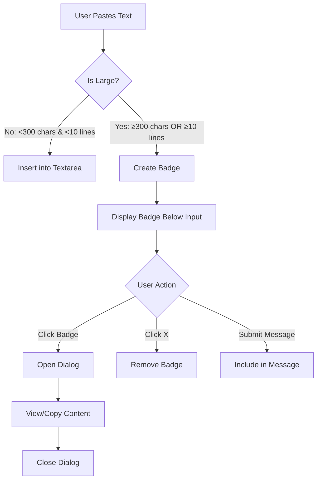

# Large Text Paste Feature

## Overview

This feature enhances the chat input UX by automatically detecting when users paste large amounts of text and rendering it as a clickable badge instead of inserting it directly into the textarea. This prevents the input area from becoming cluttered and provides a better user experience.

## Components

### 1. PastedTextBadge

A clickable badge component that represents pasted text content.

**Props:**
- `id: string` - Unique identifier for the pasted text item
- `textPreview: string` - Preview text shown in tooltip
- `onClick: () => void` - Handler for viewing the full content
- `onRemove?: () => void` - Handler for removing the pasted text

**Features:**
- Displays "PASTED" label with FileText icon
- Shows preview on hover
- Removable via X button
- Clickable to view full content

### 2. PastedTextDialog

A modal dialog for viewing the full content of pasted text.

**Props:**
- `isOpen: boolean` - Controls dialog visibility
- `onClose: () => void` - Handler for closing the dialog
- `content: string` - The full text content to display
- `title?: string` - Optional dialog title (default: "Pasted Text Content")

**Features:**
- Scrollable content area
- Monospace font for better readability
- Copy to clipboard button with visual feedback
- Shows character and line count
- Responsive max-height (80vh)

### 3. Utility Functions (pasteUtils.ts)

#### `isLargeText(text: string): boolean`
Determines if pasted text should be treated as "large".

**Threshold:** 300+ characters OR 10+ lines

#### `createPastedTextItem(content: string): PastedTextItem`
Creates a new PastedTextItem with unique ID and timestamp.

#### `getTextPreview(text: string, maxLength?: number): string`
Generates a preview of the text for display in tooltips.

**Default maxLength:** 50 characters

## Integration with ChatInputArea

### State Management

```typescript
const [pastedTextItems, setPastedTextItems] = useState<PastedTextItem[]>([]);
const [selectedPasteId, setSelectedPasteId] = useState<string | null>(null);
```

### Paste Detection

The `handlePaste` function now:
1. Checks for file pastes (existing behavior)
2. Checks for large text pastes (new behavior)
3. Allows small text to paste normally

### Message Submission

When submitting a message, pasted text items are:
1. Combined with the input value
2. Separated by double newlines (`\n\n`)
3. Included in the final message sent to the backend

### Session Management

Pasted text items are automatically cleared when:
- The session changes
- A message is successfully submitted

## User Flow



## Usage Example

```typescript
import { PastedTextBadge, PastedTextDialog, isLargeText } from './paste';

// Check if text is large
if (isLargeText(pastedText)) {
  // Create badge instead of inserting
  const item = createPastedTextItem(pastedText);
  setPastedTextItems(prev => [...prev, item]);
}

// Render badges
{pastedTextItems.map((item) => (
  <PastedTextBadge
    key={item.id}
    id={item.id}
    textPreview={getTextPreview(item.content)}
    onClick={() => handleViewPastedText(item.id)}
    onRemove={() => handleRemovePastedText(item.id)}
  />
))}

// Render dialog
<PastedTextDialog
  isOpen={selectedPasteId !== null}
  onClose={handleClosePastedTextDialog}
  content={currentContent}
/>
```

## Testing Scenarios

- [ ] Paste text < 300 chars → inserts normally into textarea
- [ ] Paste text ≥ 300 chars → creates badge
- [ ] Paste text with 10+ lines → creates badge
- [ ] Click badge → opens dialog with full content
- [ ] Click X on badge → removes from list
- [ ] Submit with pasted text → includes in message
- [ ] Multiple pastes → all badges shown
- [ ] Mix files + pasted text → both shown correctly
- [ ] Session change → clears pasted text
- [ ] Copy button in dialog → copies to clipboard
- [ ] Dialog scrolling → works for very long text

## Browser Compatibility

- Uses native Clipboard API (`navigator.clipboard.writeText`)
- Requires HTTPS or localhost for clipboard access
- Fallback error handling for clipboard failures

## Accessibility

- Keyboard navigation supported
- ARIA labels on interactive elements
- Focus management after actions
- Screen reader friendly

## Performance Considerations

- Text preview is truncated to 50 characters
- Dialog uses virtualized scrolling for large content
- Unique IDs prevent unnecessary re-renders
- Memoized submission check includes pasted items

## Future Enhancements

- [ ] Syntax highlighting for code pastes
- [ ] Auto-detect and format JSON/XML
- [ ] Paste history/recent pastes
- [ ] Drag and drop text files
- [ ] Export pasted text to file
- [ ] Search within pasted text