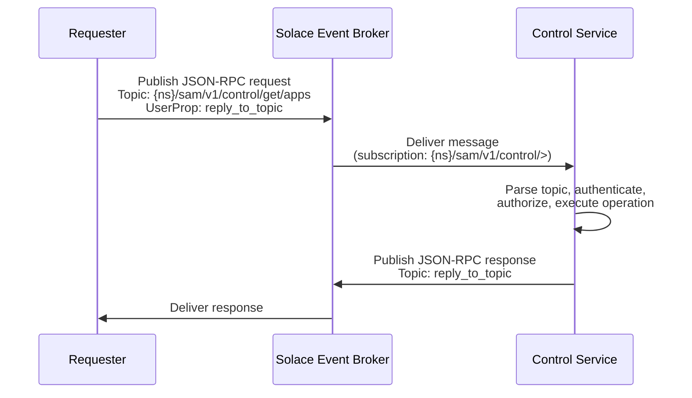
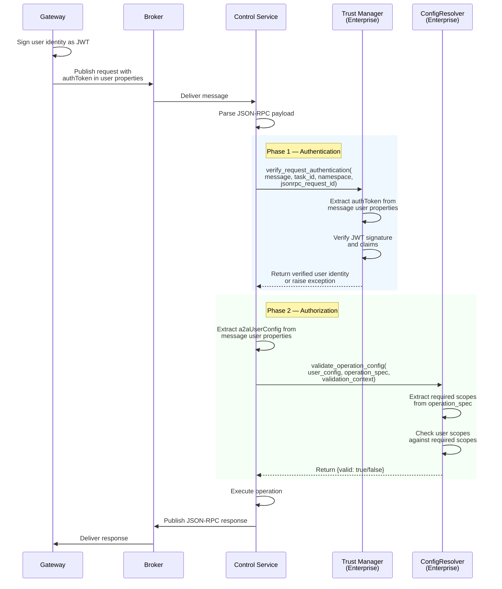

# Dynamic App Management Control Plane

The Dynamic App Management Control Plane enables runtime management of SAC applications (agents, gateways, workflows, and services) without restarting the system. Apps can be created, stopped, started, updated, and removed individually while other apps continue running.

The control plane exposes a RESTful API over the Solace event broker using JSON-RPC 2.0 messaging. Any component in the mesh can send management requests, and Enterprise deployments protect these operations with RBAC.

## Architecture

The control plane spans three layers, each responsible for a distinct concern:

```
+---------------------------+
|   Enterprise (Optional)   |
|   Trust Manager (authn)   |
|   ConfigResolver (authz)  |
+-------------+-------------+
              |
+-------------v-------------+
|   SAM Control Service     |
|   Broker subscriber,      |
|   request routing,        |
|   security delegation     |
+-------------+-------------+
              |
+-------------v-------------+
|   SAC Runtime              |
|   App lifecycle:           |
|   add, remove, stop,      |
|   start, get_info          |
+----------------------------+
```

- **SAC** provides primitive per-app lifecycle operations: `stop()`, `start()`, `add_app()`, `remove_app()`, and `get_info()`.
- **SAM** provides the Control Service that exposes these operations as a RESTful API over the broker, with topic-based routing and security delegation hooks.
- **Enterprise** (optional) provides authentication via Trust Manager and authorization via scope-based RBAC, validating user identity and permissions before each operation executes.

### Design Principles

The control plane follows the same architectural principles as the rest of Agent Mesh:

- **Event-driven**: All control operations are asynchronous messages over the Solace event broker. There are no HTTP endpoints or synchronous RPC calls.
- **Decoupled**: The requester and the control service communicate through pub/sub topics. The requester doesn't need to know where the control service runs.
- **Observable**: The HTTP method is encoded in the topic, so auditing systems can subscribe to specific operation types (for example, `*/sam/v1/control/delete/>`) without parsing message payloads.
- **Backwards compatible**: All changes are additive. Existing apps that don't use the control plane continue to work identically.

## Topic Structure

Control plane topics follow a hierarchical structure under the `sam/v1/control` namespace. The HTTP method is included in the topic path to support fine-grained subscription filtering.

```
{namespace}/sam/v1/control/{method}/apps
{namespace}/sam/v1/control/{method}/apps/{app_name}
{namespace}/sam/v1/control/{method}/apps/{app_name}/{custom_path}
```

The `{method}` level uses lowercase HTTP verbs: `get`, `post`, `put`, `patch`, `delete`.

| Topic Pattern | Description |
|---------------|-------------|
| `{ns}/sam/v1/control/>` | Wildcard subscription used by the control service to receive all requests |
| `{ns}/sam/v1/control/get/apps` | List all running apps |
| `{ns}/sam/v1/control/post/apps` | Create and start a new app |
| `{ns}/sam/v1/control/get/apps/{name}` | Get details for a specific app |
| `{ns}/sam/v1/control/put/apps/{name}` | Replace an app's configuration (stop, reconfig, start) |
| `{ns}/sam/v1/control/patch/apps/{name}` | Partial update (for example, enable or disable) |
| `{ns}/sam/v1/control/delete/apps/{name}` | Remove an app |
| `{ns}/sam/v1/control/{method}/apps/{name}/{path}` | Custom management endpoint delegated to the app |

Including the method in the topic enables auditing and observability without message introspection. For example, a security monitoring agent can subscribe to `*/sam/v1/control/delete/>` to observe all delete operations across all namespaces.

## Communication Pattern

The control plane uses a request-reply pattern over the Solace broker:



1. The requester publishes a JSON-RPC 2.0 request to the appropriate control topic, including a `reply_to_topic` user property that specifies where the response should be sent.
2. The control service receives the message (it subscribes to `{ns}/sam/v1/control/>`).
3. The control service parses the topic to determine the method, resource, and app name, then authenticates and authorizes the request before executing the operation. For more information, see [Security](#security).
4. The control service publishes the JSON-RPC response to the requester's reply-to topic.

This pattern is fully asynchronous. The response is published when the operation completes, even if that takes significant time (for example, waiting for in-flight messages to drain during a stop).

## Request and Response Format

All control plane messages use JSON-RPC 2.0 format.

### Request

```json
{
    "jsonrpc": "2.0",
    "id": "req-abc-123",
    "params": {
        "body": { }
    }
}
```

The `id` field is a correlation identifier returned in the response. The `params.body` field contains the request payload (for example, the app configuration for a create operation). The HTTP method is not included in the JSON body; it is derived from the topic.

### Success Response

```json
{
    "jsonrpc": "2.0",
    "id": "req-abc-123",
    "result": {
        "apps": [
            {
                "name": "my_agent_app",
                "enabled": true,
                "status": "running",
                "num_instances": 1,
                "app_module": "solace_agent_mesh.agent.sac.app"
            }
        ]
    }
}
```

### Error Response

```json
{
    "jsonrpc": "2.0",
    "id": "req-abc-123",
    "error": {
        "code": -32001,
        "message": "App 'xyz' not found"
    }
}
```

| Code | Meaning |
|------|---------|
| `-32600` | Invalid request (malformed JSON-RPC) |
| `-32601` | Method not allowed on the target resource |
| `-32001` | Resource not found |
| `-32002` | Conflict (for example, duplicate app name) |
| `-32003` | Authorization denied |
| `-32004` | Operation failed (for example, stop timeout) |

## Operations

### List Apps

Retrieves basic information for all running apps.

- **Topic:** `{ns}/sam/v1/control/get/apps`
- **Body:** none
- **Response:** `{"apps": [{"name": "...", "enabled": true, "status": "running", ...}]}`

### Create App

Creates and starts a new app at runtime.

- **Topic:** `{ns}/sam/v1/control/post/apps`
- **Body:** Full app configuration (same structure as a YAML `apps[]` entry)
- **Response:** The created app's info

The app name must be unique. If an app with the same name already exists, the control service returns a `-32002` conflict error.

### Get App

Retrieves detailed information for a specific app, including any custom management endpoints it exposes.

- **Topic:** `{ns}/sam/v1/control/get/apps/{name}`
- **Body:** none
- **Response:** App info plus `management_endpoints` list

### Update App (Full Replace)

Replaces an app's configuration by stopping the existing app, applying the new configuration, and starting the new app.

- **Topic:** `{ns}/sam/v1/control/put/apps/{name}`
- **Body:** Full new app configuration
- **Response:** The updated app's info

### Patch App (Partial Update)

Applies a partial update to an app. Currently supports enabling and disabling.

- **Topic:** `{ns}/sam/v1/control/patch/apps/{name}`
- **Body:** `{"enabled": false}` to stop, `{"enabled": true}` to start
- **Response:** The updated app's info

### Delete App

Stops and removes an app, cleaning up all associated resources.

- **Topic:** `{ns}/sam/v1/control/delete/apps/{name}`
- **Body:** none
- **Response:** `{"deleted": "app_name"}`

### Custom Management Endpoints

Any app can expose type-specific management endpoints by overriding `get_management_endpoints()` and `handle_management_request()` in its App subclass. The control service delegates requests with paths beyond `/apps/{name}` to the target app.

- **Topic:** `{ns}/sam/v1/control/{method}/apps/{name}/{custom_path}`
- **Body:** varies by endpoint
- **Response:** varies by endpoint

## App Lifecycle

Each app tracks two state properties:

- **`enabled`** (boolean): The desired state. Set to `true` when the app should run, `false` when it should be stopped.
- **`status`** (string): The observed state. The following diagram illustrates the status transitions.

```
created --> starting --> running --> stopping --> stopped
                           |                       |
                           +--------> error <------+
                                       |
                                       v
                                    stopped
```

| Status | Description |
|--------|-------------|
| `created` | App object exists but has not started yet |
| `starting` | App is initializing flows and connecting to the broker |
| `running` | App is processing messages normally |
| `stopping` | App is draining in-flight messages and disconnecting |
| `stopped` | App is fully stopped and can be restarted or removed |
| `error` | An error occurred during start or stop |

### Graceful Shutdown

When an app is stopped, the shutdown follows three phases:

1. **Pre-stop hook**: The app executes any type-specific drain logic (for example, waiting for in-progress LLM calls to complete). Components continue running during this phase.
2. **Signal**: The app's stop signal is set, causing component run loops to exit. Threads are joined with a configurable timeout.
3. **Cleanup**: Broker connections are disconnected, queues are drained, and flow state is cleared.

In-flight messages complete processing before the app shuts down. This ensures that no messages are lost during a stop operation.

### Thread Safety

All mutations to the app list, flow list, and flow input queues are protected by a lock. The `add_app()` method uses double-check locking to ensure app name uniqueness even under concurrent requests.

## Configuration

The control service is configured as a standard SAM app in YAML:

```yaml
apps:
  - name: control_service_app
    app_module: solace_agent_mesh.services.control.app
    broker:
      <<: *broker_connection
    app_config:
      namespace: ${SOLACE_AGENT_MESH_NAMESPACE, sam}
      authorization:
        type: none
      max_message_size_bytes: ${MAX_MESSAGE_SIZE_BYTES, 10000000}
```

The `authorization.type` field controls how requests are authorized:

| Type | Behavior |
|------|----------|
| `none` | All operations are allowed (suitable for development) |
| `deny_all` | All operations are denied |
| Enterprise RBAC | When Enterprise is installed, middleware overrides this to enforce scope-based authorization |

## Security

The control plane uses a two-phase security model that mirrors the agent request handling pattern. In community (open source) deployments, security enforcement is disabled by default and all operations are permitted. In Enterprise deployments, both phases are active and every request must pass authentication and authorization before any operation executes.

### Security Flow

The following diagram illustrates how the control service processes a request through both security phases.



### Phase 1: Authentication (Trust Manager)

Authentication verifies the identity of the requester. The control service uses the same Trust Manager integration as agents, implemented in `SamComponentBase`. When Enterprise is installed and trust is configured, the Trust Manager initializes automatically during component startup.

The authentication flow works as follows:

1. The gateway signs the user identity into a JWT and attaches it as an `authToken` user property on the Solace message.
2. The control service calls `trust_manager.verify_request_authentication()`, passing the full message, a task identifier (the JSON-RPC request `id`), the namespace, and the JSON-RPC request ID.
3. The Trust Manager extracts the `authToken` from the message user properties, verifies the JWT signature against the known signing keys, and validates the claims.
4. If verification succeeds, the Trust Manager returns a verified user identity containing the user ID, name, email, roles, and scopes. Processing continues to Phase 2.
5. If verification fails, the Trust Manager raises an exception. The control service catches it, builds a JSON-RPC error response with code `-32003`, and publishes it to the requester. The request does not proceed further.

When no `authToken` is present (for example, in a community deployment without Enterprise), the Trust Manager returns `None` and processing continues without an authenticated identity.

The control service also handles trust card messages. Trust cards are periodic broadcasts that establish cryptographic trust between components. When the control service receives a trust card message (identified by topic pattern), it delegates handling to the Trust Manager before any JSON-RPC processing occurs.

### Phase 2: Authorization (ConfigResolver)

Authorization determines whether the authenticated user has permission to perform the requested operation. The control service delegates this decision to the ConfigResolver middleware, which follows the same pattern used by agents and gateways throughout Agent Mesh.

The authorization flow works as follows:

1. The control service extracts the `a2aUserConfig` dictionary from the message user properties. This dictionary contains the user's enterprise capabilities, including granted scopes.
2. The control service builds an `operation_spec` that describes the requested operation:
   ```json
   {
       "operation_type": "control_plane_access",
       "method": "GET",
       "app_name": "my_agent",
       "custom_path": []
   }
   ```
3. The control service calls `config_resolver.validate_operation_config(user_config, operation_spec, validation_context)`.
4. In community deployments, the default ConfigResolver returns `{"valid": true}` for all operations.
5. In Enterprise deployments, the Enterprise ConfigResolver calls `extract_operation_validation_scopes()` to determine the required scopes, then checks the user's granted scopes against them using wildcard-aware matching.

### Scope Mapping

Each control plane operation maps to a required scope following the existing three-part pattern used throughout Agent Mesh.

| Operation | Required Scope |
|-----------|---------------|
| List apps (GET /apps) | `sam:apps:read` |
| Create app (POST /apps) | `sam:apps:create` |
| Get app (GET /apps/{name}) | `sam:apps:read` |
| Update app (PUT /apps/{name}) | `sam:apps:update` |
| Patch app (PATCH /apps/{name}) | `sam:apps:update` |
| Delete app (DELETE /apps/{name}) | `sam:apps:delete` |
| Custom endpoint | `sam:apps/{name}:manage` |

Wildcard scopes are supported. For example, `sam:apps:*` grants all standard CRUD operations, and `sam:apps/*:manage` grants access to custom management endpoints on any app.

Scope matching is case-sensitive and supports `*` as a wildcard in any segment of the scope string. The `fnmatch` pattern matching rules apply, so `sam:*:read` matches `sam:apps:read` and `*` alone matches any scope.

### Predefined Roles

Enterprise provides predefined role-to-scope mappings for common access patterns:

- **`apps_manager`** -- Full application management access. Grants `sam:apps:read`, `sam:apps:create`, `sam:apps:update`, `sam:apps:delete`, and `sam:apps/*:manage`.
- **`apps_viewer`** -- Read-only access. Grants `sam:apps:read` only.

Administrators can define custom roles with any combination of the scopes listed above.

### Community Deployment Security

In community (open source) deployments without Enterprise, both security phases are effectively no-ops:

- **Authentication**: The Trust Manager is not initialized (the Enterprise import fails gracefully). All requests proceed without identity verification.
- **Authorization**: The default ConfigResolver returns `{"valid": true}` for all operations. The `authorization.type` configuration controls a simpler fallback:
  - `none` -- All operations are permitted (default).
  - `deny_all` -- All operations are denied. This is useful for disabling the control plane without removing the app configuration.

### Security Error Responses

Security failures produce JSON-RPC error responses with code `-32003` (authorization denied). The error message is generic ("Authentication failed" or "Access denied") to avoid leaking security details. When Enterprise is installed, the exception may include structured error data through the `create_error_response_data()` method, which the control service forwards in the error response `data` field.

Internal details such as the request topic, required scopes, and granted scopes are never included in error responses sent to the requester. These details are logged server-side at the appropriate log level for debugging.

## Implementation Across Repos

The feature is implemented across three repositories, each with a distinct responsibility:

| Repository | Responsibility |
|------------|---------------|
| `solace-ai-connector` (SAC) | Per-app lifecycle (`stop`, `start`), runtime app addition and removal (`add_app`, `remove_app`), thread safety, `get_info()`, and management endpoint hooks |
| `solace-agent-mesh` (SAM) | Control Service app and component, topic construction and parsing in the A2A protocol module, request routing, and security delegation hooks |
| `solace-agent-mesh-enterprise` | Trust Manager for JWT authentication, ConfigResolver for scope-based authorization, scope extraction (`extract_operation_validation_scopes`), and role-to-scope mappings |

### SAC: App Lifecycle

SAC provides the building blocks that the control service uses to manage apps:

- `App.stop(timeout)`: Three-phase graceful shutdown with configurable timeout
- `App.start()`: Restart from stopped state, recreating flows and connections
- `App.get_info()`: Returns name, enabled, status, num_instances, and app_module
- `App.get_management_endpoints()`: Override point for custom endpoint discovery
- `App.handle_management_request()`: Override point for custom endpoint handling
- `SolaceAiConnector.add_app(app_info)`: Create, register, and run an app at runtime
- `SolaceAiConnector.remove_app(app_name)`: Stop, deregister, and clean up an app

All mutations to shared data structures are protected by `_apps_lock`. The existing connector-level `stop()` continues to stop all apps as before.

### SAM: Control Service

The Control Service consists of two classes:

- **`ControlServiceApp`** (`services/control/app.py`): A `SamAppBase` subclass that programmatically creates the component definition and configures the broker subscription to `{ns}/sam/v1/control/>`.
- **`ControlServiceComponent`** (`services/control/component.py`): A `SamComponentBase` subclass that handles incoming JSON-RPC messages. It parses the topic to extract the method, resource, and app name, runs the request through both security phases, routes it to the appropriate handler, and publishes the response to the requester's reply-to topic.

The A2A protocol module (`common/a2a/protocol.py`) provides topic construction and parsing helpers:

- `get_control_subscription_topic(namespace)`: Returns the wildcard subscription topic
- `get_control_apps_topic(namespace, method)`: Returns the collection endpoint topic
- `get_control_app_topic(namespace, app_name, method)`: Returns the individual app endpoint topic
- `parse_control_topic(namespace, topic)`: Parses a topic into `(method, resource, app_name, custom_path_parts)`

### Enterprise: RBAC Integration

Enterprise provides two security integrations for the control plane:

- **Trust Manager** (`common/trust/trust_manager.py`): Handles JWT authentication through `verify_request_authentication()`. The Trust Manager extracts the `authToken` from message user properties, verifies the signature against known signing keys, and returns a verified user identity with user ID, roles, and scopes. It also handles trust card distribution for establishing cryptographic trust between components.
- **ConfigResolver** (`middleware/config_resolver_impl.py`): Handles scope-based authorization through `validate_operation_config()`. The resolver calls `extract_operation_validation_scopes()` to map the HTTP method to the required scope (for example, `GET` to `sam:apps:read`), then uses `check_scopes()` with wildcard-aware matching to verify the user's granted scopes satisfy the requirement.

Both integrations follow the same patterns used for agent and gateway security. The control service does not contain any Enterprise-specific verification logic; it delegates all security decisions through the Trust Manager and ConfigResolver interfaces that Enterprise overrides at runtime.
