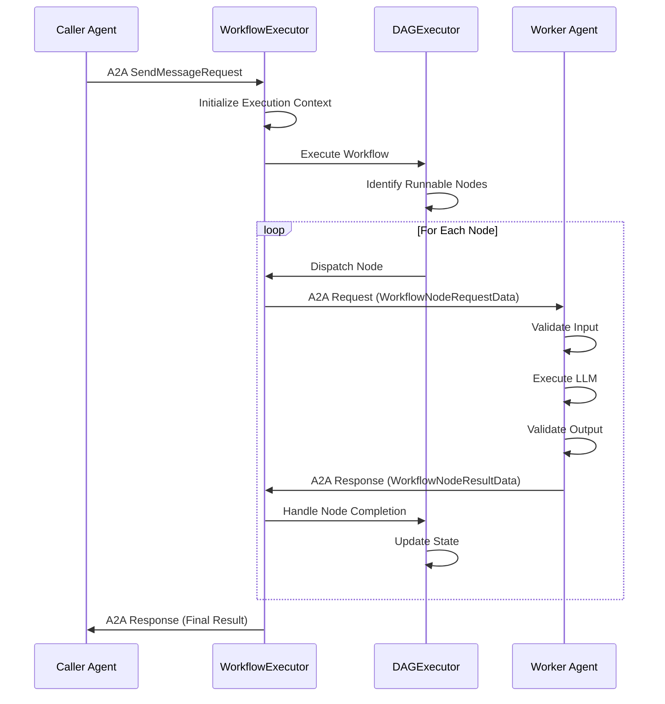

# Workflows Architecture

This document describes the architecture of Workflows in Solace Agent Mesh (SAM). It targets internal developers who need to understand how the feature works and why certain design decisions were made.

## Introduction

Workflows enable DAG-based orchestration of agents with guaranteed data integrity and schema validation. Previously called "Prescribed Workflows," this feature is now referred to simply as "Workflows."

A workflow defines a directed acyclic graph (DAG) of nodes that execute in dependency order. Each node typically invokes an agent to perform work. The workflow engine coordinates execution, manages data flow between nodes, and validates data at boundaries.

The key value propositions are:

- **Reliability**—Schema validation at workflow edges ensures type safety and predictable behavior.
- **Data Integrity**—Artifact-based data flow prevents LLM hallucination of critical values like IDs and keys.
- **Composability**—Workflows are agents, so workflows can invoke other workflows.
- **Observability**—Execution produces status updates at each stage for debugging and monitoring.

## Core Architecture

### Workflows-as-Agents Pattern

Externally, a workflow is indistinguishable from a regular agent. It publishes an Agent Card, accepts A2A tasks, and returns responses through the standard protocol. This design choice has several benefits:

- Workflows are discoverable through the same Agent Card mechanism as regular agents.
- Any agent (including the orchestrator) can invoke a workflow without special handling.
- Workflows can invoke other workflows, enabling composition.
- No changes were required to the orchestrator or gateways to support workflows.

The workflow identifies itself via the `agent_type: workflow` extension in its Agent Card. When a calling agent discovers a workflow, SAM generates a `WorkflowAgentTool` instead of a generic peer agent tool.

### Component Overview

The workflow engine consists of three main server-side components:

**WorkflowExecutorComponent** (`src/solace_agent_mesh/workflow/component.py`) is the execution engine. It loads the workflow definition from YAML, publishes the Agent Card, manages workflow execution lifecycles, and coordinates with the other components.

**DAGExecutor** (`src/solace_agent_mesh/workflow/dag_executor.py`) handles the execution graph. It analyzes node dependencies, determines which nodes can run next, evaluates conditional expressions, and resolves data templates like `{{step1.output.id}}`.

**AgentCaller** (`src/solace_agent_mesh/workflow/agent_caller.py`) dispatches tasks to worker agents. It constructs the A2A message for each node, injects workflow metadata, and correlates responses back to the originating workflow execution.

### WorkflowNodeHandler: Agent-Side Workflow Support

The `WorkflowNodeHandler` (`src/solace_agent_mesh/agent/sac/workflow_support/handler.py`) is a critical component that lives within standard agents. It enables any agent to participate as a workflow node without code changes.

When the workflow engine invokes an agent, it includes a `WorkflowNodeRequestData` part in the message. This part contains the node ID, input data, and optionally input/output schemas. The WorkflowNodeHandler detects this and takes over the agent's execution for that request.

**Input Validation.** Before the agent's LLM runs, the handler validates incoming data against the node's `input_schema`. If validation fails, the handler rejects the task immediately and returns an error to the workflow.

**Schema Injection.** The workflow can specify `input_schema_override` and `output_schema_override` on a per-node basis. This allows the same agent to enforce different contracts in different workflow contexts.

**System Prompt Injection.** The handler injects workflow-specific instructions into the LLM's system prompt. These instructions explain the agent's role as a workflow node, describe the expected input and output formats, and direct the agent to produce its result in a specific way.

**Result Embed Pattern.** To signal completion, the agent must output a result embed in its response:

```
«result:artifact=output.json status=success»
```

The handler parses this embed to identify the output artifact. If the agent fails, it uses:

```
«result:status=failure message="Description of the problem"»
```

**Output Validation.** After the agent produces a result, the handler loads the referenced artifact and validates it against the `output_schema`. If validation fails, the handler can automatically retry the LLM with feedback about what went wrong.

**Retry Behavior.** The handler supports configurable retry attempts for output validation failures. On each retry, it feeds the validation errors back to the LLM so it can correct its output.

The key insight is that this design makes schema-validated agent invocation available to workflows without requiring agents to be "workflow-aware." Any existing agent with appropriate tools can participate in a workflow simply by being invoked with the workflow protocol.

### Data Flow

The following diagram shows the high-level execution flow:



Data flows between nodes via template expressions. A node's input can reference workflow input (`{{workflow.input.field}}`) or outputs from completed nodes (`{{node_id.output.field}}`). The DAGExecutor resolves these templates before dispatching each node.

## Node Types

Workflows support seven node types for different orchestration patterns.

### Agent Node

The fundamental building block. Invokes an agent and waits for its response.

```yaml
- id: analyze_data
  type: agent
  agent_name: "DataAnalyzer"
  input:
    dataset: "{{workflow.input.raw_data}}"
```

Agent nodes support optional features: `when` clauses for conditional execution, `retryStrategy` for automatic retries, and `timeout` for node-specific time limits.

### Conditional Node

Binary branching based on an expression. Evaluates a condition and routes to either `true_branch` or `false_branch`.

```yaml
- id: check_threshold
  type: conditional
  condition: "'{{analyze_data.output.score}}' > 75"
  true_branch: approve_request
  false_branch: review_manually
```

Conditions use simpleeval for safe Python expression evaluation. Both branch targets must include the conditional node in their `depends_on` list.

### Switch Node

Multi-way branching when you need more than two paths. Cases are evaluated in order; the first match wins.

```yaml
- id: route_by_priority
  type: switch
  cases:
    - when: "'{{input.priority}}' == 'critical'"
      then: urgent_handler
    - when: "'{{input.priority}}' == 'high'"
      then: priority_handler
  default: standard_handler
```

### Map Node

Parallel iteration over an array. Executes a target node for each item with optional concurrency control.

```yaml
- id: process_orders
  type: map
  items: "{{workflow.input.orders}}"
  node: process_single_order
  concurrency_limit: 5
```

The target node accesses the current item via `{{_map_item}}`. The map node collects all results into `{{process_orders.output.results}}`.

### Fork Node

Parallel execution of multiple independent branches. Each branch invokes an agent and contributes to a merged output.

```yaml
- id: gather_info
  type: fork
  branches:
    - id: get_customer
      agent_name: "CustomerService"
      input:
        customer_id: "{{workflow.input.id}}"
      output_key: customer
    - id: get_orders
      agent_name: "OrderService"
      input:
        customer_id: "{{workflow.input.id}}"
      output_key: orders
```

The fork node's output contains all branch results keyed by `output_key`.

### Join Node

Explicit synchronization point. Waits for specified upstream nodes according to a strategy.

```yaml
- id: wait_for_all
  type: join
  wait_for: [branch_a, branch_b, branch_c]
  strategy: all  # or "any" or "n_of_m"
```

With `strategy: any`, the join completes when the first upstream node finishes. With `n_of_m`, you specify how many must complete via the `n` field.

### Loop Node

While-loop iteration. Repeats a target node until a condition becomes false.

```yaml
- id: retry_until_success
  type: loop
  node: attempt_operation
  condition: "'{{attempt_operation.output.status}}' != 'success'"
  max_iterations: 10
```

The `max_iterations` field provides a safety limit to prevent infinite loops.

## Key Design Decisions

### Argo Workflows Alignment

During design, we evaluated several workflow engines: AWS Step Functions, Apache Airflow, and Argo Workflows. Argo Workflows was the closest match to SAM's needs and mental model.

**What we adopted from Argo:**

- `dependencies` as an alias for `depends_on`
- `withParam` and `withItems` for map node item sources
- `retryStrategy` with backoff configuration
- `when` clauses for conditional node execution

**What we extended for SAM:**

- `agent_name` to specify which agent executes a node
- Template expressions using `{{path.to.value}}` syntax
- `coalesce` and `concat` operators for data transformation
- Workflow-specific Agent Card extensions

We support both Argo field names and SAM equivalents (for example, both `depends_on` and `dependencies` work) to make the syntax familiar to developers with Argo experience.

### Workflows-as-Agents Pattern

The decision to make workflows appear as agents externally was deliberate. The alternative (introducing a separate "workflow" entity type) would have required changes throughout the system: new discovery mechanisms, new invocation protocols, and special handling in the orchestrator.

By implementing workflows as agents, we got composition for free. A workflow can invoke another workflow using the same A2A protocol it uses to invoke any other agent. The orchestrator doesn't need to know whether it's delegating to an agent or a workflow.

This also simplified the implementation. The WorkflowExecutorComponent extends the same base as regular agent components, reusing infrastructure for message handling, session management, and artifact storage.

### Schema Validation and Data Integrity

Workflows enforce schema validation at boundaries to guarantee data integrity. This addresses a fundamental challenge with LLM-based systems: preventing hallucination of critical data.

**Artifact-Based Data Flow.** Rather than passing data inline in messages, workflows reference data artifacts. The `WorkflowAgentTool` supports two invocation modes: parameter mode (where arguments are validated and stored as an artifact) and artifact mode (where a pre-existing artifact is passed through). This keeps critical data out of the LLM's generation path.

**Template Expressions.** Data references like `{{node_id.output.field}}` are resolved by the DAGExecutor, not by the LLM. The LLM never sees raw data values that it might corrupt; it only sees the resolved values as input to its task.

**Validation Points.** Schema validation occurs at three points:
1. Workflow input validation when a request arrives
2. Node input validation before each agent executes
3. Node output validation after each agent produces a result

**Operators for Conditional Data.** The `coalesce` operator handles optional branches. It returns the first non-null value from a list. This is essential for conditional workflows where only one branch executes:

```yaml
output_mapping:
  final_status:
    coalesce:
      - "{{manual_review.output.status}}"
      - "{{auto_approve.output.status}}"
```

The `concat` operator joins strings or arrays for building composite values in output mappings.

## Implementation Files Reference

| Area | Location |
|------|----------|
| Workflow Engine | `src/solace_agent_mesh/workflow/` |
| Main Executor | `src/solace_agent_mesh/workflow/component.py` |
| DAG Logic | `src/solace_agent_mesh/workflow/dag_executor.py` |
| Node Definitions | `src/solace_agent_mesh/workflow/app.py` |
| Agent Caller | `src/solace_agent_mesh/workflow/agent_caller.py` |
| Agent-Side Handler | `src/solace_agent_mesh/agent/sac/workflow_support/handler.py` |
| Schema Validator | `src/solace_agent_mesh/agent/sac/workflow_support/validator.py` |
| Workflow Tool | `src/solace_agent_mesh/agent/tools/workflow_tool.py` |
| Data Models | `src/solace_agent_mesh/common/data_parts.py` |
| Protocol Handlers | `src/solace_agent_mesh/workflow/protocol/event_handlers.py` |

For detailed design rationale and sequence diagrams, see `docs/design/workflow_architecture.md`.
