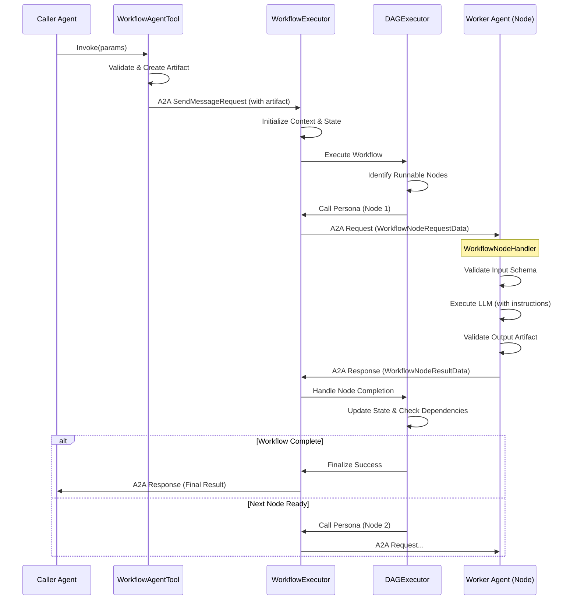
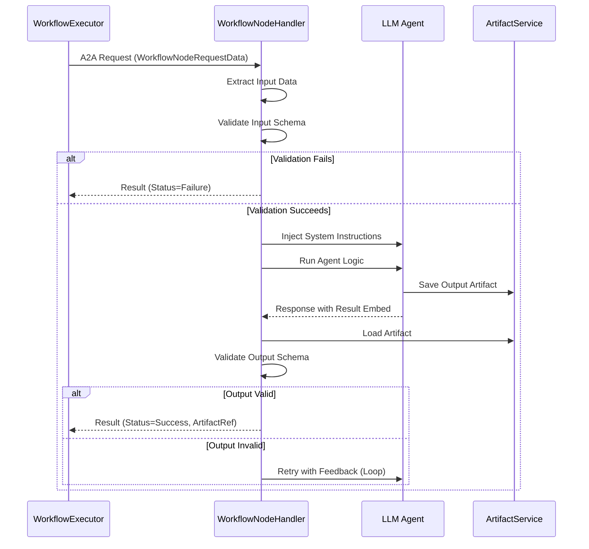

# Workflow Architecture in Solace Agent Mesh

## 1. Overview

The Workflow feature in Solace Agent Mesh (SAM) enables **Prescriptive Workflows**: structured, DAG-based orchestration of agents with guaranteed data integrity and schema validation.

Key architectural principles:
*   **"Workflows as Agents"**: To the rest of the mesh, a workflow appears and behaves exactly like a standard agent. It publishes an Agent Card, accepts A2A tasks, and returns responses.
*   **Decoupled Execution**: The workflow engine (`WorkflowExecutorComponent`) manages the orchestration state, while standard agents (`SamAgentComponent`) execute the actual work (nodes).
*   **Type Safety**: Data flow between nodes is strictly validated against JSON schemas defined in the workflow or agent configuration.

## 2. Core Components

### 2.1. Workflow Executor (`WorkflowExecutorComponent`)
This is the "brain" of the workflow. It is a specialized SAM component that:
*   Loads the workflow definition (YAML).
*   Publishes the workflow's Agent Card.
*   Manages the lifecycle of workflow executions (`WorkflowExecutionContext`).
*   Persists execution state to the Session Service.

### 2.2. DAG Executor (`DAGExecutor`)
A logic module within the Workflow Executor responsible for:
*   Analyzing the dependency graph (DAG).
*   Determining which nodes are runnable.
*   Handling flow control (Conditional, Fork, Loop).
*   Resolving data templates (e.g., `{{step1.output.id}}`).

### 2.3. Persona Caller (`PersonaCaller`)
The interface used by the Workflow Executor to dispatch tasks to worker agents. It:
*   Constructs the A2A message for a node.
*   Injects the `WorkflowNodeRequestData` (schemas, context).
*   Manages the correlation between workflow nodes and A2A sub-tasks.

### 2.4. Workflow Node Handler (`WorkflowNodeHandler`)
A module residing within **standard agents** (`SamAgentComponent`). It allows any agent to act as a workflow node by:
*   Detecting incoming workflow requests.
*   Validating input data against the node's schema.
*   Injecting workflow-specific system instructions (e.g., "You are node X...").
*   Validating the agent's output artifact before returning it to the workflow.

## 3. Invocation Models

Workflows are invoked using the standard Agent-to-Agent (A2A) protocol, but with specialized tooling to handle structured data.

### 3.1. Discovery
Workflows identify themselves via the Agent Card extension `agent_type: workflow`.
When a calling agent discovers a workflow, SAM automatically generates a `WorkflowAgentTool` instead of a generic `PeerAgentTool`.

### 3.2. The `WorkflowAgentTool`
This tool provides a **Dual-Mode** interface to the calling LLM:

1.  **Parameter Mode (Implicit Artifacts)**:
    *   **Usage**: The LLM provides arguments matching the workflow's `input_schema`.
    *   **Mechanism**: The tool validates the arguments, serializes them into a JSON file, saves it as an artifact (e.g., `workflow_input_xyz.json`), and sends a reference to this artifact.
    *   **Best for**: New data generation or simple inputs.

2.  **Artifact Mode (Pass-through)**:
    *   **Usage**: The LLM provides a single argument `input_artifact` containing a filename.
    *   **Mechanism**: The tool passes this filename directly to the workflow.
    *   **Best for**: Passing large datasets or outputs from previous steps without re-tokenizing.

### 3.3. Protocol
The invocation uses a standard A2A `SendMessageRequest` with specific metadata:
*   `sessionBehavior: "RUN_BASED"`: Ensures each workflow execution runs in an isolated context.
*   `invoked_with_artifacts`: References the input data.

## 4. Agent-as-a-Node

Any standard SAM agent can participate in a workflow without code changes, provided it adheres to the protocol enforced by the `WorkflowNodeHandler`.

### 4.1. Becoming a Node
An agent becomes a node when it receives an A2A message containing a `WorkflowNodeRequestData` part. This data structure includes:
*   `node_id`: The ID of the step being executed.
*   `input_schema` / `output_schema`: The strict contracts for this execution.

### 4.2. Execution Flow
1.  **Input Validation**: The agent validates the incoming data against the `input_schema`. If validation fails, the agent rejects the task immediately.
2.  **Context Injection**: The `WorkflowNodeHandler` injects a system prompt instructing the LLM on its role and the required output format.
3.  **Result Embed**: To signal completion, the agent **MUST** output a specific embed string in its final response:
    ```text
    «result:artifact=my_output.json status=success»
    ```
4.  **Output Validation**: The handler intercepts this response, loads the referenced artifact (`my_output.json`), and validates it against the `output_schema`.
5.  **Return**: If valid, a `WorkflowNodeResultData` signal is sent back to the workflow engine. If invalid, the agent may be auto-retried with error feedback.

## 5. Data Flow Summary

1.  **Caller** invokes `WorkflowAgentTool` -> Input Artifact created.
2.  **Workflow Engine** receives request -> Initializes `WorkflowExecutionContext`.
3.  **DAG Executor** identifies start node -> Resolves inputs.
4.  **Persona Caller** sends A2A request to **Worker Agent**.
5.  **Worker Agent** (`WorkflowNodeHandler`) validates input -> Runs LLM -> Validates output artifact.
6.  **Worker Agent** returns result signal to **Workflow Engine**.
7.  **Workflow Engine** updates state -> Triggers next node or finalizes.
8.  **Workflow Engine** returns final response to **Caller**.

## 6. Appendix A: Sequence Diagrams

### 6.1. Workflow Invocation & Execution



### 6.2. Worker Agent Execution (Node)



## 7. Appendix B: Implementation Files

The following files contain the core implementation of the Workflow feature:

### Workflow Engine (`src/solace_agent_mesh/workflow/`)
*   `component.py`: Main `WorkflowExecutorComponent` class.
*   `app.py`: `WorkflowApp` definition and configuration models.
*   `dag_executor.py`: Logic for DAG traversal and node execution.
*   `persona_caller.py`: Handles A2A communication with worker agents.
*   `workflow_execution_context.py`: State management (`WorkflowExecutionContext`, `WorkflowExecutionState`).
*   `protocol/event_handlers.py`: Handlers for incoming A2A messages.
*   `flow_control/conditional.py`: Logic for evaluating conditional nodes.

### Agent-Side Support (`src/solace_agent_mesh/agent/`)
*   `sac/workflow_support/handler.py`: `WorkflowNodeHandler` for executing agents as nodes.
*   `sac/workflow_support/validator.py`: JSON schema validation utilities.
*   `tools/workflow_tool.py`: `WorkflowAgentTool` for invoking workflows from other agents.

### Common & Shared (`src/solace_agent_mesh/common/`)
*   `data_parts.py`: Data models for `WorkflowNodeRequestData` and `WorkflowNodeResultData`.
*   `agent_card_utils.py`: Utilities for extracting schemas from Agent Cards.
