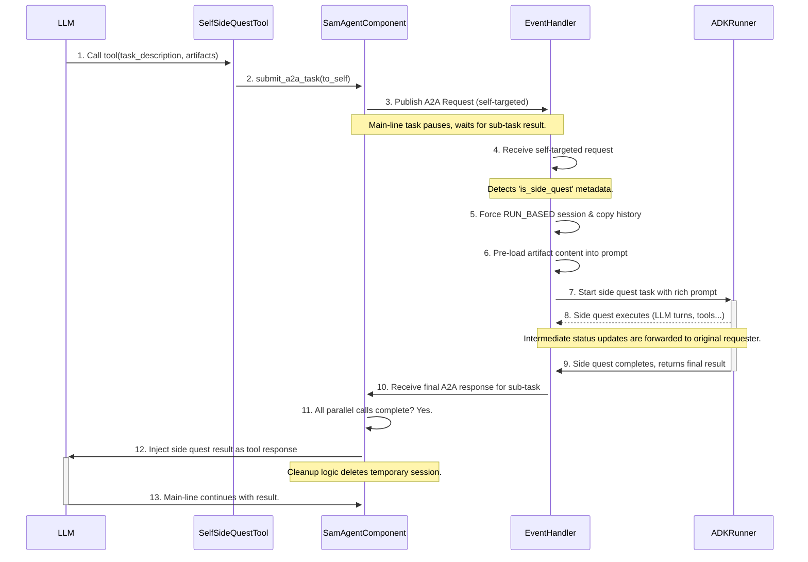

# Agent Side Quests: Detailed Design

## 1. Overview

This document provides the detailed design for the "Agent Side Quests" feature. A side quest is a mechanism that allows an agent to initiate a self-contained, isolated sub-task on itself. This sub-task, or "quest," inherits the full context of the main conversation but executes in a temporary session. Upon completion, only the final result is returned to the main conversation, and the temporary context is discarded.

This pattern is invaluable for complex problem-solving, allowing an agent to perform exploratory work, analyze large artifacts, or execute multi-step tool sequences without permanently cluttering its primary context window. It combines the power of delegation (similar to calling a peer agent) with the convenience of operating on its own full context.

## 2. Detailed Design

The design leverages the existing A2A protocol and `RUN_BASED` session mechanics to provide a robust and maintainable implementation.

### 2.1. `SelfSideQuestTool`: The Invocation Mechanism

A new built-in tool, `SelfSideQuestTool`, will be introduced as the primary way for an agent's LLM to initiate a side quest.

*   **Tool Name**: The tool will be registered as `self_side_quest`.
*   **Long-Running**: It will be a long-running tool (`is_long_running = True`), integrating with the agent's asynchronous task management system.
*   **Parameters**:
    *   `task_description` (string, required): A natural language description of the goal for the side quest.
    *   `artifacts` (array, optional): A list of artifact identifiers (`{filename: str, version: str | int}`) to be pre-loaded into the side quest's initial context.

When called, the tool's `run_async` method will construct and submit an A2A `SendMessageRequest` targeting its own agent name.

### 2.2. A2A Message and Metadata

The `SelfSideQuestTool` will create an A2A `Message` with specific metadata to signal the agent's event handler to treat the request as a side quest.

*   **`metadata.is_side_quest`**: A boolean flag set to `True`.
*   **`metadata.parent_session_id`**: The session ID of the main-line task. This is crucial for context inheritance.
*   **`metadata.invoked_with_artifacts`**: If the tool was called with the `artifacts` parameter, this metadata field will contain the list of artifact identifiers.

### 2.3. Session and Context Handling in `event_handlers.py`

The core logic for handling a side quest request resides in `handle_a2a_request` within `src/solace_agent_mesh/agent/protocol/event_handlers.py`.

1.  **Detection**: The handler will inspect the incoming A2A message's metadata for `is_side_quest: True`.
2.  **Forced `RUN_BASED` Behavior**: Upon detection, the `session_behavior` for the task will be programmatically forced to `RUN_BASED`, overriding any other configuration.
3.  **Context Inheritance**: The existing logic for `RUN_BASED` sessions will be leveraged. It creates a new, temporary `effective_session_id` (e.g., `parent-session:task-id:run`) and copies the entire event history from the `parent_session_id` specified in the metadata.
4.  **Artifact Pre-loading**:
    *   If `invoked_with_artifacts` is present in the metadata, the handler will not use the standard `translate_a2a_to_adk_content` function.
    *   Instead, it will directly construct a multi-part `adk_types.Content` object.
    *   It will first load the content of each specified artifact using the `artifact_service`.
    *   The final `adk_types.Content` will consist of the `task_description` text part, followed by the loaded artifact parts, each clearly delineated with headers (e.g., `--- Start of Artifact: report.csv ---`).
    *   This rich, pre-populated content object is then passed to the ADK runner, saving an LLM turn.

### 2.4. Parallel and Recursive Execution

The design inherently supports parallel and recursive side quests.

*   **Parallelism**: The `SelfSideQuestTool` will function identically to the `PeerAgentTool` regarding parallel execution. If the LLM outputs multiple `self_side_quest` and/or `peer_` tool calls in one turn, the ADK framework will execute them concurrently. The `TaskExecutionContext` will correctly track all pending sub-tasks (both side quests and peer calls) and will only resume the main-line task after all of them have returned a result.
*   **Recursion**: A side quest is a standard A2A task. As such, it has access to all the same tools as its parent, including the `self_side_quest` tool. If a side quest initiates another side quest, the process simply repeats: a new `RUN_BASED` session is created, inheriting the context from its immediate parent (the first side quest), and so on. The session cleanup logic will correctly unwind this "stack" as each quest completes.

### 2.5. Status and Result Forwarding

The side quest's lifecycle is managed as a standard A2A sub-task, ensuring seamless integration with the existing status and result forwarding mechanisms.

*   **Status Updates**: Intermediate status updates from the side quest (e.g., `tool_invocation_start`, `llm_invocation`, artifact creation progress) are published as `TaskStatusUpdateEvent`s. The `handle_a2a_response` function in the main-line agent will receive these events. It will identify them as belonging to a sub-task and forward them to the original requester (e.g., the gateway), providing real-time visibility.
*   **Final Result**: When the side quest completes, it produces a final `Task` object. This is received by `handle_a2a_response`, which then triggers the `_retrigger_agent_with_peer_responses` logic. The result is injected back into the main-line's context as a tool response, allowing the main-line to continue its work.

### 2.6. Automatic Cleanup

Cleanup is handled by the existing `finalize_task_with_cleanup` method in `src/solace_agent_mesh/agent/sac/component.py`.

*   Because a side quest is a `RUN_BASED` session, the cleanup logic will correctly identify it upon completion.
*   It will automatically call `session_service.delete_session` on the temporary `effective_session_id`, ensuring the entire isolated context (history, state) is purged.

## 3. Data Flow Diagram

## 4. Key Decisions Rationale

*   **Self-Targeted A2A Task**: This is the cornerstone of the design. It maximizes reuse of the existing, battle-tested infrastructure for task management, session handling, parallel execution, and asynchronous communication. It avoids creating a separate, less-capable "in-process" sub-task mechanism.
*   **`RUN_BASED` Session Model**: Reusing the `RUN_BASED` session type is the cleanest way to achieve context inheritance and automatic cleanup. It ensures that side quests behave consistently with other temporary tasks in the system.
*   **Tool-Based Invocation**: Making this a tool call provides a clear, declarative interface for the LLM. It allows the side quest capability to be managed, versioned, and documented just like any other tool in the agent's arsenal.
*   **Artifact Pre-loading in Event Handler**: Placing the artifact loading logic within the `handle_a2a_request` handler is the most efficient design. It allows the side quest to start with a fully-formed, rich context, saving a full LLM turn that would otherwise be spent on a `load_artifact` tool call.
