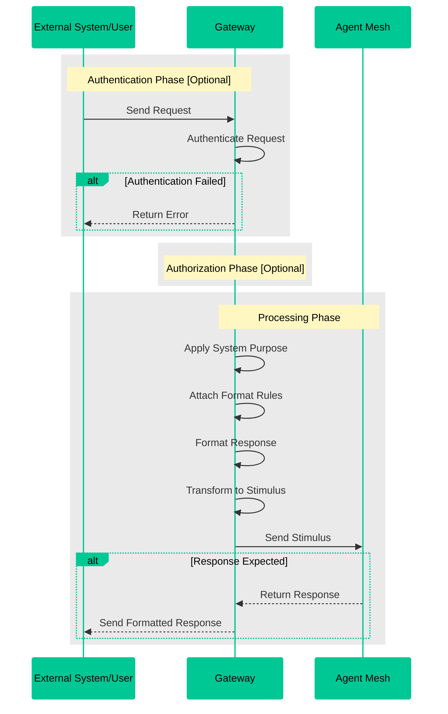

# Gateways

Gateways are a crucial component of the Agent Mesh framework that expose the agent mesh to external systems through various protocols. Built on a common base gateway architecture, they provide the following functions:

- serve as the primary interface between Agent Mesh and the outside world
- manage the flow of information in and out of the system through the A2A protocol
- handle authentication, user enrichment, and message processing
- support multiple interface types including REST, HTTP SSE, webhooks, and event mesh connectivity

:::tip[In one sentence]
Gateways are the external interfaces that connect various systems to the A2A agent mesh through standardized protocols.
:::

## Key Functions

1. **Entry Points**: Gateways act as the entry points from the outside world and translate external requests into A2A protocol messages and route them through the Solace event mesh to appropriate agents.

2. **Authentication & Authorization**: Common authentication and user enrichment flow across all gateway types, with pluggable identity providers.

3. **Configurable System Purpose**: Each gateway has a configurable system purpose that sets the context for all stimuli entering Agent Mesh through that gateway. This design allows for tailored processing based on the specific use case or domain.

4. **Customizable Output Formatting**: Gateways have a configurable output description that controls how stimuli responses are formatted when sent back to the outside world. This configurable output description ensures that the output meets the requirements of the receiving system or user interface.

5. **Multiple Interface Types**: Gateways can have different interfaces to accommodate various communication protocols and systems. Some examples include REST APIs, event meshes, Slack integrations, browser-based interfaces, and so on.

## How Gateways Work

The following diagram illustrates the complete flow of information through a gateway in Agent Mesh:



## Available Gateways

Agent Mesh comes with several built-in gateway types:

### Core Gateways

1. **HTTP SSE Gateway**
   - Real-time web interface with streaming responses
   - Server-sent events for live updates
   - Agent discovery API
   - File upload and download handling

2. **REST Gateway**
   - Task submission with immediate task ID return
   - Polling-based result retrieval
   - Authentication integration

3. **Webhook Gateway**
   - Handles incoming webhook requests
   - Transforms webhook payloads to A2A messages

### Plugin Gateways

Additional gateway types are available through the plugin ecosystem:

- **Event Mesh Gateway**: External event mesh connectivity with message transformation
- **Slack Gateway**: Slack bot integration for team collaboration
- **Microsoft Teams Gateway** *(Enterprise)*: Teams bot integration with Azure AD authentication, file sharing, and real-time streaming responses (Docker deployment only)
- **Custom Gateways**: Create your own gateway implementations

For more information about plugins and how to configure them, see [Plugins](./plugins.md).

One of the official core plugin gateway interfaces is the [Solace Event Mesh Gateway](https://github.com/SolaceLabs/solace-agent-mesh-core-plugins/tree/main/sam-event-mesh-gateway), which enables communication with the PubSub+ event broker directly as an input interface.

:::note
Each gateway type has its own configuration options and specific features. See the individual gateway documentation pages for detailed information on setup and usage.
:::

## Create a Gateway

To create a gateway, you can either [use one of the pre-existing plugins](./plugins.md#use-a-plugin) or create yours from scratch.


### Gateway from Scratch

To create a gateway from scratch, you need to use the CLI `add gateway` command without any interfaces. This command creates a _python gateway template file_ which you can then customize to your needs.

```sh
sam add gateway my-interface
```

To learn more about creating your own gateway, see [Creating Custom Gateways](../developing/create-gateways.md).

:::tip[Share and Reuse]
If you would like to share your custom gateway with the community or re-use it within other projects, you can create a plugin for it. For more information, see [Create Plugins](./plugins.md#create-a-plugin).
:::

## Gateway Configuration

Gateways are configured through YAML files that define how they connect to the event mesh and process external requests. This section covers the essential configuration options for different gateway types.

### Core Gateway Configuration

All gateways share these common configuration fields:

| Field | Type | Required | Description |
|-------|------|----------|-------------|
| `namespace` | string | Yes | A2A topic namespace for the gateway |
| `gateway_id` | string | No | Unique gateway identifier (auto-generated if omitted) |
| `system_purpose` | string | No | Description of the gateway's purpose, sets context for all incoming requests |
| `response_format` | string | No | Instructions for how responses should be formatted for the external system |
| `artifact_service` | object | No | Configuration for artifact storage (see [Artifact Storage](../installing-and-configuring/artifact-storage.md)) |
| `session_service` | object | No | Configuration for session management (see [Session Storage](../installing-and-configuring/session-storage.md)) |

### WebUI Gateway Configuration

The WebUI Gateway provides a real-time web interface with streaming responses. It requires additional configuration for the FastAPI server and session management.

#### Required Configuration

```yaml
app_config:
  namespace: "myorg/ai-agents"
  gateway_id: "web-ui-gateway"
  session_secret_key: "${SESSION_SECRET_KEY}"  # Required for session signing
  
  # FastAPI Server Configuration
  fastapi_host: "0.0.0.0"
  fastapi_port: 8000
  
  # CORS Configuration
  cors_allowed_origins:
    - "http://localhost:3000"
    - "http://127.0.0.1:3000"
```

#### WebUI-Specific Fields

| Field | Type | Default | Description |
|-------|------|---------|-------------|
| `session_secret_key` | string | *Required* | Secret key for signing web session cookies. Must be consistent across all instances |
| `fastapi_host` | string | `127.0.0.1` | Host address for the FastAPI server |
| `fastapi_port` | integer | `8000` | Port for the FastAPI server |
| `cors_allowed_origins` | array[string] | `[]` | List of allowed CORS origins for web requests |
| `gateway_artifact_content_limit_bytes` | integer | `10485760` | Maximum artifact size in bytes (default: 10MB) |
| `gateway_recursive_embed_depth` | integer | `3` | Maximum depth for recursive embed resolution |
| `enable_embed_resolution` | boolean | `true` | Enable dynamic embed processing in messages |

#### Complete WebUI Gateway Example

```yaml
log:
  stdout_log_level: INFO
  log_file_level: DEBUG
  log_file: webui_gateway.log

!include ../shared_config.yaml

apps:
  - name: webui_gateway_app
    app_base_path: .
    app_module: solace_agent_mesh.gateway.http_sse.app

    broker:
      <<: *broker_connection

    app_config:
      namespace: "myorg/ai-agents"
      gateway_id: "web-ui-gateway"
      session_secret_key: "${SESSION_SECRET_KEY}"
      
      fastapi_host: "0.0.0.0"
      fastapi_port: 8000
      cors_allowed_origins:
        - "http://localhost:3000"
        - "http://127.0.0.1:3000"

      artifact_service: *default_artifact_service
      session_service:
        type: "sql"
        database_url: "sqlite:///webui-gateway.db"
        default_behavior: "PERSISTENT"

      model: *general_model
      system_purpose: "Web interface for AI agent interactions"
      response_format: "Provide clear, helpful responses suitable for web display"
      enable_embed_resolution: true
```

### Generic Gateway Configuration

Generic gateways use custom adapters to integrate with external systems. The adapter handles the protocol-specific logic while the gateway manages A2A communication.

#### Required Configuration

```yaml
app_config:
  namespace: "${NAMESPACE}"
  gateway_adapter: "your_package.adapter.YourAdapter"
  
  adapter_config:
    # Adapter-specific configuration
    custom_field: "value"
```

#### Generic Gateway Fields

| Field | Type | Required | Description |
|-------|------|----------|-------------|
| `gateway_adapter` | string | Yes | Python module path to the adapter class (e.g., `sam_slack_gateway_adapter.adapter.SlackAdapter`) |
| `adapter_config` | object | No | Adapter-specific configuration passed to the adapter implementation |

#### Slack Gateway Example

```yaml
log:
  stdout_log_level: INFO
  log_file_level: DEBUG
  log_file: slack_gateway.log

!include ../shared_config.yaml

apps:
  - name: slack_gateway_app
    app_base_path: .
    app_module: solace_agent_mesh.gateway.generic.app

    broker:
      <<: *broker_connection

    app_config:
      namespace: "${NAMESPACE}"
      gateway_adapter: sam_slack_gateway_adapter.adapter.SlackAdapter
      
      adapter_config:
        slack_bot_token: "${SLACK_BOT_TOKEN}"
        slack_app_token: "${SLACK_APP_TOKEN}"
        slack_initial_status_message: ":thinking_face: Thinking..."
        correct_markdown_formatting: true
        slack_email_cache_ttl_seconds: 0

      artifact_service: *default_artifact_service
      system_purpose: "Slack interface for team AI agent interactions"
      response_format: "Format responses appropriately for Slack channels"
```

### Configuration Best Practices

1. **Use Environment Variables**: Store sensitive information like API keys and secrets in environment variables
2. **Shared Configuration**: Use `!include` to reference shared broker and service configurations
3. **System Purpose**: Define clear system purpose to set appropriate context for incoming requests
4. **Response Format**: Customize response formatting based on the target platform's requirements
5. **Session Management**: Configure persistent session storage for production deployments
