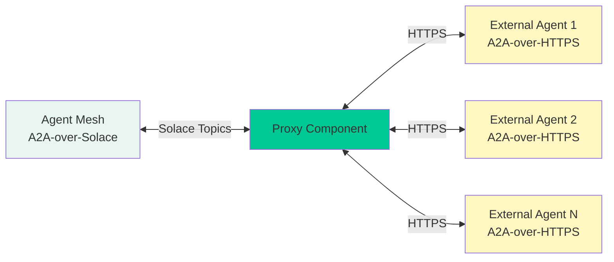

# Proxies

Proxies enable Agent Mesh to integrate with external agents that communicate using the A2A (Agent-to-Agent) protocol over HTTPS but are not natively connected to the Solace event mesh. They act as protocol bridges, translating between A2A-over-HTTPS and A2A-over-Solace, allowing external agents to participate seamlessly in the agent mesh ecosystem.

:::tip[In one sentence]
Proxies are protocol bridges that connect external A2A-over-HTTPS agents to the Solace event mesh, enabling hybrid agent architectures.
:::

## Key Functions

1. **Protocol Translation**: Proxies translate between A2A-over-HTTPS and A2A-over-Solace, enabling external agents to communicate with agents on the mesh without modification.

2. **Authentication Management**: Proxies handle authentication to downstream agents, supporting multiple authentication schemes including static bearer tokens, API keys, and OAuth 2.0 client credentials flow with automatic token refresh.

3. **Agent Discovery**: Proxies fetch agent cards from external agents and publish them to the mesh discovery topic, making external agents discoverable to other agents in the system.

4. **Artifact Handling**: Proxies manage artifact flow between the mesh and external agents, resolving artifact URIs to byte content before forwarding requests and saving returned artifacts to the mesh's artifact service.

5. **Task Lifecycle Management**: Proxies track active tasks, handle cancellation requests, and ensure proper cleanup when tasks complete or fail.

6. **Automatic Retry Logic**: For OAuth 2.0 authenticated agents, proxies automatically detect authentication failures (401 responses), refresh tokens, and retry requests without manual intervention.

## When to Use a Proxy

Proxies are the right choice when you need to:

- **Integrate Third-Party Agents**: Connect to external A2A agents provided by vendors or partners that run on their own infrastructure.

- **Hybrid Cloud Architectures**: Bridge agents running in different cloud environments or on-premises systems with your Solace mesh.

- **Legacy System Integration**: Connect existing A2A agents that cannot be modified to use Solace messaging directly.

- **Gradual Migration**: Incrementally migrate agents to the Solace mesh while maintaining compatibility with external systems.

- **Service Isolation**: Keep certain agents isolated on separate infrastructure while still enabling them to participate in collaborative workflows.

### Proxy vs. Native Agent

| Aspect | Proxy | Native Agent |
|--------|-------|--------------|
| **Communication** | A2A-over-HTTPS to external agent | A2A-over-Solace directly |
| **Deployment** | External agent runs separately | Runs within Agent Mesh |
| **Authentication** | Proxy handles auth to external agent | Mesh-level authentication |
| **Latency** | Additional HTTP hop | Direct mesh communication |
| **Use Case** | External/third-party agents | Agents you control |

## Architecture Overview

The proxy sits between the Solace event mesh and external A2A agents, performing bidirectional protocol translation:



The proxy performs these operations:

1. **Inbound Flow**: Receives A2A requests from the mesh, resolves artifact URIs to byte content, forwards HTTPS requests to external agents, and streams responses back to the mesh.

2. **Outbound Flow**: Receives responses from external agents, saves artifacts to the mesh's artifact service, replaces byte content with artifact URIs, and publishes responses to mesh topics.

3. **Discovery Flow**: Periodically fetches agent cards from external agents, updates the local registry, and publishes cards to the mesh discovery topic.

## Configuration

Proxies are configured through YAML files that specify the namespace, downstream agents, authentication, and service settings.

### Basic Configuration

```yaml
app:
  class_name: solace_agent_mesh.agent.proxies.a2a.app.A2AProxyApp
  name: my-a2a-proxy
  app_config:
    namespace: "myorg/production"
    proxied_agents:
      - name: "external-data-agent"
        url: "https://api.example.com/agent"
        request_timeout_seconds: 120
    artifact_service:
      type: "filesystem"
      base_path: "/tmp/proxy-artifacts"
    discovery_interval_seconds: 60
    default_request_timeout_seconds: 300

broker:
  # Broker configuration inherited from environment or specified here
```

### Configuration Parameters

- `namespace`: The topic prefix for A2A communication (for example, "myorg/production").
- `proxied_agents`: A list of external agents to proxy (see Authentication Types below).
- `artifact_service`: Configuration for storing artifacts (memory, filesystem, or GCS).
- `discovery_interval_seconds`: How often to refresh agent cards from external agents (default: 60).
- `default_request_timeout_seconds`: Default timeout for requests to external agents (default: 300).

## Authentication Types

The proxy supports three authentication schemes for connecting to downstream agents.

### Static Bearer Token

Use static bearer tokens for agents that require a fixed authentication token.

```yaml
proxied_agents:
  - name: "secure-agent"
    url: "https://api.example.com/agent"
    authentication:
      type: "static_bearer"
      token: "${AGENT_BEARER_TOKEN}"  # Use environment variable
```

### Static API Key

Use static API keys for agents that require API key authentication.

```yaml
proxied_agents:
  - name: "api-key-agent"
    url: "https://api.example.com/agent"
    authentication:
      type: "static_apikey"
      token: "${AGENT_API_KEY}"
```

### OAuth 2.0 Client Credentials

Use OAuth 2.0 client credentials flow for agents that require dynamic token acquisition. The proxy automatically handles token refresh and retry logic.

```yaml
proxied_agents:
  - name: "oauth-agent"
    url: "https://api.example.com/agent"
    authentication:
      type: "oauth2_client_credentials"
      token_url: "https://auth.example.com/oauth/token"
      client_id: "${OAUTH_CLIENT_ID}"
      client_secret: "${OAUTH_CLIENT_SECRET}"
      scope: "agent.read agent.write"  # Optional
      token_cache_duration_seconds: 3300  # Optional, default: 3300 (55 minutes)
```

The proxy caches OAuth tokens and automatically refreshes them when they expire. If a request receives a 401 Unauthorized response, the proxy invalidates the cached token and retries the request once with a fresh token.

:::note[Security Best Practice]
Always use environment variables for sensitive credentials. Never commit tokens or secrets directly in configuration files.
:::

## Artifact Handling

The proxy manages artifact flow in both directions to ensure seamless integration between the mesh and external agents.

### Inbound Artifacts (Mesh to External Agent)

When forwarding requests to external agents, the proxy resolves artifact URIs to byte content:

1. The proxy receives an A2A request containing artifact references (for example, `artifact://app/user/session/data.csv?version=1`).
2. The proxy loads the artifact content from the mesh's artifact service.
3. The proxy replaces the URI with the actual byte content in the request.
4. The proxy forwards the modified request to the external agent.

This ensures external agents receive complete artifact data without needing access to the mesh's artifact service.

### Outbound Artifacts (External Agent to Mesh)

When receiving responses from external agents, the proxy saves artifacts to the mesh:

1. The external agent returns artifacts with byte content in the response.
2. The proxy saves each artifact to the mesh's artifact service.
3. The proxy replaces the byte content with an artifact URI.
4. The proxy publishes the modified response to the mesh.

This ensures artifacts are stored centrally and can be accessed by other agents in the mesh.

### Artifact Metadata

The proxy automatically generates metadata for saved artifacts, including:

- `proxied_from_artifact_id`: The original artifact ID from the external agent
- `description`: Extracted from the artifact or generated from context
- `produced_artifacts`: A manifest of all artifacts created during task execution

## Discovery and Health

The proxy maintains agent discovery and health monitoring through periodic agent card fetching.

### Initial Discovery

When the proxy starts, it performs synchronous discovery of all configured agents:

1. Fetches agent cards from each external agent's `/.well-known/agent.json` endpoint.
2. Updates the local agent registry with agent capabilities.
3. Publishes agent cards to the mesh discovery topic.

This ensures external agents are immediately discoverable when the proxy starts.

### Periodic Refresh

The proxy periodically refreshes agent cards based on the configured `discovery_interval_seconds`:

1. Fetches updated agent cards from external agents.
2. Updates the local registry with any changes.
3. Publishes updated cards to the mesh.

This ensures the mesh has current information about external agent capabilities and availability.

### Agent Card Transformation

The proxy transforms agent cards to make external agents appear as native mesh agents:

- The `name` field is set to the configured alias (the name you specify in `proxied_agents`).
- The `url` field is rewritten to use the Solace topic format (for example, `solace:myorg/production/agent/external-data-agent`).

This allows other agents to interact with external agents using standard A2A protocol over Solace, without knowing they are proxied.

## Task Lifecycle Management

The proxy tracks active tasks and manages their lifecycle from initiation to completion.

### Task Initiation

When a request arrives from the mesh:

1. The proxy creates a task context to track the task's state.
2. The proxy resolves inbound artifacts.
3. The proxy forwards the request to the external agent.
4. The proxy begins streaming responses back to the mesh.

### Task Cancellation

When a cancellation request arrives:

1. The proxy looks up the active task context.
2. The proxy forwards the cancellation request to the external agent.
3. The proxy publishes the cancellation response to the mesh.

### Task Completion

When a task completes:

1. The proxy processes any final artifacts.
2. The proxy publishes the final task response to the mesh.
3. The proxy removes the task context from active tracking.

## Error Handling and Retry Logic

The proxy implements robust error handling and automatic retry logic for authentication failures.

### OAuth 2.0 Automatic Retry

When using OAuth 2.0 authentication, the proxy automatically handles token expiration:

1. A request receives a 401 Unauthorized response from the external agent.
2. The proxy invalidates the cached token.
3. The proxy removes all cached clients for the agent/session.
4. The proxy fetches a fresh token from the OAuth provider.
5. The proxy retries the request once with the new token.

This ensures seamless operation even when tokens expire during long-running tasks.

### Connection Errors

The proxy provides clear error messages for connection failures:

- Connection refused or agent unreachable
- Timeout errors with configurable timeout values
- JSON-RPC protocol errors from external agents

### Error Responses

When errors occur, the proxy publishes standard A2A error responses to the mesh, including:

- `InternalError`: For unexpected proxy errors
- `InvalidRequestError`: For malformed requests
- `TaskNotFoundError`: For cancellation requests on unknown tasks

## Creating a Proxy

To create a proxy, use the Agent Mesh CLI with the plugin system.

### Installation

First, install the A2A proxy plugin (if not already installed):

```bash
sam plugin install a2a-proxy
```

### Adding a Proxy

Create a new proxy configuration:

```bash
sam plugin add my-proxy --plugin a2a-proxy
```

This creates a configuration file in your `configs` directory. Edit the file to add your external agents and authentication settings.

### Running the Proxy

Run the proxy along with your other Agent Mesh components:

```bash
sam run
```

The proxy automatically subscribes to the appropriate Solace topics and begins proxying requests to external agents.

## Advanced Configuration

### Per-Agent Timeout Override

You can override the default timeout for specific agents:

```yaml
proxied_agents:
  - name: "slow-agent"
    url: "https://slow.example.com/agent"
    request_timeout_seconds: 600  # 10 minutes
```

### Custom Artifact Service Scope

Configure artifact storage scope for the proxy:

```yaml
artifact_service:
  type: "filesystem"
  base_path: "/data/proxy-artifacts"
  artifact_scope: "namespace"  # Options: namespace, app, custom
```

### Multiple Proxies

You can run multiple proxy instances to distribute load or isolate different sets of external agents:

```yaml
# proxy-1.yaml
app:
  name: data-agents-proxy
  app_config:
    proxied_agents:
      - name: "data-agent-1"
        url: "https://data1.example.com/agent"

# proxy-2.yaml
app:
  name: analytics-agents-proxy
  app_config:
    proxied_agents:
      - name: "analytics-agent-1"
        url: "https://analytics1.example.com/agent"
```

## Troubleshooting

### Agent Not Discoverable

If an external agent does not appear in the mesh:

1. Check that the agent's URL is accessible from the proxy.
2. Verify the agent exposes `/.well-known/agent.json`.
3. Check proxy logs for discovery errors.
4. Ensure `discovery_interval_seconds` is set appropriately.

### Authentication Failures

If requests fail with 401 errors:

1. Verify credentials are correctly set in environment variables.
2. For OAuth 2.0, check that `token_url`, `client_id`, and `client_secret` are correct.
3. Ensure the OAuth token URL uses HTTPS (required for security).
4. Check proxy logs for token acquisition errors.

### Timeout Errors

If requests timeout:

1. Increase `request_timeout_seconds` for slow agents.
2. Check network connectivity between proxy and external agent.
3. Verify the external agent is responding within the timeout period.

### Artifact Issues

If artifacts are not flowing correctly:

1. Verify the artifact service is properly configured.
2. Check that the proxy has write permissions to the artifact storage location.
3. Ensure artifact URIs are correctly formatted.
4. Check proxy logs for artifact save/load errors.

## Best Practices

1. **Use Environment Variables**: Store all credentials in environment variables, never in configuration files.

2. **Set Appropriate Timeouts**: Configure timeouts based on the expected response time of external agents.

3. **Monitor Discovery**: Regularly check that external agents are being discovered and their cards are up to date.

4. **Isolate Proxies**: Run separate proxy instances for different security zones or external agent groups.

5. **Configure Artifact Storage**: Use persistent artifact storage (filesystem or GCS) rather than memory for production deployments.

6. **Enable Logging**: Configure appropriate log levels to troubleshoot issues without exposing sensitive data.

7. **Test Authentication**: Verify authentication works before deploying to production, especially for OAuth 2.0 flows.

8. **Plan for Failures**: Design your system to handle external agent unavailability gracefully.
