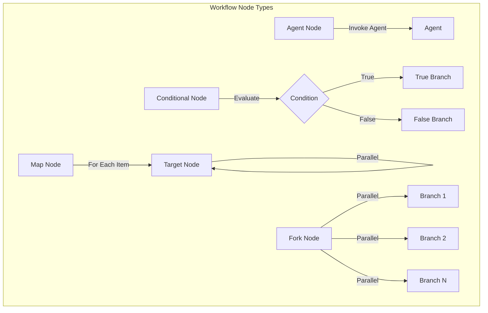

Workflows are orchestration components within the Agent Mesh framework that coordinate multiple agents in defined sequences or patterns. They:

* orchestrate complex, multi-step processes by invoking multiple agents in a coordinated manner
* support conditional branching and parallel execution patterns
* manage data flow between agents using template expressions and operators
* enable building sophisticated agent-based applications without custom orchestration code

:::tip[In one sentence]
Workflows are DAG-based orchestration components that coordinate multiple agents to accomplish complex, multi-step tasks.
:::

## Key Functions

1. **Agent Orchestration**: Workflows coordinate multiple agents by defining execution order, dependencies, and data flow between them.

2. **Conditional Branching**: Workflows support conditional logic, allowing different execution paths based on runtime data or agent outputs.

3. **Parallel Execution**: Workflows can execute multiple agents concurrently or process arrays of items in parallel with configurable concurrency limits.

4. **Data Transformation**: Workflows transform and route data between agents using template expressions and operators like `coalesce` and `concat`.

5. **Type Safety**: Workflows support JSON Schema validation for inputs and outputs, ensuring data contracts between workflow nodes.

6. **Reusability**: Workflows can invoke any agent in the mesh by name, promoting component reuse and composition.


## Workflow Architecture

Workflows in Agent Mesh are built on the `solace_agent_mesh.workflow.app` module and use a Directed Acyclic Graph (DAG) execution model. Each workflow is defined by a YAML configuration file that specifies the workflow structure, node types, dependencies, and data flow.

Each workflow integrates with:
- **A2A Protocol**: For communication with agents
- **DAG Executor**: For managing node execution order and dependencies
- **Template Engine**: For resolving data references and expressions
- **Agent Registry**: For discovering and invoking agents

Workflows function as meta-agents in the system. They expose an agent card and can be invoked through the A2A protocol just like regular agents, but instead of performing work directly, they delegate to other agents according to their defined structure.

### Workflow Execution Model

Workflows execute as directed acyclic graphs where each node represents either an agent invocation or a control flow operation:

- **Initialization**: The workflow receives input and validates it against the input schema (if provided).

- **Node Execution**: Nodes execute in topological order based on their dependencies. A node runs only when all its dependencies have completed successfully.

- **Data Flow**: Each node can access workflow input and outputs from completed nodes using template expressions like `{{workflow.input.field}}` or `{{node_id.output.field}}`.

- **Output Mapping**: When all nodes complete, the workflow constructs its final output by evaluating the output mapping expressions.


## Node Types

Workflows support four types of nodes that provide different orchestration capabilities:

### Agent Node

An Agent Node invokes an agent and waits for its response. This is the primary building block for workflows.

- **Purpose**: Execute a specific agent to perform a task
- **Configuration**: Requires `agent_name` field to identify the target agent
- **Input Mapping**: Can explicitly map input fields or infer them from dependencies
- **Use Case**: Any task that requires agent intelligence (data analysis, API calls, transformations)

```yaml
- id: analyze_data
  type: agent
  agent_name: "DataAnalyzer"
  input:
    dataset: "{{workflow.input.raw_data}}"
```

### Conditional Node

A Conditional Node evaluates an expression and routes execution to different branches based on the result.

- **Purpose**: Branch execution based on runtime conditions
- **Configuration**: Requires a `condition` expression and `true_branch` node ID
- **Optional**: `false_branch` for alternate path
- **Use Case**: Business logic routing (approve/reject, priority levels, error handling)

```yaml
- id: check_threshold
  type: conditional
  condition: "'{{analyze_data.output.score}}' > 75"
  true_branch: approve_request
  false_branch: review_manually
```

### Map Node

A Map Node processes an array of items by executing a target node for each item, optionally in parallel.

- **Purpose**: Parallel processing of collections
- **Configuration**: Requires `items` (array reference) and `node` (target node ID)
- **Concurrency**: Optional `concurrency_limit` to control parallel execution
- **Use Case**: Batch processing, parallel data transformations, fan-out patterns

```yaml
- id: process_orders
  type: map
  items: "{{workflow.input.orders}}"
  node: process_single_order
  concurrency_limit: 5
```

### Fork Node

A Fork Node executes multiple branches in parallel and merges their outputs.

- **Purpose**: Execute multiple independent tasks concurrently
- **Configuration**: Requires `branches` array with agent names and input mappings
- **Output**: Merged results from all branches
- **Use Case**: Gathering data from multiple sources, parallel validations

```yaml
- id: gather_info
  type: fork
  branches:
    - id: get_customer
      agent_name: "CustomerService"
      input:
        customer_id: "{{workflow.input.id}}"
      output_key: customer
    - id: get_orders
      agent_name: "OrderService"
      input:
        customer_id: "{{workflow.input.id}}"
      output_key: orders
```




## Potential Workflow Examples

- **Order Processing with Risk Evaluation**: A workflow that evaluates order risk and routes high-risk orders for manual review while automatically approving low-risk orders.

- **Batch Data Transformation Pipeline**: A workflow that retrieves data from a source, processes each item in parallel, and aggregates the results into a summary report.

- **Multi-Agent Coordination**: A workflow that coordinates multiple specialized agents (data retrieval, analysis, visualization) to generate comprehensive reports.

- **Conditional Business Logic**: A workflow that implements approval hierarchies, escalation paths, or multi-stage validation processes.


## When to Use Workflows

Use workflows when you need to:

- **Coordinate Multiple Agents**: When a task requires sequential or parallel execution of multiple agents with defined data flow.

- **Implement Business Logic**: When you need conditional branching, approval processes, or complex decision trees.

- **Process Collections**: When you need to process arrays or batches of items, potentially in parallel.

- **Ensure Type Safety**: When you want to enforce input/output contracts between agents using JSON Schema.

Use a single agent when:

- The task can be accomplished by one agent with its tools
- You don't need explicit orchestration logic
- The workflow would only contain a single agent node


## Workflow Configuration

Workflows are configured through YAML files similar to agents, but use the workflow app module:

```yaml
apps:
  - name: my_workflow
    app_module: solace_agent_mesh.workflow.app
    broker:
      <<: *broker_connection
    app_config:
      namespace: ${NAMESPACE}
      agent_name: "MyWorkflow"
      display_name: "My Workflow"

      workflow:
        description: "Workflow description here"

        input_schema:
          type: object
          properties:
            # Define expected inputs

        output_schema:
          type: object
          properties:
            # Define expected outputs

        nodes:
          # Define workflow nodes here

        output_mapping:
          # Map node outputs to final workflow output
```

For detailed information on creating and configuring workflows, see [Creating Workflows](../developing/create-workflows.md).

For a complete reference of all workflow configuration parameters, see [Workflow Configuration](../installing-and-configuring/configurations.md#workflow-configuration).
