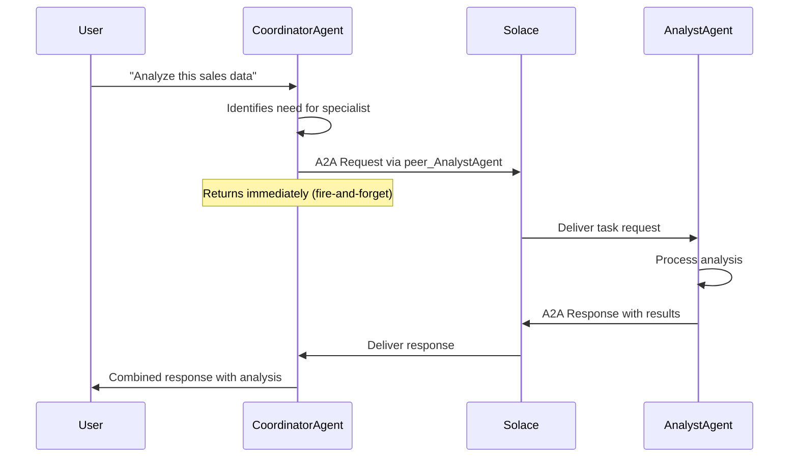

# Inter-Agent Communication

## Overview

Inter-agent communication enables agents to delegate tasks to peer agents within the Agent Mesh ecosystem. This powerful capability allows you to build sophisticated multi-agent workflows where specialized agents collaborate to solve complex problems.

### Key Concepts

- **Peer Agent Tool**: Automatically generated tools that enable one agent to delegate tasks to another
- **A2A Protocol**: Agent-to-Agent messaging protocol over Solace event broker
- **Task Delegation**: The process of one agent requesting another agent to perform a subtask
- **Artifact Sharing**: Passing files and data between agents during delegation

### Use Cases

- **Specialist Delegation**: A coordinator agent delegates domain-specific tasks to specialist agents
- **Workflow Orchestration**: Sequential processing across multiple specialized agents
- **Parallel Processing**: Distributing work across multiple agents for concurrent execution
- **Knowledge Sharing**: Agents with different capabilities collaborating on complex requests

---

## How It Works

### Architecture Overview

When agents are deployed in Agent Mesh, they automatically discover each other through the agent registry. For each peer agent discovered, a dynamic `peer_<agent_name>` tool is created and made available to other agents.



### Task Delegation Flow

1. **Discovery**: Agents discover peers through the agent registry
2. **Tool Generation**: `peer_<agent_name>` tools are automatically created
3. **Invocation**: Agent calls peer tool with task description and optional artifacts
4. **Message Routing**: Request sent via Solace A2A protocol
5. **Execution**: Peer agent receives and processes the task
6. **Response**: Results returned asynchronously to calling agent
7. **Continuation**: Calling agent incorporates peer results and continues

### Security Context Propagation

User security context (scopes, permissions) is automatically propagated through delegation chains:

- User scopes are maintained across all agent interactions
- RBAC policies are enforced at each delegation level
- Artifacts are scoped to user sessions for privacy

---

## Configuration

### Basic Agent Setup

No special configuration is required for inter-agent communication - it's enabled by default when agents are deployed in the same namespace.

```yaml
apps:
  # Coordinator agent
  - name: coordinator
    app_module: solace_agent_mesh.agent.sac.app
    app_config:
      namespace: "myorg/production"
      agent_name: "CoordinatorAgent"
      instruction: "You coordinate tasks and delegate to specialist agents."
      model: "gemini-1.5-pro"

  # Specialist agent
  - name: analyst
    app_module: solace_agent_mesh.agent.sac.app
    app_config:
      namespace: "myorg/production"
      agent_name: "DataAnalystAgent"
      instruction: "You are a data analysis specialist."
      model: "gemini-1.5-pro"
```

The `CoordinatorAgent` will automatically have access to `peer_DataAnalystAgent` tool.

### Timeout Configuration

Configure request timeout for peer agent communication:

```yaml
app_config:
  inter_agent_communication:
    request_timeout_seconds: 600  # Default: 600 (10 minutes)
```

### Restricting Peer Access with RBAC

Control which agents users can delegate to using required scopes:

```yaml
# In your agent configuration
app_config:
  # Only users with specific delegation scope can use this agent
  required_scopes:
    - "agent:DataAnalystAgent:delegate"
```

Then configure roles with appropriate scopes:

```yaml
# roles.yaml
roles:
  - name: "analyst_user"
    scopes:
      - "agent:DataAnalystAgent:delegate"
      - "agent:CoordinatorAgent:delegate"

  - name: "basic_user"
    scopes:
      - "agent:CoordinatorAgent:delegate"
      # Cannot directly access DataAnalystAgent
```

---

## Usage Patterns

### Pattern 1: Specialist Agent Delegation

A generalist coordinator delegates domain-specific work to specialist agents.

#### Example: Research Coordinator

**Scenario**: A coordinator agent delegates research tasks to specialized agents.

```yaml
apps:
  - name: coordinator
    app_config:
      namespace: "research/prod"
      agent_name: "ResearchCoordinator"
      instruction: |
        You coordinate research tasks. When users ask for:
        - Financial analysis: delegate to FinancialAnalystAgent
        - Market research: delegate to MarketResearchAgent
        - Legal review: delegate to LegalReviewAgent
        Always provide context and relevant artifacts to specialists.

  - name: financial_analyst
    app_config:
      namespace: "research/prod"
      agent_name: "FinancialAnalystAgent"
      instruction: "You are a financial analysis specialist."
      tools:
        - tool_type: builtin-group
          group_name: "data_analysis"

  - name: market_researcher
    app_config:
      namespace: "research/prod"
      agent_name: "MarketResearchAgent"
      instruction: "You specialize in market research and trend analysis."
      tools:
        - tool_type: builtin-group
          group_name: "web"
```

**Example Interaction**:

```
User: "Analyze the Q3 2024 financial report and identify market trends"

ResearchCoordinator:
1. Calls peer_FinancialAnalystAgent with task: "Analyze Q3 2024 financial report"
2. Calls peer_MarketResearchAgent with task: "Identify market trends from Q3 2024"
3. Synthesizes both responses into comprehensive analysis
```

### Pattern 2: Sequential Workflow

Tasks flow through multiple agents in sequence, with each adding value.

#### Example: Document Processing Pipeline

```yaml
apps:
  - name: intake_agent
    app_config:
      agent_name: "DocumentIntakeAgent"
      instruction: |
        You receive documents from users. Extract key information, then:
        1. Delegate to DocumentClassifierAgent for classification
        2. Based on classification, route to appropriate specialist

  - name: classifier
    app_config:
      agent_name: "DocumentClassifierAgent"
      instruction: "Classify documents by type (invoice, contract, report, etc.)"

  - name: invoice_processor
    app_config:
      agent_name: "InvoiceProcessorAgent"
      instruction: "Extract invoice data and validate against business rules."
      tools:
        - tool_type: builtin-group
          group_name: "data_analysis"
```

**Flow**:
```
User → IntakeAgent → ClassifierAgent → InvoiceProcessorAgent → User
```

### Pattern 3: Parallel Task Processing

Distribute independent subtasks across multiple agents for concurrent execution.

#### Example: Multi-Source Data Aggregation

```yaml
apps:
  - name: aggregator
    app_config:
      agent_name: "DataAggregatorAgent"
      instruction: |
        You aggregate data from multiple sources. Delegate to:
        - SalesDataAgent for sales metrics
        - MarketingDataAgent for campaign metrics
        - CustomerDataAgent for customer metrics
        Then combine all results into unified dashboard.

  - name: sales_data
    app_config:
      agent_name: "SalesDataAgent"
      instruction: "Fetch and analyze sales data."

  - name: marketing_data
    app_config:
      agent_name: "MarketingDataAgent"
      instruction: "Fetch and analyze marketing campaign data."

  - name: customer_data
    app_config:
      agent_name: "CustomerDataAgent"
      instruction: "Fetch and analyze customer engagement data."
```

**Parallel Execution**:
All three data agents can be called simultaneously, reducing total processing time.

---

## Tool Usage

### Basic Delegation

The peer agent tool accepts three parameters:

| Parameter | Type | Required | Description |
|-----------|------|----------|-------------|
| `task_description` | string | Yes | Detailed description of what the peer agent should do |
| `user_query` | string | No | Original user query for additional context |
| `artifacts` | array | No | List of artifact references to provide as context |

### Example 1: Simple Task Delegation

```python
# LLM automatically calls:
peer_DataAnalystAgent(
    task_description="Calculate the average revenue per customer from the sales data"
)
```

The peer agent receives this task and executes it independently.

### Example 2: Delegation with Context

```python
peer_ReportGeneratorAgent(
    task_description="Generate a comprehensive Q3 2024 sales performance report",
    user_query="Create a Q3 sales report with charts and key insights"
)
```

Providing `user_query` gives the peer agent the original user intent.

### Example 3: Delegation with Artifacts

```python
peer_CodeReviewAgent(
    task_description="Review the code for security vulnerabilities and best practices",
    user_query="Review this Python implementation",
    artifacts=[
        {"filename": "main.py", "version": "latest"},
        {"filename": "utils.py", "version": "2"},
        {"filename": "requirements.txt", "version": "latest"}
    ]
)
```

The peer agent automatically has access to the specified artifacts.

### Artifact Specification

Artifacts are referenced by filename and optional version:

```python
# Latest version (default)
{"filename": "data.csv"}

# Specific version
{"filename": "data.csv", "version": "3"}

# Explicit latest
{"filename": "data.csv", "version": "latest"}
```

---

## Advanced Topics

### Timeout Handling

Configure timeouts to prevent long-running delegations from blocking:

```yaml
app_config:
  inter_agent_communication:
    request_timeout_seconds: 300  # 5 minutes for quick tasks
```

**Timeout Behavior**:
- After timeout expires, calling agent receives timeout error
- Peer agent may still be processing (fire-and-forget pattern)
- Calling agent can handle timeout gracefully and continue

**Example Timeout Handling**:

```yaml
instruction: |
  When delegating to peer agents:
  - If you receive a timeout error, inform the user the task is taking longer than expected
  - Offer to proceed without that specific result if possible
  - Suggest alternative approaches
```

### Error Handling

Peer agents may return errors. The calling agent should handle these gracefully:

**Common Errors**:
- **Peer Not Found**: Target agent is not available or not in the same namespace
- **Timeout**: Task exceeded configured timeout
- **Permission Denied**: User lacks required delegation scope
- **Message Size Exceeded**: Request payload too large

**Error Response Example**:

```json
{
  "status": "error",
  "message": "Failed to delegate task to peer agent 'AnalystAgent': Peer agent 'AnalystAgent' not found or unavailable."
}
```

**Agent Instruction for Error Handling**:

```yaml
instruction: |
  When peer agent delegation fails:
  1. Acknowledge the error to the user
  2. Attempt the task yourself if you have the capability
  3. If unable, explain the limitation and suggest alternatives
  4. Never expose technical error details to users
```

### Multi-Level Delegation

Agents can delegate to peers, which can further delegate to other peers:

```
User → AgentA → AgentB → AgentC
```

**Considerations**:
- Each level adds latency
- Timeout applies to direct peer call, not entire chain
- Security context propagates through entire chain
- Artifacts can be shared across all levels

**Best Practice**: Limit delegation depth to 2-3 levels for manageable complexity.

### Artifact Propagation

Artifacts created by peer agents are automatically registered with the calling agent:

```python
# Peer creates analysis_result.csv
# Calling agent automatically has access to it
# Can reference it in subsequent operations or return to user
```

This "artifact bubbling" ensures all generated files are available upstream.

---

## Complete Examples

### Example 1: Customer Support Workflow

A customer support agent coordinates with specialist agents to resolve issues.

**Configuration**:

```yaml
apps:
  - name: support_coordinator
    app_config:
      namespace: "support/prod"
      agent_name: "SupportCoordinator"
      instruction: |
        You are a customer support coordinator. When customers have:
        - Billing questions: delegate to BillingAgent
        - Technical issues: delegate to TechnicalSupportAgent
        - Account problems: delegate to AccountAgent

        Always summarize the specialist's response in customer-friendly language.

      tools:
        - tool_type: builtin-group
          group_name: "artifact_management"

  - name: billing_agent
    app_config:
      namespace: "support/prod"
      agent_name: "BillingAgent"
      instruction: "You handle billing inquiries and have access to billing systems."
      tools:
        - tool_type: python
          component_module: "company.tools.billing"
          function_name: "lookup_invoice"

  - name: technical_agent
    app_config:
      namespace: "support/prod"
      agent_name: "TechnicalSupportAgent"
      instruction: "You troubleshoot technical issues."
      tools:
        - tool_type: python
          component_module: "company.tools.diagnostics"
          function_name: "run_diagnostics"
```

**Interaction Flow**:

```
User: "I was charged twice for my November subscription"

SupportCoordinator:
  → Recognizes billing issue
  → Calls peer_BillingAgent(
      task_description="Investigate duplicate charge for November subscription",
      user_query="I was charged twice for my November subscription"
    )
  → Receives: "Found duplicate charge on Nov 15. Invoice #12345 and #12346. Refund initiated."
  → Responds: "I've found the issue - you were indeed charged twice on November 15th.
              I've initiated a refund for the duplicate charge (invoice #12346).
              You should see the refund in 3-5 business days."
```

### Example 2: Content Creation Pipeline

Sequential workflow for creating, reviewing, and publishing content.

**Configuration**:

```yaml
apps:
  - name: content_creator
    app_config:
      agent_name: "ContentCreatorAgent"
      instruction: |
        You create draft content based on user requirements.
        After creating content, always delegate to EditorAgent for review.
      tools:
        - tool_type: builtin-group
          group_name: "artifact_management"

  - name: editor
    app_config:
      agent_name: "EditorAgent"
      instruction: |
        You review content for grammar, style, and clarity.
        After editing, delegate to SEOAgent for optimization.
      tools:
        - tool_type: builtin-group
          group_name: "artifact_management"

  - name: seo_optimizer
    app_config:
      agent_name: "SEOAgent"
      instruction: |
        You optimize content for search engines.
        After optimization, delegate to PublisherAgent for final publishing.
      tools:
        - tool_type: builtin-group
          group_name: "artifact_management"
```

**Flow**:

```
User: "Create a blog post about AI trends in healthcare"

ContentCreatorAgent:
  → Creates draft.md artifact
  → peer_EditorAgent(task="Review and improve this blog post", artifacts=["draft.md"])

EditorAgent:
  → Reviews draft.md
  → Creates edited_draft.md
  → peer_SEOAgent(task="Optimize for SEO", artifacts=["edited_draft.md"])

SEOAgent:
  → Optimizes content
  → Creates final_post.md
  → peer_PublisherAgent(task="Publish to blog", artifacts=["final_post.md"])

User receives: "Blog post created, edited, optimized, and published!"
```

### Example 3: Research and Analysis

Parallel data gathering with sequential analysis.

**Configuration**:

```yaml
apps:
  - name: research_orchestrator
    app_config:
      agent_name: "ResearchOrchestrator"
      instruction: |
        You orchestrate research tasks:
        1. Delegate web research to WebResearchAgent (parallel)
        2. Delegate database queries to DataAgent (parallel)
        3. Wait for all results
        4. Delegate synthesis to AnalysisAgent (sequential)
      tools:
        - tool_type: builtin-group
          group_name: "artifact_management"

  - name: web_researcher
    app_config:
      agent_name: "WebResearchAgent"
      tools:
        - tool_type: builtin-group
          group_name: "web"

  - name: data_agent
    app_config:
      agent_name: "DataAgent"
      tools:
        - tool_type: builtin-group
          group_name: "data_analysis"

  - name: analyst
    app_config:
      agent_name: "AnalysisAgent"
      instruction: "Synthesize research findings into actionable insights."
```

**Execution**:

```
User: "Research electric vehicle market trends"

ResearchOrchestrator (parallel calls):
  → peer_WebResearchAgent(task="Find latest EV market news and reports")
  → peer_DataAgent(task="Query EV sales data from database")

[Both execute concurrently]

ResearchOrchestrator (after both complete):
  → peer_AnalysisAgent(
      task="Synthesize findings into market trend report",
      artifacts=["web_research.md", "sales_data.csv"]
    )

AnalysisAgent:
  → Creates comprehensive_report.md

User receives: Complete market analysis with web + database insights
```

---

## Best Practices

### 1. Clear Task Descriptions

Provide detailed, actionable task descriptions:

```yaml
# Good
task_description: "Analyze the Q3 sales data CSV and calculate:
  (1) total revenue,
  (2) average order value,
  (3) top 5 products by sales.
  Return results in a formatted report."

# Poor
task_description: "Analyze data"
```

### 2. Appropriate Delegation

Only delegate when necessary:

- **Delegate**: Tasks requiring specialized tools or knowledge
- **Don't Delegate**: Simple tasks within your capability

### 3. Timeout Management

Set realistic timeouts based on task complexity:

```yaml
# Quick lookups
request_timeout_seconds: 60

# Data processing
request_timeout_seconds: 300

# Complex analysis
request_timeout_seconds: 600
```

### 4. Error Recovery

Always have fallback strategies:

```yaml
instruction: |
  When peer delegation fails:
  1. Try alternative peer if available
  2. Attempt task yourself if possible
  3. Ask user for clarification
  4. Provide partial results if applicable
```

### 5. Artifact Management

Be explicit about which artifacts to share:

```python
# Share only relevant artifacts
artifacts=[
    {"filename": "sales_data.csv"},  # Needed for analysis
    # Don't include: user_profile.json (not relevant)
]
```

### 6. Namespace Organization

Group related agents in the same namespace:

```yaml
# Good - related agents in same namespace
namespace: "finance/prod"
  - CoordinatorAgent
  - InvoiceAgent
  - ReportAgent

# Avoid - mixing unrelated agents
namespace: "prod"
  - FinanceAgent
  - HRAgent
  - ITAgent  # Better in separate namespaces
```

---

## Security Considerations

### Scope-Based Access Control

Restrict agent delegation using RBAC:

```yaml
# Role definition
roles:
  - name: "premium_user"
    scopes:
      - "agent:*:delegate"  # Can delegate to any agent

  - name: "basic_user"
    scopes:
      - "agent:CoordinatorAgent:delegate"  # Only coordinator
```

### Data Isolation

- Artifacts are automatically scoped to user sessions
- Peer agents inherit calling user's security context
- No cross-user data access in delegations

### Audit Trail

All inter-agent communications are logged:

```
[PeerTool:DataAnalyst] Task delegated by CoordinatorAgent
[PeerTool:DataAnalyst] User: user@example.com, Session: abc123
[PeerTool:DataAnalyst] Task completed in 2.3s
```