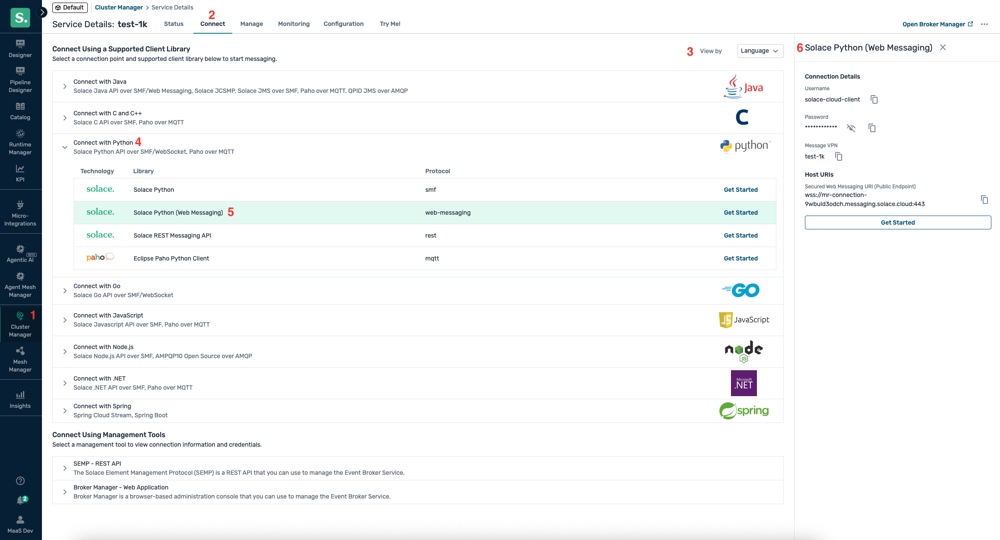

This guide walks you through installing and running Agent Mesh Enterprise using Docker. You will download the enterprise image, load it into Docker, and launch a container configured for either development or production use.

:::tip
All the `docker` commands can also be run using any Docker-compatible tool, such as [Podman](https://podman.io/).
:::

## Prerequisites

Before you begin, ensure you have the following:

- Docker installed on your system
- Access to the [Solace Product Portal](https://products.solace.com/prods/Agent_Mesh/Enterprise/)
- An LLM service API key and endpoint (optional—you can configure models through the Agent Mesh UI after starting the application)
- For production deployments, Solace broker credentials

## Understanding the Installation Process

The installation process consists of three main steps. First, you download and load the Docker image into your local Docker environment. This makes the Agent Mesh Enterprise software available on your system. Second, you identify the exact image name and tag that Docker assigned during the load process. You need this information to reference the correct image when starting your container. Finally, you run the container with the appropriate configuration for your use case—either development mode with an embedded broker or production mode connected to an external Solace broker.

## Step 1: Download and Load the Enterprise Image

You need to obtain the Agent Mesh Enterprise Docker image from the Solace Product Portal and load it into your Docker environment.

Download the latest enterprise docker image tarball from the [Solace Product Portal](https://products.solace.com/prods/Agent_Mesh/Enterprise/).

After downloading the tarball, load the image into Docker. This command extracts the image from the compressed archive and makes it available in your local Docker image repository.

```bash
docker load -i solace-agent-mesh-enterprise-<tag>.tar.gz
```

Ensure you replace `<tag>` with the appropriate version number from your downloaded file.

## Step 2: Identify the Image Name

After loading the image, you need to identify its full name and tag. Docker assigns a repository name and tag to the image during the load process, and you will use this information when running the container.

Run the following command to list all Docker images on your system:

```bash
docker images
```

The output displays all available images with their repository names, tags, image IDs, creation dates, and sizes. Look for the Agent Mesh Enterprise image in the list.

Example output:
```bash
REPOSITORY                                                                 TAG                IMAGE ID      CREATED      SIZE
868978040651.dkr.ecr.us-east-1.amazonaws.com/solace-agent-mesh-enterprise  1.0.37-c8890c7f31  2589d25d0917  9 days ago   5.25 GB
```

Take note of the complete repository name and tag. You will need this full identifier when starting the container. In the example above, the complete image name is `868978040651.dkr.ecr.us-east-1.amazonaws.com/solace-agent-mesh-enterprise:1.0.37-c8890c7f31`.

The numeric hashes at the beginning and end of the repository name (such as `868978040651` and `c8890c7f31`) vary between versions and builds. Your image will have different hash values.

## Step 3: Run the Container

You can run Agent Mesh Enterprise in two different modes depending on your needs. Development mode uses an embedded Solace broker for quick testing and experimentation, while production mode connects to an external Solace broker for enterprise deployments.

:::tip
You may need to include `--platform linux/amd64` depending on the host machine you're using.
:::

:::warning[Authorization Required]
**Agent Mesh Enterprise uses secure-by-default authorization.** Without explicit authorization configuration, the system will **deny all access** to protect your deployment.

For production use, you must configure RBAC (Role-Based Access Control) to grant access to users. See the [RBAC Setup Guide](./rbac-setup-guide.md) for details.

For development/testing only, you can disable authorization by setting `type: none` in your configuration, but this should **never** be used in production. (see example below)
:::


### Running in Development Mode

Development mode simplifies getting started by using an embedded Solace broker. This configuration requires fewer parameters and allows you to test Agent Mesh Enterprise without setting up external infrastructure. Use this mode for local development, testing, and evaluation.

The following command starts a container in development mode. The `-itd` flags run the container in interactive mode with a pseudo-TTY, detached in the background. The `-p 8001:8000` flag maps port 8000 inside the container to port 8001 on your host machine, making the web UI accessible at `http://localhost:8001`.

```bash
docker run -itd -p 8001:8000 \
  -e NAMESPACE="<YOUR_NAMESPACE>" \
  -e SOLACE_DEV_MODE="true" \
  -e SAM_AUTHORIZATION_CONFIG="/preset/auth/insecure_permissive_auth_config.yaml" \
  --name sam-ent-dev \
  solace-agent-mesh-enterprise:<tag>
```

Replace the placeholder values with your actual configuration:

- `<YOUR_NAMESPACE>`: A unique identifier for your deployment (such as "sam-dev")
- `<tag>`: The image tag you identified in Step 2

The `SOLACE_DEV_MODE="true"` environment variable tells the container to use the embedded broker instead of connecting to an external one.

:::tip[Configure Models Through the UI]
After starting Solace Agent Mesh, open the web interface at `http://localhost:8001` and configure your AI models from the **Models** page. The platform guides you through the initial model setup on first use. For details, see [Model Configurations](../installing-and-configuring/model_configurations.md).

Alternatively, you can provide LLM configuration as environment variables at container startup by adding `-e LLM_SERVICE_API_KEY`, `-e LLM_SERVICE_ENDPOINT`, `-e LLM_SERVICE_PLANNING_MODEL_NAME`, and `-e LLM_SERVICE_GENERAL_MODEL_NAME` to the `docker run` command. This is useful for automated or headless deployments.
:::

<details>
    <summary>Example: Basic Development Mode (Secure Default - Access Denied)</summary>

    ```bash
    docker run -itd -p 8001:8000 \
      -e NAMESPACE="sam-dev" \
      -e SOLACE_DEV_MODE="true" \
      --name sam-ent-dev \
      868978040651.dkr.ecr.us-east-1.amazonaws.com/solace-agent-mesh-enterprise:1.0.37-c8890c7f31
    ```
    
    **Note:** This configuration uses secure defaults and will deny all access. You must configure RBAC or use the following permissive development configuration. After starting Solace Agent Mesh, configure your AI models from the **Models** page in the web interface at `http://localhost:8001`.
</details>

<details>
    <summary>Example: Development Mode with Permissive Authorization (Development Only)</summary>

    You can use the pre-configured development configuration file provided in the `preset` directory. Run the container with the `SAM_AUTHORIZATION_CONFIG` environment variable pointing to this file to disable authorization checks.
    
    ```bash
    docker run -itd -p 8001:8000 \
      -e NAMESPACE="sam-dev" \
      -e SOLACE_DEV_MODE="true" \
      -e SAM_AUTHORIZATION_CONFIG="/preset/auth/insecure_permissive_auth_config.yaml" \
      --name sam-ent-dev \
      868978040651.dkr.ecr.us-east-1.amazonaws.com/solace-agent-mesh-enterprise:1.0.37-c8890c7f31
    ```
    
    After starting Solace Agent Mesh, configure your AI models from the **Models** page in the web interface at `http://localhost:8001`.

    **⚠️ Warning:** This configuration disables authorization and grants full access. Use only for local development.
</details>

### Running in Production Mode

Production mode connects to an external Solace broker, which provides enterprise-grade messaging capabilities including high availability, disaster recovery, and scalability. Use this mode when deploying Agent Mesh Enterprise in production environments.

The production configuration requires additional environment variables to specify the Solace broker connection details. These credentials allow the container to connect to your Solace Cloud service or on-premises broker.

```bash
docker run -itd -p 8001:8000 \
  -e NAMESPACE="<YOUR_NAMESPACE>" \
  -e SOLACE_DEV_MODE="false" \
  -e SOLACE_BROKER_URL="<YOUR_BROKER_URL>" \
  -e SOLACE_BROKER_VPN="<YOUR_BROKER_VPN>" \
  -e SOLACE_BROKER_USERNAME="<YOUR_BROKER_USERNAME>" \
  -e SOLACE_BROKER_PASSWORD="<YOUR_BROKER_PASSWORD>" \
  --name sam-ent-prod \
  solace-agent-mesh-enterprise:<tag>
```

After starting Solace Agent Mesh, configure your AI models from the **Models** page in the web interface. You can also provide LLM configuration as environment variables at startup (see the preceding development mode section for details).

Replace the placeholder values with your actual configuration. You need to provide:

- `<YOUR_BROKER_URL>`: The secured Web Messaging URI for your Solace broker
- `<YOUR_BROKER_VPN>`: The Message VPN name for your Solace service
- `<YOUR_BROKER_USERNAME>`: The username for broker authentication
- `<YOUR_BROKER_PASSWORD>`: The password for broker authentication

The `SOLACE_DEV_MODE="false"` environment variable tells the container to connect to the external broker specified by the other SOLACE_BROKER parameters instead of using the embedded broker.

**Ensure you have set up proper RBAC authorization for production deployments.** For more information, see [RBAC Setup Guide](./rbac-setup-guide.md).

<details>
    <summary>How to find your credentials</summary>

    Go to Solace Cloud.

    Cluster manager > Your Service > Connect

    Switch dropdown to View by Language

    Open the connect with Python dropdown

    Click Solace Python (Web Messaging) as the protocol.

    Copy:
    - Username for SOLACE_BROKER_USERNAME,
    - Password for SOLACE_BROKER_PASSWORD,
    - Message VPN for SOLACE_BROKER_VPN
    - Secured Web Messaging URI for SOLACE_BROKER_URL

    

</details>

## Infrastructure Setup: S3 Buckets for OpenAPI Connector Specs

Some enterprise features require additional infrastructure setup. If you plan to use the OpenAPI Connector feature, you must configure a dedicated S3 bucket for OpenAPI specification files. This is separate from artifact storage and is required for agents to download OpenAPI specs at startup.

### When is a connector specs bucket required?
- When using the OpenAPI Connector feature for REST API integrations
- When deploying via Kubernetes (Helm charts handle this automatically)
- When agents must access OpenAPI spec files at startup

### Why a separate bucket?
- **Public read access**: Agents must download OpenAPI specs without authentication
- **Security isolation**: Keeps infrastructure files separate from user artifacts
- **No secrets**: Only API schemas, endpoints, and models are stored (never credentials)

### Setup Instructions

1. **Create the connector specs S3 bucket** (public read, authenticated write):
   ```bash
   aws s3 mb s3://my-connector-specs-bucket --region us-west-2
   ```

2. **Apply a public read policy**:
   Save as `connector-specs-policy.json`:
   ```json
   {
     "Version": "2012-10-17",
     "Statement": [{
       "Sid": "PublicReadGetObject",
       "Effect": "Allow",
       "Principal": "*",
       "Action": "s3:GetObject",
       "Resource": "arn:aws:s3:::my-connector-specs-bucket/*"
     }]
   }
   ```
   Apply with:
   ```bash
   aws s3api put-bucket-policy \
     --bucket my-connector-specs-bucket \
     --policy file://connector-specs-policy.json
   ```

3. **IAM permissions for write access** (for the SAM service):
   - Grant `s3:PutObject`, `s3:DeleteObject`, `s3:ListBucket` to the SAM platform's IAM user/role for this bucket.

4. **Kubernetes deployments**: Use the `connectorSpecBucketName` value in your Helm chart.

5. **Standalone deployments**: The platform manages the connector specs bucket; see your deployment guide.

### Security Notes
- Never store API keys, passwords, or secrets in OpenAPI spec files
- Public read is safe for API schemas only
- Write access should be restricted to the platform

## Infrastructure Setup: S3 Bucket for Eval Data (Offline Evaluations)

If you plan to use the [Offline Evaluations](offline-evaluations.md) feature, the platform service stores execution data and artifact snapshots in object storage. By default this reuses the artifacts bucket; provisioning a dedicated bucket is optional and only needed for IAM or lifecycle separation.

### When is a dedicated eval data bucket required?
- It is **optional** — by default, eval data shares the artifacts bucket under `{namespace}/eval/runs/...` keys
- When you want separate IAM, retention, or replication policies for eval data
- When deploying via Kubernetes (Helm charts handle this automatically)

### Setup Instructions

1. **Create the eval data S3 bucket** (private, authenticated read/write):
   ```bash
   aws s3 mb s3://my-eval-data-bucket --region us-west-2
   ```

2. **IAM permissions for the SAM service**:
   - Grant `s3:PutObject`, `s3:GetObject`, `s3:DeleteObject`, `s3:ListBucket` for this bucket.

3. **Kubernetes deployments**: Set `dataStores.s3.evalDataBucketName` (or the Azure / GCS equivalent) in your Helm chart values. Leave empty to share the artifacts bucket.

4. **Standalone deployments**: Set `EVAL_DATA_BUCKET_NAME` on the platform service. When unset, eval data falls back to an ephemeral local filesystem path.

### Security Notes
- Keep the bucket private — no public read access is needed
- Apply lifecycle rules to age out historical eval data if desired
- The same credential used for the artifacts bucket can be used here when both share a provider

## Accessing the Web UI

After starting the container in either development or production mode, you can access the Agent Mesh Enterprise web interface through your browser. The UI provides a graphical interface for managing agents, monitoring activity, and configuring your deployment.

Navigate to `http://localhost:8001` in your web browser. The port number corresponds to the host port you specified in the `-p 8001:8000` flag when running the container.

## Troubleshooting and Debugging

If you encounter issues or need to investigate the behavior of your Agent Mesh Enterprise deployment, you can examine the log files generated by the container. These logs provide detailed information about system operations, errors, and debugging information.

To view logs, check the `.log` files in your container. For information about changing debug levels and advanced debugging techniques, see [Diagnosing and Resolving Problems](../deploying/debugging.md).
