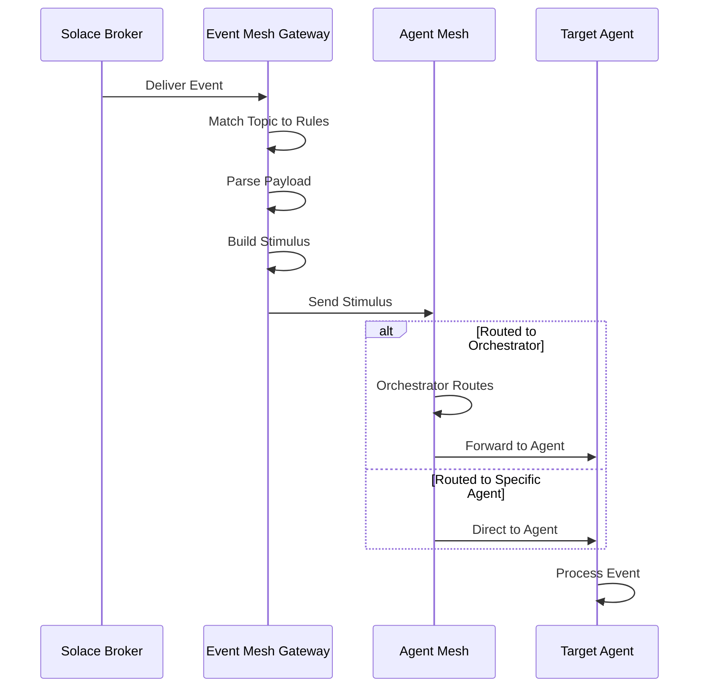

# Event Mesh Gateway

Event Mesh gateways enable Agent Mesh to consume events from Solace PubSub+ Event Mesh brokers and route them to agents. This gateway type triggers agent workflows in response to business events in real time.

## Overview

Event Mesh gateways subscribe to topics on Solace brokers and transform incoming events into agent requests. When an event arrives, the gateway applies configured event rules to determine which agent should process the event, then forwards the event payload as a stimulus to the Agent Mesh. Agents can process or enrich the event data, and the gateway can optionally publish the agent's response back to the event mesh.

You can use this integration to build systems that respond to business events automatically. For example, you can configure a gateway to listen for order events and trigger an agent that processes order data, or subscribe to sensor readings and route them to an analytics agent.

The gateway supports connecting to either the default SAM broker (the same broker Agent Mesh uses internally) or a custom external broker with separate connection credentials.

## Prerequisites

Before creating an Event Mesh gateway, verify that you have the following:

### Solace Broker Access

You need access to a Solace PubSub+ event broker with appropriate permissions to subscribe to topics. This can be the default SAM broker or a separate external broker.

### Topic Subscription Permissions

The broker credentials you configure must have permission to subscribe to the topics defined in your event rules. Work with your Solace administrator to ensure appropriate ACL (Access Control List) configuration.

### Network Connectivity

If connecting to an external broker, verify that network firewalls and security groups allow traffic from Agent Mesh Enterprise to your broker on the appropriate ports. The gateway supports tcp, tcps, ws, and wss protocols. Default ports are 55555 for SMF and 55443 for Secure SMF.

## Creating an Event Mesh Gateway

You create Event Mesh gateways through the Gateways section in the Agent Mesh Enterprise web interface. Navigate to Gateways and click the Create Gateway button, then select "Event Mesh" as the gateway type.

### Configuration Fields

The Event Mesh gateway creation form requires the following information:

#### Basic Details

##### Gateway Name

A unique identifier for this gateway within your Agent Mesh deployment. Choose a descriptive name that indicates the gateway's purpose, such as `Order Events Gateway` or `IoT Sensor Gateway`. This name appears in the gateway list and deployment status.

The gateway name must be unique across all gateways in your deployment. Names must be 3–255 characters.

##### Description

A description explaining what the gateway does and its intended use case. This helps administrators understand the gateway's purpose. Descriptions must be 10–1000 characters.

#### Broker Connection

##### Use Default Broker

Select whether to use the default SAM broker or configure a custom external broker connection.

- Default Broker: Uses the same Solace broker that Agent Mesh uses for internal communication. No additional connection configuration required.
- Custom Broker: Requires you to provide a Broker URL, VPN name, and credentials for an external broker.

##### Custom Broker Settings

When not using the default broker, you must provide the following connection details:

| Field | Description | Example |
|-------|-------------|---------|
| Broker URL | URI with protocol prefix (tcp, tcps, ws, wss), hostname, and port | `tcps://broker.example.com:55443` |
| VPN Name | Message VPN to connect to | `default` |
| Username | Client username for broker authentication | `event-gateway-user` |
| Password | Client password for broker authentication | (stored securely) |

#### Event Rules

Event rules define which topics to subscribe to and how to route incoming events to agents. You can configure multiple event rules for a single gateway, and each rule must have a unique name.

##### Rule Name

Each event rule requires a name that is unique within the gateway. The name must start with a letter and contain only letters, numbers, and underscores (matching the pattern `^[a-zA-Z][a-zA-Z0-9_]*$`). Rule names are compared case-insensitively, so `OrderRule` and `orderrule` are treated as the same name.

##### Subscriptions

Each rule defines one or more topic subscriptions that determine which events the rule processes. Solace wildcard syntax is supported:
- `*` matches exactly one level
- `>` matches one or more levels

Examples:
- `orders/created`—Exact topic match
- `orders/*`—All direct children of `orders/`
- `sensors/>`—All topics under `sensors/` at any depth

##### Target Agent

Select how incoming events should be routed:

- Orchestrator: Route events to the main Orchestrator, which determines the appropriate agent based on event content.
- Specific Agent: Route events directly to a named agent, bypassing the Orchestrator.

##### Message Format

Configure how the gateway interprets incoming event payloads:

| Format | Description |
|--------|-------------|
| JSON | Parse payload as a JSON object |
| Text | Treat payload as a plain text string |

##### Additional Instructions

The Additional Instructions field defines how the event payload is presented to the target agent. You can use template variables to include event data in the instructions:
- `{payload}`—The full event payload
- `{topic}`—The topic the event was received on
- `{payload.field}`—A specific field from a JSON payload

##### Response Output (Optional)

You can optionally configure the gateway to publish agent responses back to the event mesh:

- Success Output: The topic where the agent's response is published when processing succeeds.
- Error Output: The topic where error information is published when processing fails.

If you do not configure output topics, the gateway processes events without publishing responses.

##### Response Type

When output topics are configured, you can control the format of the published response:

| Type | Description |
|------|-------------|
| Text | Publish the agent's text response |
| Full JSON | Publish the complete response as a JSON object |
| Error JSON | Publish error details as a JSON object |
| Custom | Use a custom response format |

### Example Configuration

The following example shows a configuration for an Event Mesh gateway that processes order events:

Basic Details:
- Name: `Order Processing Gateway`
- Description: `Consumes order events from the commerce system and routes them to the order processing agent`

Broker Connection:
- Use Default Broker: No
- Broker URL: `tcps://commerce-broker.example.com:55443`
- VPN Name: `commerce`
- Username: `sam-gateway`
- Password: (configured securely)

Event Rules:
- Rule Name: `process_orders`
- Subscriptions: `commerce/orders/>`
- Target: Specific Agent—`order-processor`
- Message Format: JSON
- Additional Instructions: `Process the following order event: {payload}`
- Success Output: `commerce/orders/processed`
- Response Type: Full JSON

## After Creating the Gateway

After you successfully create the gateway, it appears in the Gateways list with "Not Deployed" status. At this point you can:

1. Edit the configuration to modify settings before deployment.
2. Download YAML to export the configuration for version control.
3. Deploy to create a running gateway instance.

To deploy the gateway, click the Deploy button in the gateway details panel. The gateway status changes to "Deploying" as the Deployer creates the instance, then to "Deployed" when the process completes. For detailed information about gateway deployment and lifecycle management, see [Gateways](gateways.md).

## How Event Processing Works

The following diagram shows the event processing flow when the gateway receives an event from the broker.

1. The broker delivers events matching subscribed topics.
2. The gateway matches the topic against configured event rules.
3. The event payload is parsed according to the configured format.
4. The gateway creates an Agent Mesh stimulus from the event.
5. The stimulus is routed to the Orchestrator or directly to a specific agent.
6. The target agent processes the event and performs configured actions.

## Security Considerations

### Broker Credentials

Event Mesh gateway configurations contain broker credentials when using custom broker connections. These credentials are:

- Stored encrypted in the Platform Service database
- Redacted from API responses (displayed as `********`)
- Injected at deployment time through Kubernetes Secrets

:::warning[Credential Security]
Never commit downloaded YAML files containing actual credentials to version control. Use environment variable placeholders and inject secrets through your deployment pipeline.
:::

### Topic Access Control

The gateway can only subscribe to topics that the configured broker credentials are authorized to access. Work with your Solace administrator to:

- Create dedicated credentials for the gateway
- Configure appropriate ACLs for topic subscriptions
- Limit access to only the topics the gateway needs

### Event Validation

The gateway does not validate event payloads beyond parsing them according to the configured format. Agents receiving events should validate payload structure and content before processing.

## Troubleshooting

### Gateway Shows Disconnected

A deployed gateway shows "Disconnected" connection status.

This issue can occur when the gateway pod crashed or was evicted, when there are network connectivity issues to the broker, when broker credentials are invalid, or when the broker VPN is unavailable.

To resolve this issue:
1. Check Kubernetes pod status: `kubectl get pods | grep gateway`
2. Check pod logs: `kubectl logs <pod-name>`
3. Verify broker connectivity and credentials
4. Consider undeploying and redeploying the gateway

### Events Not Being Processed

Events are published to subscribed topics but agents do not receive them.

This issue can occur when the topic subscription pattern does not match published topics, when event rule routing is misconfigured, or when the target agent is not deployed.

To resolve this issue:
1. Verify the topic subscription pattern matches your published topics
2. Test with a simple exact topic match before using wildcards
3. Check that the target agent is deployed and responding
4. Review gateway logs for subscription or parsing errors

### Payload Parsing Errors

The gateway receives events but fails to process them.

This issue can occur when the payload format configuration does not match the actual event format, when events configured for JSON parsing contain invalid JSON, or when there are encoding issues with text payloads.

To resolve this issue:
1. Verify the payload format setting matches your event format
2. Validate that published events contain valid JSON if using JSON format
3. Check that event encoding matches the configured setting
