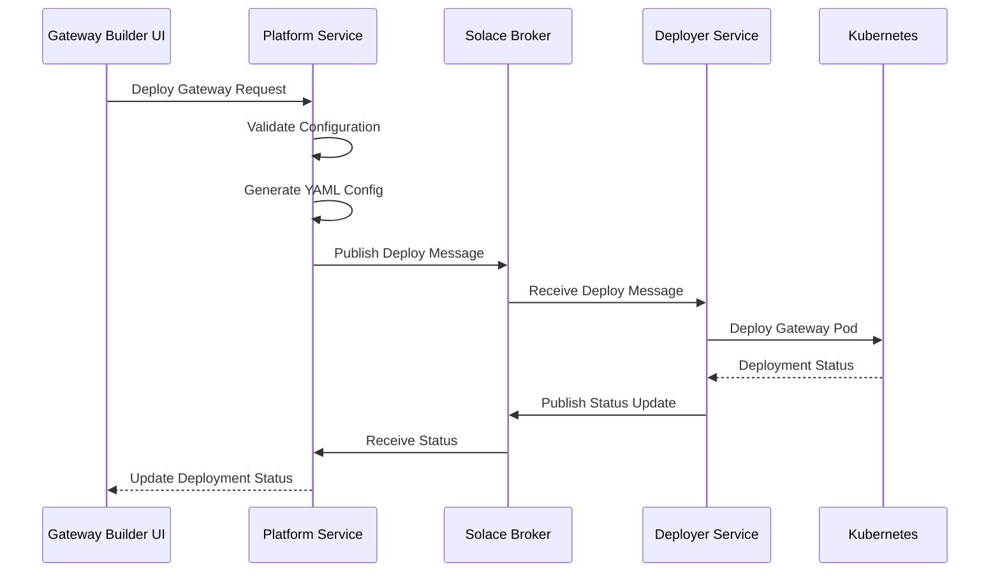

# Gateways

Gateways connect your Agent Mesh deployment to external systems, enabling agents to receive requests from and send responses to platforms like Slack, Microsoft Teams, and Solace Event Mesh brokers. You configure each gateway with connection details and routing rules for a specific integration target.

## Gateway Types

Agent Mesh Enterprise provides multiple gateway types, each integrating with a different external system.

### Event Mesh Gateway

Event Mesh gateways connect Agent Mesh to Solace PubSub+ Event Mesh brokers, enabling agents to process or enrich events in real time. You can configure event rules that subscribe to topics and route incoming events to specific agents, with optional response publishing back to the event mesh. For detailed information about creating and configuring Event Mesh gateways, see [Event Mesh Gateway](event-mesh-gateway.md).

### Slack Gateway

Slack gateways integrate Agent Mesh with Slack workspaces, enabling users to interact with agents through Slack channels and direct messages. The gateway uses Socket Mode for real-time message processing without requiring public endpoints. For detailed information about creating and configuring Slack gateways, see [Slack Gateway](slack-gateway.md).

### Microsoft Teams Gateway

Microsoft Teams gateways connect Agent Mesh with Microsoft Teams, allowing users to interact with agents through Teams channels and chats. This gateway requires Docker deployment and Azure AD configuration. Teams gateway documentation will be available when the feature is released.

### REST Gateway

REST gateways expose Agent Mesh capabilities through REST API endpoints, enabling programmatic access from external applications and services. REST gateway documentation will be available when the feature is released.

## Creating Gateways

You create gateways through the Gateways section of the Agent Mesh Enterprise web interface. Navigate to the Gateways page and click the Create Gateway button. The workflow varies depending on the gateway type, but all gateways require a unique name and connection credentials appropriate for the target system.

### Gateway Configuration Workflow

The gateway creation process follows these steps:

1. Select the gateway type based on your integration target.
2. Provide a unique name (3–255 characters) and description (10–1000 characters).
3. Enter connection details, credentials, and routing rules specific to the gateway type.
4. Save the configuration. The gateway appears in the list with "Not Deployed" status.
5. Click Deploy to create a running gateway instance.

## How Gateway Deployment Works

When you deploy a gateway through the web interface, the deployment process involves several components working together.

The Platform Service validates your configuration, generates a YAML configuration file, and publishes a deployment message to the Solace broker. The Deployer component receives this message and creates a running gateway instance in Kubernetes. Status updates flow back through the broker to update the UI.

:::info[Deployer Requirement]
Gateway deployments require the Deployer service to be running and connected. If the Deployer is offline, deployment requests will fail.
:::

## Gateway States

Gateways move through distinct states as you create, edit, and deploy them.

| State | Description | Available Actions |
|-------|-------------|-------------------|
| Not Deployed | Initial status for newly created gateways | Edit, Download, Deploy, Delete |
| Deploying | In-progress while the Deployer creates the instance | Edit only (no deploy or delete) |
| Deployed | Gateway is active and processing requests | Edit, Download, Update, Undeploy, Delete (if disconnected) |
| Deploy Failed | Deployment operation failed | Edit, Download, Deploy, Update, Delete |
| Undeploying | In-progress while the Deployer removes the instance | Edit only (no deploy or delete) |
| Undeployed | Previously deployed but has been stopped | Edit, Download, Deploy, Delete |
| Undeploy Failed | Undeploy operation failed | Edit, Download, Update, Undeploy, Delete |

:::warning
You cannot delete a gateway that is deployed and connected. Undeploy the gateway first, or wait until it shows a disconnected status before deleting.
:::

## Managing Deployed Gateways

### Configuration Drift Detection

When you deploy a gateway, the system records its configuration as a snapshot. If you later edit the gateway's description or configuration values, the system detects this mismatch and marks the gateway as out of sync. The system also detects drift when the Deployer version changes after a gateway was deployed. The running gateway continues using its deployed configuration until you explicitly update the deployment. To apply the new configuration, use the Update action on the deployed gateway, which redeploys it with the current settings.

### Connection Status Monitoring

Deployed gateways publish a discovery card to the broker every 30 seconds. The Platform Service tracks these cards and considers a gateway connected if it received a card within the last 90 seconds:

- Connected: The gateway is running and has reported within the TTL window
- Disconnected: The gateway is deployed but has not reported within the TTL window

### Credential Handling

Gateway configurations that contain secrets (broker passwords, Slack tokens) are stored encrypted in the Platform Service database. API responses redact these values, displaying `********` instead. At deployment time, the actual values are injected through Kubernetes Secrets so they never appear in plain text in configuration files or API traffic.

### Downloading Gateway Configurations

The Download button exports gateway configurations as YAML files for version control or infrastructure-as-code workflows. Downloaded files use environment variable placeholders for credentials and are designed for the Gateway Deployer in Kubernetes environments.

## Access Control

Gateway operations require specific RBAC capabilities. For detailed information about configuring role-based access control, see [Setting Up RBAC](../rbac-setup-guide.md).

| Capability | Purpose |
|------------|---------|
| `sam:gateways:create` | Create new gateways |
| `sam:gateways:read` | View gateway configurations, status, and schemas |
| `sam:gateways:update` | Edit existing gateway configurations |
| `sam:gateways:delete` | Delete gateways |
| `sam:gateways:deploy` | Deploy, update, and undeploy gateways |

## Limitations

The current gateway implementation has the following limitations:

- Gateways deploy as single replicas with some downtime during updates.
- No configuration rollback is available. To revert changes, you must manually update the configuration to previous values.
- Configuration changes require a gateway restart because there is no hot-reload capability.
- Inbound network access requires separate infrastructure configuration for ingress.
- The Deployer service must be online to deploy or undeploy gateways.
