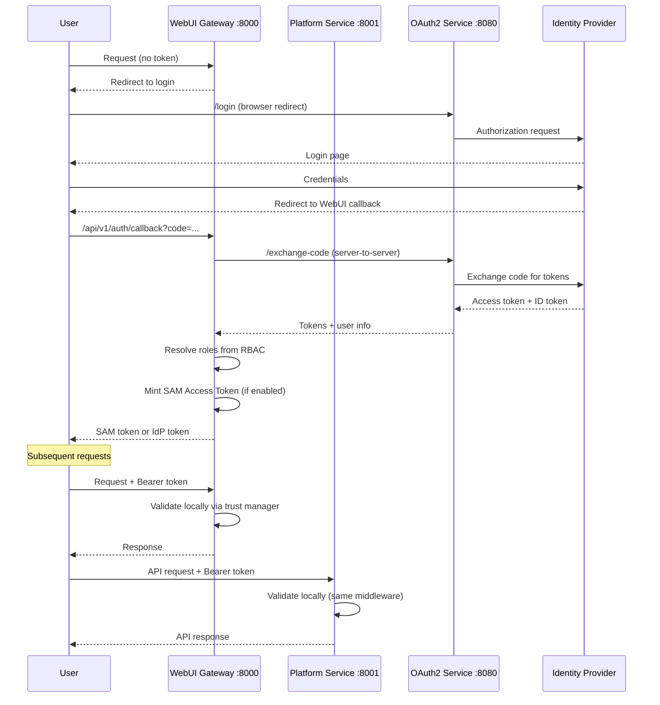

## Overview

Agent Mesh Enterprise secures access through two complementary layers: authentication validates identity (via OAuth2 or SAM Access Tokens), and authorization determines what that identity can do (via RBAC scopes). Both the [WebUI Gateway](../components/gateways.md) and the [Platform Service](../components/platform-service.md) share the same auth middleware and the same config resolver, so a single configuration secures both services.

The system is secure by default---if no authorization configuration exists, all access is denied. You must explicitly configure an authorization type to grant access to users.

This page describes the full auth architecture. For step-by-step setup instructions, see [Enabling SSO](single-sign-on.md) and [RBAC Setup Guide](rbac-setup-guide.md).

## Authentication Flow

### Token Types

Agent Mesh Enterprise supports two token types:

SAM Access Tokens are locally signed JWTs minted at the OAuth callback after a user logs in. The gateway resolves the user's roles, embeds them in the token, and signs it with an ES256 ephemeral key. Subsequent requests are validated locally through the trust manager---no network call to the OAuth2 service is needed. Claims include `sam_user_id`, `roles`, `email`, `name`, `jti`, and `provider`.

IdP tokens are issued by the external identity provider (Azure, Google, Auth0, Okta, Keycloak) and validated by calling the OAuth2 service at `external_auth_service_url`. This is the standard validation path when SAM Access Tokens are not enabled.

The auth middleware tries SAM Access Token validation first. If the token is not a valid SAM token or the feature is disabled, it falls back to IdP validation.

### Token Extraction

The middleware extracts the access token from three sources, checked in order:

1. `Authorization` header (`Bearer <token>`)
2. Session cookie (`access_token` key)
3. Query parameter (`?token=<token>`)

If no token is found in any location, the request receives a 401 response.

### Full Authentication Sequence

The following diagram shows the end-to-end flow from initial login through subsequent API requests:



At the OAuth callback, the gateway resolves the user's RBAC roles, then calls `prepare_and_mint_sam_token()` to produce a signed JWT that embeds those roles. The frontend stores this token and presents it on all subsequent requests. Both the WebUI Gateway and Platform Service validate the token locally through the trust manager key registry.

## User Identity Resolution

When the middleware receives validated user info (from either token path), it extracts the user identifier by checking these claims in order:

`sub` &rarr; `client_id` &rarr; `username` &rarr; `oid` &rarr; `preferred_username` &rarr; `upn` &rarr; `unique_name` &rarr; `email` &rarr; `name` &rarr; `azp` &rarr; `user_id`

The first non-empty value wins. If the resolved identifier equals `unknown`, `null`, `none`, or an empty string (case-insensitive), the system falls back to `sam_dev_user`.

Email addresses are normalized to lowercase for case-insensitive matching; all other identifiers remain case-sensitive. This normalization happens in the enterprise config resolver when it matches identities against `user-to-role-assignments.yaml`.

The display name is resolved separately: `name` &rarr; `given_name` + `family_name` &rarr; `preferred_username` &rarr; user identifier.

For guidance on mapping these identities to role assignments, see the [RBAC Setup Guide](rbac-setup-guide.md).

## Authorization

### Authorization Types

Agent Mesh Enterprise supports four authorization types:

| Type | Behavior |
|------|----------|
| `deny_all` | Secure default. Rejects all access. Active when no `authorization_service` block exists. |
| `default_rbac` | File-based RBAC with role definitions and user-to-role assignments. Recommended for production. |
| `custom` | Pluggable module/class for external authorization systems. Requires `module` and `class_name` in config. |
| `none` | Disables authorization and grants wildcard `*` scope to all users. |

:::danger Development Only
The `type: none` authorization configuration grants full access to every user and should never be used in production. It is distinct from development mode (`frontend_use_authorization: false`), which disables authentication entirely.
:::

### Configuration Resolution Priority

The system resolves authorization configuration using a three-tier priority chain:

1. Enterprise config from the `SAM_AUTHORIZATION_CONFIG` environment variable (highest priority)
2. Gateway-specific `authorization_service` block in the app_config YAML
3. `deny_all` secure default

The `SAM_AUTHORIZATION_CONFIG` variable supports three formats: a YAML file path (`.yaml` or `.yml` extension), a JSON file path (`.json` extension), or a raw JSON string.

For details on creating the enterprise configuration file, see the [RBAC Setup Guide](rbac-setup-guide.md).

## SAM Access Tokens and the Trust Manager

### How SAM Tokens Work

At the OAuth callback, the gateway resolves the user's roles from the RBAC configuration, then mints a JWT containing those roles and basic identity claims (`sub`, `email`, `name`). The token also includes a unique `jti` (token ID) and the `provider` name.

The JWT is signed with ES256 using the gateway's ephemeral EC private key. The frontend stores this token and presents it on all subsequent requests. When a request arrives, the auth middleware validates it locally through the trust manager key registry---no call to the OAuth2 service is needed. The roles embedded in the token feed directly into scope resolution, avoiding a second RBAC lookup.

The default token TTL is 3600 seconds (1 hour), configurable through the `sam_access_token.ttl_seconds` setting.

### Trust Manager Architecture

Each gateway generates an ephemeral EC key pair at startup. It publishes a Trust Card (containing the public key in JWKS format) to the broker and re-publishes it periodically (default every 60 seconds). Other components subscribe to Trust Card topics and store the public keys in a Trust Registry.

Only components with `component_type: "gateway"` can sign user identity JWTs. This restriction is enforced at both signing time and verification time. Task ID binding prevents cross-task replay on per-request user identity JWTs. SAM Access Tokens use an empty `task_id` because they are session-level tokens, not bound to a specific task.

When verifying a SAM Access Token, the trust manager decodes the JWT header, looks up the issuer in the Trust Registry, verifies the issuer is a gateway, retrieves the matching public key by `kid`, and validates the signature. Expiration and issuance time are checked with a configurable clock skew tolerance (default 300 seconds).

## Shared Auth Between WebUI Gateway and Platform Service

### Shared Middleware and Config Resolver

Both the WebUI Gateway and the Platform Service call `create_oauth_middleware(component)` and add the resulting middleware to their FastAPI application. A `MiddlewareRegistry` singleton holds one `EnterpriseConfigResolverImpl` class, which both services query for authorization decisions.

:::warning Use `SAM_AUTHORIZATION_CONFIG` for RBAC
The Platform Service only inherits RBAC configuration when the `SAM_AUTHORIZATION_CONFIG` environment variable is set. This variable applies globally to all services in the process. If you configure `authorization_service` only in the WebUI Gateway's YAML file without setting this environment variable, the Platform Service will not inherit that configuration and will default to `deny_all`, causing all Platform Service API requests to be denied.

Always use `SAM_AUTHORIZATION_CONFIG` to ensure both services share the same authorization configuration.
:::

In standard deployments (Docker container or Kubernetes pod), both services run within the same process, so this sharing happens automatically once the environment variable is set. If you run them as separate processes, each process performs its own initialization---you must pass the same `SAM_AUTHORIZATION_CONFIG` environment variable pointing to the same configuration to keep behavior consistent.

### Configuration Differences

Both services read the same core auth keys, but the WebUI Gateway requires additional keys for the browser login flow:

| Configuration Key | WebUI Gateway | Platform Service |
|---|---|---|
| `frontend_use_authorization` | Yes | Yes |
| `external_auth_service_url` | Yes | Yes |
| `external_auth_provider` | Yes | Yes |
| `frontend_auth_login_url` | Yes | No |
| `frontend_redirect_url` | Yes | No |
| `external_auth_callback_uri` | Yes | No |

The difference exists because the WebUI Gateway handles the browser login/redirect flow (redirecting unauthenticated users, processing OAuth callbacks), while the Platform Service only validates tokens on incoming API requests.

## Development Mode

When `frontend_use_authorization` is set to `false` (the default), the auth middleware bypasses all token validation and assigns a hardcoded development identity to every request:

| Field | Value |
|-------|-------|
| `id` | `sam_dev_user` |
| `name` | `Sam Dev User` |
| `email` | `sam@dev.local` |
| `auth_method` | `development` |

Both the WebUI Gateway and Platform Service use this same bypass.

:::danger Never Use in Production
Development mode grants full access with no identity verification. Any request from any source is treated as authenticated. Always set `frontend_use_authorization: true` in production.
:::

Development mode (`frontend_use_authorization: false`) is distinct from `authorization_service.type: none`. Development mode disables authentication entirely---no token is required. The `none` authorization type disables authorization but still requires a valid token for authentication; it grants wildcard `*` scope to every authenticated user.

## Paths That Skip Authentication

Even when authentication is enabled, certain paths bypass token validation to support system operations:

| Path | Reason |
|------|--------|
| `/health`, `/api/v1/platform/health` | Health checks for orchestrators and load balancers |
| `/api/v1/config` | Frontend configuration (login URLs, feature flags) |
| `/api/v1/auth/callback` | OAuth callback from identity provider |
| `/api/v1/auth/tool/callback` | OAuth callback for tool-level auth |
| `/api/v1/auth/login` | Initiates the OAuth login flow |
| `/api/v1/auth/refresh` | Token refresh endpoint |
| `/api/v1/csrf-token` | CSRF protection token |
| `/api/v1/platform/mcp/oauth/callback` | MCP OAuth proxy callback |

`OPTIONS` requests bypass authentication to support CORS preflight. Requests with paths that do not start with `/api` also bypass auth, as these serve static files.

## Configuration Reference

| Variable | Purpose | Default | Used By |
|----------|---------|---------|---------|
| `FRONTEND_USE_AUTHORIZATION` | Enable or disable authentication | `false` | Both |
| `EXTERNAL_AUTH_SERVICE_URL` | URL of the OAuth2 authentication service | --- | Both |
| `EXTERNAL_AUTH_PROVIDER` | Provider name as defined in `oauth2_config.yaml` | `generic` | Both |
| `EXTERNAL_AUTH_CALLBACK` | Callback URI for OAuth redirect | --- | WebUI only |
| `FRONTEND_AUTH_LOGIN_URL` | URL the frontend calls to start login | --- | WebUI only |
| `FRONTEND_REDIRECT_URL` | URL to redirect to after login completes | --- | WebUI only |
| `SAM_AUTHORIZATION_CONFIG` | Path to enterprise config or raw JSON string | --- | Both (via initializer) |

The `platform.yaml` configuration file accepts these auth-related fields under `app_config`:

```yaml
app_config:
  frontend_use_authorization: ${FRONTEND_USE_AUTHORIZATION}
  external_auth_service_url: ${EXTERNAL_AUTH_SERVICE_URL}
  external_auth_provider: ${EXTERNAL_AUTH_PROVIDER}
```

These values must match the corresponding fields in your WebUI Gateway configuration. When you generate configuration with `sam init --gui`, both files are created with the same environment variable references, so they stay in sync automatically.

For provider-specific variables, see [Enabling SSO](single-sign-on.md). For RBAC file configuration, see the [RBAC Setup Guide](rbac-setup-guide.md).

## Troubleshooting

### 401 Errors on Platform Service While WebUI Works

This typically means the Platform Service is not receiving the same auth configuration as the WebUI Gateway. The most common cause is configuring `authorization_service` directly in the WebUI Gateway's YAML file without setting the `SAM_AUTHORIZATION_CONFIG` environment variable. The Platform Service only inherits RBAC configuration from the global environment variable, not from the gateway's local config. Set `SAM_AUTHORIZATION_CONFIG` to point to your enterprise configuration file to resolve this.

Also verify that `platform.yaml` includes the `frontend_use_authorization`, `external_auth_service_url`, and `external_auth_provider` fields under `app_config`, and that they reference the same environment variables as your WebUI Gateway configuration.

### All Requests Denied After Login

The system is running with `deny_all` authorization. Verify that the `SAM_AUTHORIZATION_CONFIG` environment variable is set and points to a valid enterprise configuration file containing an `authorization_service` block. Check the logs for messages with the `[EnterpriseConfigResolverImpl]` or `[ConfigurableRbacAuthSvc]` prefix to confirm whether the RBAC configuration loaded.

### User Identity Mismatch

The identity extracted from the IdP token differs from what appears in `user-to-role-assignments.yaml`. Check the middleware logs for the extracted identifier. Email identities are lowercased automatically, so `User@Example.com` matches `user@example.com` in role assignments. Non-email identifiers (such as `oid` or `sub` values) are case-sensitive and must match exactly.

### SAM Token Validation Fails

A log message "Token is not a valid sam_access_token" followed by IdP validation is normal behavior for IdP tokens---the middleware tries SAM validation first, then falls back. If you expect SAM tokens to work but they do not, verify that `sam_access_token.enabled` is set to `true` in the gateway's app_config and that the trust manager is initialized (look for Trust Card publication messages in the logs).
