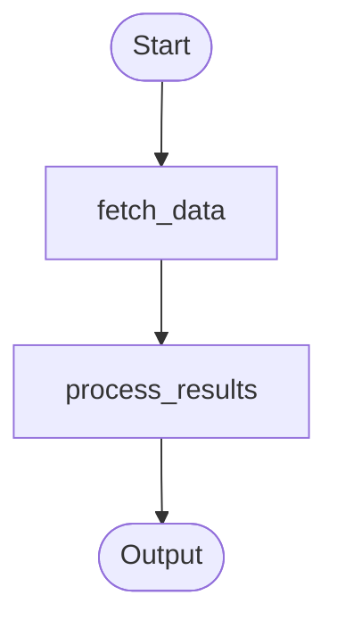

# PR 5a: Workflow Runtime - Orchestrator Component

## Overview

This PR introduces the `WorkflowExecutorComponent`, the main orchestrator that receives workflow requests and coordinates execution. It handles component lifecycle, message routing, agent card publishing, and event forwarding.

## Branch Information

- **Branch Name:** `pr/workflows-5a-orchestrator`
- **Target:** `pr/workflows-4-workflow-tool`

## Files Changed

### `src/solace_agent_mesh/workflow/component.py`

The `WorkflowExecutorComponent` class (~1,100 lines) extends `SamComponentBase`:

| Method/Area | Purpose |
|-------------|---------|
| `__init__()` | Initialize component, parse workflow definition |
| `_handle_message_async()` | Route messages by topic |
| `_async_setup_and_run()` | Component initialization |
| `_setup_periodic_agent_card_publishing()` | Schedule agent card publishing |
| `_publish_workflow_agent_card_sync()` | Publish agent card |
| `_generate_workflow_agent_card()` | Build AgentCard with schemas |
| `_generate_mermaid_diagram()` | Generate workflow visualization |
| `publish_workflow_execution_start()` | Emit execution start event |
| `publish_node_execution_start()` | Emit node start event |
| `publish_node_execution_result()` | Emit node completion event |
| `publish_map_progress()` | Emit map iteration progress |
| `finalize_workflow()` | Complete workflow and send result |

#### Key Responsibilities

- **Lifecycle Management**: Component startup, shutdown, service initialization
- **Message Routing**: Route incoming messages to appropriate handlers
- **Agent Card**: Generate and publish workflow as an agent with input/output schemas
- **Event Publishing**: Forward execution events to clients via SSE
- **State Management**: Track active workflow executions

### `src/solace_agent_mesh/workflow/protocol/event_handlers.py`

A2A protocol message handlers (~350 lines):

| Handler | Purpose |
|---------|---------|
| `handle_task_request()` | Process incoming workflow requests |
| `handle_agent_response()` | Process responses from invoked agents |
| `handle_cancel_request()` | Process cancellation requests |
| `handle_agent_card_message()` | Process agent discovery messages |
| `_extract_workflow_input()` | Extract input from A2A message |
| `_initialize_workflow_state()` | Create execution context |

## Key Concepts

### Workflow as Agent

Workflows appear in the agent registry like any other agent:

```yaml
# Agent card published by workflow
name: "my-workflow"
capabilities:
  extensions:
    - uri: "https://solace.com/a2a/extensions/sam/schemas"
      params:
        input_schema: { ... }
        output_schema: { ... }
    - uri: "https://solace.com/a2a/extensions/agent-type"
      params:
        type: "workflow"
```

### Message Routing

```
Incoming Message
      │
      ├─ Request Topic → handle_task_request()
      │
      ├─ Discovery Topic → handle_agent_card_message()
      │
      └─ Response/Status Topic → handle_agent_response()
```

### Event Publishing

The component publishes execution events that flow to the frontend:

```
WorkflowExecutionStartData    → "Workflow started"
WorkflowNodeExecutionStartData → "Node X started"
WorkflowNodeExecutionResultData → "Node X completed"
WorkflowMapProgressData        → "Map: 3 of 10 items"
WorkflowExecutionResultData    → "Workflow completed"
```

### Mermaid Diagram Generation

The component generates a Mermaid diagram for visualization:



## Known Limitations

### Cancellation Not Implemented

The `handle_cancel_request()` function in `event_handlers.py` is a stub:

```python
def handle_cancel_request(component: "WorkflowExecutorComponent", task_id: str):
    """Handle workflow cancellation request."""
    # TODO: Implement cancellation logic
    pass
```

Workflow cancellation will be implemented in a future PR. For now, workflows run to completion or failure.
