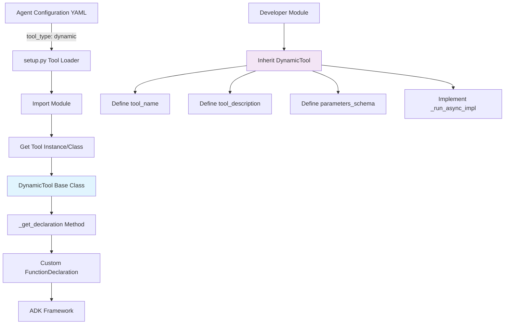

# Dynamic Tools Design Document for Solace Agent Mesh (SAM)

## Overview

This document describes the design for adding a new tool type called "dynamic" to the Solace Agent Mesh (SAM) system. Dynamic tools allow developers to create tools that define their own function names, descriptions, and parameter schemas programmatically, rather than having these inferred from Python function signatures like regular Python tools.

## Problem Statement

Currently, SAM supports three main tool types:
- **Python tools**: Function name and parameters are inferred from the Python function signature
- **MCP tools**: External tools that communicate via the Model Context Protocol
- **Builtin tools**: Pre-registered tools in the SAM tool registry

However, there's no way for a Python module to define multiple tools with custom names and parameter schemas without being constrained by Python function signatures. Dynamic tools fill this gap by allowing modules to programmatically define their tool interface.

## Architecture

### Core Components



### Key Classes

#### 1. DynamicTool Base Class
A new abstract base class that extends Google ADK's `BaseTool` and provides the interface for dynamic tool definition.

**Location**: `src/solace_agent_mesh/agent/tools/dynamic_tool.py`

```python
from abc import ABC, abstractmethod
from typing import Optional
from google.adk.tools import BaseTool, ToolContext
from google.genai import types as adk_types

class DynamicTool(BaseTool, ABC):
    """
    Base class for dynamic tools that can define their own function names,
    descriptions, and parameter schemas programmatically.
    """
    
    def __init__(self, tool_config: Optional[dict] = None):
        # Initialize with a placeholder name, will be overridden by tool_name property
        super().__init__(name="dynamic_tool_placeholder")
        self.tool_config = tool_config or {}
    
    @property
    @abstractmethod
    def tool_name(self) -> str:
        """Return the function name that the LLM will call."""
        pass
    
    @property
    @abstractmethod
    def tool_description(self) -> str:
        """Return the description of what this tool does."""
        pass
    
    @property
    @abstractmethod
    def parameters_schema(self) -> adk_types.Schema:
        """Return the ADK Schema defining the tool's parameters."""
        pass
    
    def _get_declaration(self) -> Optional[adk_types.FunctionDeclaration]:
        """
        Generate the FunctionDeclaration for this dynamic tool.
        This follows the same pattern as PeerAgentTool and MCP tools.
        """
        # Update the tool name to match what the module defines
        self.name = self.tool_name
        
        return adk_types.FunctionDeclaration(
            name=self.tool_name,
            description=self.tool_description,
            parameters=self.parameters_schema,
        )
    
    @abstractmethod
    async def _run_async_impl(
        self, 
        args: dict, 
        tool_context: ToolContext, 
        credential: Optional[str] = None
    ) -> dict:
        """
        Implement the actual tool logic.
        Must return a dictionary response.
        """
        pass
```

#### 2. Enhanced Tool Loading Logic
Modifications to `src/solace_agent_mesh/agent/adk/setup.py` to handle dynamic tools.

**New tool type handling**:
```python
elif tool_type == "dynamic":
    module_name = tool_config.get("component_module")
    class_name = tool_config.get("class_name")  # Optional, defaults to finding DynamicTool subclass
    base_path = tool_config.get("component_base_path")
    
    if not module_name:
        raise ValueError("'component_module' required for dynamic tool.")
    
    module = import_module(module_name, base_path=base_path)
    
    # Find the dynamic tool class
    if class_name:
        tool_class = getattr(module, class_name)
    else:
        # Auto-discover DynamicTool subclass in module
        tool_class = _find_dynamic_tool_class(module)
    
    if not tool_class or not issubclass(tool_class, DynamicTool):
        raise TypeError(f"Module '{module_name}' must contain a DynamicTool subclass.")
    
    # Instantiate the dynamic tool
    specific_tool_config = tool_config.get("tool_config")
    dynamic_tool_instance = tool_class(tool_config=specific_tool_config)
    dynamic_tool_instance.origin = "dynamic"
    
    # Validate the tool can generate a proper declaration
    declaration = dynamic_tool_instance._get_declaration()
    if not declaration:
        raise ValueError(f"Dynamic tool '{tool_class.__name__}' failed to generate a valid declaration.")
    
    _check_and_register_tool_name(declaration.name, f"dynamic:{module_name}")
    loaded_tools.append(dynamic_tool_instance)
    
    log.info(
        "%s Loaded dynamic tool: %s from %s",
        component.log_identifier,
        declaration.name,
        module_name,
    )
```

### Configuration Format

#### YAML Configuration
Dynamic tools are configured in agent YAML files similar to other tool types:

```yaml
tools:
  # Basic dynamic tool configuration
  - tool_type: dynamic
    component_module: my_tools.weather_api
    component_base_path: .
    tool_config:
      api_key: ${WEATHER_API_KEY}
      timeout: 30

  # Dynamic tool with explicit class name
  - tool_type: dynamic
    component_module: my_tools.database_tools
    class_name: DatabaseQueryTool
    component_base_path: .
    tool_config:
      connection_string: ${DB_CONNECTION_STRING}
      max_rows: 1000

  # Dynamic tool with embed resolution support
  - tool_type: dynamic
    component_module: my_tools.file_processor
    component_base_path: .
    raw_string_args: ["file_content"]  # Skip embed resolution for these args
    tool_config:
      max_file_size: 10485760  # 10MB
```

## Example Implementation

### Example 1: Weather API Tool

**File**: `my_tools/weather_api.py`

```python
import asyncio
import httpx
from typing import Optional, Dict, Any
from google.genai import types as adk_types
from solace_agent_mesh.agent.tools.dynamic_tool import DynamicTool

class WeatherTool(DynamicTool):
    """
    A dynamic tool that fetches current weather information for a given location.
    """
    
    @property
    def tool_name(self) -> str:
        return "get_current_weather"
    
    @property
    def tool_description(self) -> str:
        return "Get the current weather information for a specified location using a weather API."
    
    @property
    def parameters_schema(self) -> adk_types.Schema:
        return adk_types.Schema(
            type=adk_types.Type.OBJECT,
            properties={
                "location": adk_types.Schema(
                    type=adk_types.Type.STRING,
                    description="The city and state/country for which to get weather information (e.g., 'San Francisco, CA' or 'London, UK')",
                ),
                "units": adk_types.Schema(
                    type=adk_types.Type.STRING,
                    description="Temperature units to use",
                    enum=["celsius", "fahrenheit", "kelvin"],
                    nullable=True,
                ),
                "include_forecast": adk_types.Schema(
                    type=adk_types.Type.BOOLEAN,
                    description="Whether to include a 3-day forecast in addition to current conditions",
                    nullable=True,
                )
            },
            required=["location"],
        )
    
    async def _run_async_impl(
        self, 
        args: Dict[str, Any], 
        tool_context, 
        credential: Optional[str] = None
    ) -> Dict[str, Any]:
        """
        Fetch weather data from the configured weather API.
        """
        location = args["location"]
        units = args.get("units", "celsius")
        include_forecast = args.get("include_forecast", False)
        
        api_key = self.tool_config.get("api_key")
        timeout = self.tool_config.get("timeout", 30)
        
        if not api_key:
            return {
                "status": "error",
                "message": "Weather API key not configured"
            }
        
        try:
            async with httpx.AsyncClient(timeout=timeout) as client:
                # Example API call (adjust for your weather service)
                response = await client.get(
                    "https://api.weather.com/v1/current",
                    params={
                        "location": location,
                        "units": units,
                        "forecast": include_forecast,
                        "key": api_key
                    }
                )
                response.raise_for_status()
                weather_data = response.json()
                
                return {
                    "status": "success",
                    "location": location,
                    "current_weather": weather_data.get("current", {}),
                    "forecast": weather_data.get("forecast", []) if include_forecast else None,
                    "units": units
                }
                
        except httpx.TimeoutException:
            return {
                "status": "error",
                "message": f"Weather API request timed out after {timeout} seconds"
            }
        except httpx.HTTPStatusError as e:
            return {
                "status": "error",
                "message": f"Weather API returned error: {e.response.status_code}"
            }
        except Exception as e:
            return {
                "status": "error",
                "message": f"Unexpected error fetching weather data: {str(e)}"
            }
```

### Example 2: Multi-Tool Module

**File**: `my_tools/database_tools.py`

```python
from typing import Optional, Dict, Any, List
from google.genai import types as adk_types
from solace_agent_mesh.agent.tools.dynamic_tool import DynamicTool
import asyncpg

class DatabaseQueryTool(DynamicTool):
    """
    Dynamic tool for executing read-only database queries.
    """
    
    @property
    def tool_name(self) -> str:
        return "execute_database_query"
    
    @property
    def tool_description(self) -> str:
        return "Execute a read-only SQL query against the configured database and return results."
    
    @property
    def parameters_schema(self) -> adk_types.Schema:
        return adk_types.Schema(
            type=adk_types.Type.OBJECT,
            properties={
                "query": adk_types.Schema(
                    type=adk_types.Type.STRING,
                    description="The SQL SELECT query to execute (must be read-only)",
                ),
                "limit": adk_types.Schema(
                    type=adk_types.Type.INTEGER,
                    description="Maximum number of rows to return",
                    minimum=1,
                    maximum=1000,
                    nullable=True,
                )
            },
            required=["query"],
        )
    
    async def _run_async_impl(
        self, 
        args: Dict[str, Any], 
        tool_context, 
        credential: Optional[str] = None
    ) -> Dict[str, Any]:
        query = args["query"].strip()
        limit = args.get("limit", self.tool_config.get("max_rows", 100))
        
        # Security: Ensure query is read-only
        if not query.upper().startswith("SELECT"):
            return {
                "status": "error",
                "message": "Only SELECT queries are allowed"
            }
        
        connection_string = self.tool_config.get("connection_string")
        if not connection_string:
            return {
                "status": "error", 
                "message": "Database connection not configured"
            }
        
        try:
            conn = await asyncpg.connect(connection_string)
            
            # Add LIMIT if not present
            if "LIMIT" not in query.upper():
                query = f"{query} LIMIT {limit}"
            
            rows = await conn.fetch(query)
            await conn.close()
            
            # Convert rows to dictionaries
            results = [dict(row) for row in rows]
            
            return {
                "status": "success",
                "rows_returned": len(results),
                "data": results,
                "query_executed": query
            }
            
        except Exception as e:
            return {
                "status": "error",
                "message": f"Database query failed: {str(e)}"
            }

class DatabaseSchemaTool(DynamicTool):
    """
    Dynamic tool for exploring database schema information.
    """
    
    @property
    def tool_name(self) -> str:
        return "get_database_schema"
    
    @property
    def tool_description(self) -> str:
        return "Get schema information about database tables and columns."
    
    @property
    def parameters_schema(self) -> adk_types.Schema:
        return adk_types.Schema(
            type=adk_types.Type.OBJECT,
            properties={
                "table_name": adk_types.Schema(
                    type=adk_types.Type.STRING,
                    description="Specific table name to get schema for (optional - if not provided, returns all tables)",
                    nullable=True,
                ),
                "include_sample_data": adk_types.Schema(
                    type=adk_types.Type.BOOLEAN,
                    description="Whether to include a few sample rows from each table",
                    nullable=True,
                )
            },
            required=[],
        )
    
    async def _run_async_impl(
        self, 
        args: Dict[str, Any], 
        tool_context, 
        credential: Optional[str] = None
    ) -> Dict[str, Any]:
        table_name = args.get("table_name")
        include_sample = args.get("include_sample_data", False)
        
        connection_string = self.tool_config.get("connection_string")
        if not connection_string:
            return {
                "status": "error",
                "message": "Database connection not configured"
            }
        
        try:
            conn = await asyncpg.connect(connection_string)
            
            # Get table schema information
            if table_name:
                schema_query = """
                    SELECT column_name, data_type, is_nullable, column_default
                    FROM information_schema.columns 
                    WHERE table_name = $1
                    ORDER BY ordinal_position
                """
                schema_rows = await conn.fetch(schema_query, table_name)
                tables_info = {table_name: [dict(row) for row in schema_rows]}
            else:
                # Get all tables
                tables_query = """
                    SELECT table_name 
                    FROM information_schema.tables 
                    WHERE table_schema = 'public'
                    ORDER BY table_name
                """
                tables = await conn.fetch(tables_query)
                tables_info = {}
                
                for table_row in tables:
                

### Example 2: Multi-Tool Module (continued)

```python
# Continuing the DatabaseSchemaTool implementation...

                for table_row in tables:
                    table = table_row['table_name']
                    schema_query = """
                        SELECT column_name, data_type, is_nullable, column_default
                        FROM information_schema.columns 
                        WHERE table_name = $1
                        ORDER BY ordinal_position
                    """
                    schema_rows = await conn.fetch(schema_query, table)
                    tables_info[table] = [dict(row) for row in schema_rows]
            
            # Optionally include sample data
            sample_data = {}
            if include_sample and tables_info:
                for table in tables_info.keys():
                    try:
                        sample_rows = await conn.fetch(f"SELECT * FROM {table} LIMIT 3")
                        sample_data[table] = [dict(row) for row in sample_rows]
                    except Exception:
                        sample_data[table] = "Unable to fetch sample data"
            
            await conn.close()
            
            result = {
                "status": "success",
                "schema": tables_info
            }
            
            if include_sample:
                result["sample_data"] = sample_data
                
            return result
            
        except Exception as e:
            return {
                "status": "error",
                "message": f"Schema query failed: {str(e)}"
            }
```

## Integration with Existing Features

### Embed Resolution Support
Dynamic tools integrate seamlessly with SAM's embed resolution system. The `raw_string_args` configuration parameter can be used to specify which arguments should skip embed pre-resolution:

```yaml
tools:
  - tool_type: dynamic
    component_module: my_tools.file_processor
    raw_string_args: ["raw_content", "template"]  # These args won't have embeds resolved
    tool_config:
      max_processing_time: 60
```

### Tool Callbacks Integration
Dynamic tools automatically benefit from all existing SAM tool callback features:

1. **Large Response Management**: Responses are automatically saved as artifacts if they exceed configured thresholds
2. **Metadata Injection**: Tool execution metadata is automatically added to responses
3. **Artifact Tracking**: Any artifacts created by dynamic tools are tracked in the session
4. **Error Handling**: Standard error handling and logging applies

### Security Considerations
Dynamic tools inherit all SAM security features:

1. **Scope-based Authorization**: Can define `required_scopes` for authorization checks
2. **Input Validation**: Parameter schemas are validated by the ADK framework
3. **Timeout Management**: Tool execution timeouts are enforced
4. **Resource Limits**: Memory and processing limits apply

## Configuration Reference

### Complete Configuration Options

```yaml
tools:
  - tool_type: dynamic
    # Required: Module containing the dynamic tool class
    component_module: my_tools.example_tool
    
    # Optional: Base path for module resolution (default: ".")
    component_base_path: /path/to/modules
    
    # Optional: Specific class name (if not provided, auto-discovers DynamicTool subclass)
    class_name: MyCustomTool
    
    # Optional: Arguments that should not have embeds resolved
    raw_string_args: ["raw_content", "template_string"]
    
    # Optional: Configuration passed to the tool instance
    tool_config:
      api_key: ${API_KEY}
      timeout: 30
      custom_setting: "value"
```

### Error Handling

The system provides comprehensive error handling for dynamic tool configuration:

1. **Module Import Errors**: Clear messages when modules cannot be found or imported
2. **Class Discovery Errors**: Helpful errors when DynamicTool subclasses are not found
3. **Schema Validation Errors**: Detailed validation messages for malformed parameter schemas
4. **Runtime Errors**: Standard tool execution error handling with logging

## Advanced Use Cases

### 1. Multiple Tools in One Module
A single module can define multiple dynamic tool classes:

```python
# File: my_tools/math_tools.py

class CalculatorTool(DynamicTool):
    @property
    def tool_name(self) -> str:
        return "calculate"
    # ... implementation

class StatisticsTool(DynamicTool):
    @property
    def tool_name(self) -> str:
        return "compute_statistics"
    # ... implementation
```

Configuration:
```yaml
tools:
  - tool_type: dynamic
    component_module: my_tools.math_tools
    class_name: CalculatorTool
  - tool_type: dynamic
    component_module: my_tools.math_tools
    class_name: StatisticsTool
```

### 2. Conditional Tool Availability
Dynamic tools can conditionally disable themselves:

```python
class ConditionalTool(DynamicTool):
    def _get_declaration(self) -> Optional[adk_types.FunctionDeclaration]:
        # Only available if API key is configured
        if not self.tool_config.get("api_key"):
            return None
        return super()._get_declaration()
```

### 3. Dynamic Parameter Generation
Tools can generate parameters based on configuration:

```python
class ConfigurableTool(DynamicTool):
    @property
    def parameters_schema(self) -> adk_types.Schema:
        properties = {
            "base_param": adk_types.Schema(
                type=adk_types.Type.STRING,
                description="Always present parameter"
            )
        }
        
        # Add optional parameters based on configuration
        if self.tool_config.get("enable_advanced_features"):
            properties["advanced_param"] = adk_types.Schema(
                type=adk_types.Type.STRING,
                description="Advanced feature parameter"
            )
        
        return adk_types.Schema(
            type=adk_types.Type.OBJECT,
            properties=properties,
            required=["base_param"]
        )
```

## Comparison with Existing Tool Types

| Feature | Python Tools | MCP Tools | Builtin Tools | Dynamic Tools |
|---------|-------------|-----------|---------------|---------------|
| Function name source | Python function name | MCP server definition | Pre-registered name | Module-defined property |
| Parameter definition | Function signature | MCP server schema | Pre-registered schema | Module-defined schema |
| Multiple tools per module | Multiple functions | Server-defined | Registry-defined | Multiple classes |
| Runtime configuration | Limited | Via connection params | Via tool_config | Via tool_config |
| Custom validation | Function-level | Server-level | Implementation-level | Class-level |
| Embed resolution | Automatic | Custom wrapper | Automatic | Automatic |

## Implementation Files

The dynamic tool feature requires these new/modified files:

### New Files
1. `src/solace_agent_mesh/agent/tools/dynamic_tool.py` - Base DynamicTool class
2. `examples/agents/dynamic_tools_example.yaml` - Example configuration
3. `examples/dynamic_tools/` - Example tool implementations
4. `tests/unit/agent/tools/test_dynamic_tool.py` - Unit tests
5. `tests/integration/test_dynamic_tools.py` - Integration tests

### Modified Files
1. `src/solace_agent_mesh/agent/adk/setup.py` - Add dynamic tool loading logic
2. `src/solace_agent_mesh/agent/tools/__init__.py` - Import new dynamic_tool module (if needed)

## Benefits

1. **Flexibility**: Modules can define any tool name and parameter schema they want
2. **Multiple Tools**: Single modules can expose multiple tools with different interfaces
3. **Runtime Configuration**: Tools can adapt their behavior and interface based on configuration
4. **Type Safety**: Uses ADK's type system for parameter validation
5. **Integration**: Works seamlessly with all existing SAM features (embeds, callbacks, artifacts)
6. **Consistency**: Follows the same patterns as MCP tools and peer agent tools

## Conclusion

Dynamic tools provide a powerful and flexible way to create custom tools in SAM while maintaining full integration with the existing tool ecosystem. They bridge the gap between rigid Python function signatures and the flexibility of external tools like MCP, giving developers the best of both worlds.

The design follows established patterns in the SAM codebase (particularly the `PeerAgentTool` implementation) and leverages the ADK framework's `BaseTool` class and `FunctionDeclaration` system. This ensures that dynamic tools integrate seamlessly with all existing SAM features including embed resolution, tool callbacks, artifact management, and security controls.

Key advantages of this approach:
- **Familiar Pattern**: Uses the same `_get_declaration()` pattern as existing dynamic tools (MCP, peer agents)
- **Full ADK Integration**: Leverages all ADK framework features and type safety
- **Configuration Consistency**: YAML configuration follows existing tool type patterns
- **Extensibility**: Easy to add new capabilities without breaking existing functionality
- **Developer Experience**: Simple, intuitive API for creating custom tools with any interface