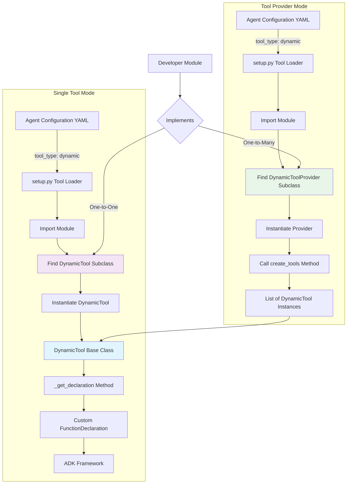

# Dynamic Tools Design Document for Solace Agent Mesh (SAM)

## Overview

This document describes the design for adding a new tool type called "dynamic" to the Solace Agent Mesh (SAM) system. Dynamic tools allow developers to create tools that define their own function names, descriptions, and parameter schemas programmatically, rather than having these inferred from Python function signatures.

This design supports two modes of operation:
1.  **Single Tool Mode**: A Python module defines a single class that inherits from `DynamicTool`, representing one tool. This is for simple, self-contained tools.
2.  **Tool Provider Mode**: A Python module defines a class that inherits from `DynamicToolProvider`. This class acts as a factory, capable of generating a list of multiple `DynamicTool` instances from a single configuration block. This is for advanced use cases where a set of related tools can be generated programmatically.

## Problem Statement

Currently, SAM supports three main tool types:
- **Python tools**: Function name and parameters are inferred from the Python function signature.
- **MCP tools**: External tools that communicate via the Model Context Protocol.
- **Builtin tools**: Pre-registered tools in the SAM tool registry.

However, there's no way for a Python module to programmatically define multiple tools with custom names and parameter schemas without being constrained by Python function signatures or requiring verbose configuration. Dynamic tools fill this gap by allowing modules to define their tool interfaces programmatically, either individually or in bulk.

## Architecture

### Core Components



### Key Classes

#### 1. `DynamicTool` Base Class
A new abstract base class that extends Google ADK's `BaseTool` and provides the interface for a single dynamic tool definition.

**Location**: `src/solace_agent_mesh/agent/tools/dynamic_tool.py`

```python
from abc import ABC, abstractmethod
from typing import Optional, List
from google.adk.tools import BaseTool, ToolContext
from google.genai import types as adk_types

class DynamicTool(BaseTool, ABC):
    """
    Base class for dynamic tools that can define their own function names,
    descriptions, and parameter schemas programmatically.
    """
    
    def __init__(self, tool_config: Optional[dict] = None):
        # Initialize with a placeholder name, will be overridden by tool_name property
        super().__init__(name="dynamic_tool_placeholder")
        self.tool_config = tool_config or {}
    
    @property
    @abstractmethod
    def tool_name(self) -> str:
        """Return the function name that the LLM will call."""
        pass
    
    @property
    @abstractmethod
    def tool_description(self) -> str:
        """Return the description of what this tool does."""
        pass
    
    @property
    @abstractmethod
    def parameters_schema(self) -> adk_types.Schema:
        """Return the ADK Schema defining the tool's parameters."""
        pass
    
    def _get_declaration(self) -> Optional[adk_types.FunctionDeclaration]:
        """
        Generate the FunctionDeclaration for this dynamic tool.
        This follows the same pattern as PeerAgentTool and MCP tools.
        """
        # Update the tool name to match what the module defines
        self.name = self.tool_name
        
        return adk_types.FunctionDeclaration(
            name=self.tool_name,
            description=self.tool_description,
            parameters=self.parameters_schema,
        )
    
    @abstractmethod
    async def _run_async_impl(
        self, 
        args: dict, 
        tool_context: ToolContext, 
        credential: Optional[str] = None
    ) -> dict:
        """
        Implement the actual tool logic.
        Must return a dictionary response.
        """
        pass
```

#### 2. `DynamicToolProvider` Base Class
A new abstract base class for factories that can generate multiple `DynamicTool` instances.

**Location**: `src/solace_agent_mesh/agent/tools/dynamic_tool.py`

```python
class DynamicToolProvider(ABC):
    """
    Base class for dynamic tool providers that can generate a list of tools
    programmatically from a single configuration block.
    """
    
    @abstractmethod
    def create_tools(self, tool_config: Optional[dict] = None) -> List[DynamicTool]:
        """
        Generate and return a list of DynamicTool instances.
        
        Args:
            tool_config: The configuration dictionary from the agent's YAML file.
            
        Returns:
            A list of initialized DynamicTool objects.
        """
        pass
```

#### 3. Enhanced Tool Loading Logic
Modifications to `src/solace_agent_mesh/agent/adk/setup.py` to handle both modes of dynamic tools.

```python
elif tool_type == "dynamic":
    module_name = tool_config.get("component_module")
    base_path = tool_config.get("component_base_path")
    
    if not module_name:
        raise ValueError("'component_module' required for dynamic tool.")
    
    module = import_module(module_name, base_path=base_path)
    specific_tool_config = tool_config.get("tool_config")

    # Attempt to find a Tool Provider first (one-to-many)
    provider_class = _find_dynamic_tool_provider_class(module)
    if provider_class:
        provider_instance = provider_class()
        dynamic_tools = provider_instance.create_tools(tool_config=specific_tool_config)
        log.info(
            "%s Loaded %d tools from DynamicToolProvider '%s' in %s",
            component.log_identifier,
            len(dynamic_tools),
            provider_class.__name__,
            module_name,
        )
    else:
        # Fallback to finding a single Tool class (one-to-one)
        class_name = tool_config.get("class_name")
        if class_name:
            tool_class = getattr(module, class_name)
        else:
            tool_class = _find_dynamic_tool_class(module)
        
        if not tool_class or not issubclass(tool_class, DynamicTool):
            raise TypeError(f"Module '{module_name}' must contain a DynamicTool or DynamicToolProvider subclass.")
        
        tool_instance = tool_class(tool_config=specific_tool_config)
        dynamic_tools = [tool_instance]

    # Process all generated tools
    for tool in dynamic_tools:
        tool.origin = "dynamic"
        declaration = tool._get_declaration()
        if not declaration:
            log.warning(f"Dynamic tool '{tool.__class__.__name__}' from module '{module_name}' did not generate a valid declaration. Skipping.")
            continue
        
        _check_and_register_tool_name(declaration.name, f"dynamic:{module_name}")
        loaded_tools.append(tool)
        log.info(
            "%s Loaded dynamic tool: %s from %s",
            component.log_identifier,
            declaration.name,
            module_name,
        )
```

## Configuration Format

Dynamic tools are configured in agent YAML files. The same format is used for both single-tool and provider modes.

```yaml
tools:
  # Example 1: Single Tool Mode (auto-discovers WeatherTool class)
  - tool_type: dynamic
    component_module: my_tools.weather_api
    component_base_path: .
    tool_config:
      api_key: ${WEATHER_API_KEY}
      timeout: 30

  # Example 2: Tool Provider Mode (auto-discovers DatabaseToolProvider)
  # This single block will load both 'execute_database_query' and 'get_database_schema' tools.
  - tool_type: dynamic
    component_module: my_tools.database_tools
    component_base_path: .
    tool_config:
      connection_string: ${DB_CONNECTION_STRING}
      max_rows: 1000

  # Example 3: Single Tool Mode with explicit class name
  - tool_type: dynamic
    component_module: my_tools.file_processor
    class_name: SpecificFileTool # Use this if module has multiple DynamicTool classes
    component_base_path: .
    raw_string_args: ["file_content"] # Skip embed resolution for these args
    tool_config:
      max_file_size: 10485760 # 10MB
```

## Example Implementation

### Example 1: Single Tool Mode (Weather API)

**File**: `my_tools/weather_api.py`

```python
import httpx
from typing import Optional, Dict, Any
from google.genai import types as adk_types
from solace_agent_mesh.agent.tools.dynamic_tool import DynamicTool

class WeatherTool(DynamicTool):
    """A dynamic tool that fetches current weather information."""
    
    @property
    def tool_name(self) -> str:
        return "get_current_weather"
    
    @property
    def tool_description(self) -> str:
        return "Get the current weather for a specified location."
    
    @property
    def parameters_schema(self) -> adk_types.Schema:
        return adk_types.Schema(
            type=adk_types.Type.OBJECT,
            properties={
                "location": adk_types.Schema(type=adk_types.Type.STRING, description="The city and state/country."),
                "units": adk_types.Schema(type=adk_types.Type.STRING, enum=["celsius", "fahrenheit"], nullable=True),
            },
            required=["location"],
        )
    
    async def _run_async_impl(self, args: Dict[str, Any], **kwargs) -> Dict[str, Any]:
        location = args["location"]
        api_key = self.tool_config.get("api_key")
        if not api_key:
            return {"status": "error", "message": "API key not configured"}
        # ... implementation to call weather API ...
        return {"status": "success", "weather": "Sunny"}
```

### Example 2: Tool Provider Mode (Database Tools)

This example shows how a single module and configuration can generate multiple, related tools.

**File**: `my_tools/database_tools.py`

```python
from typing import Optional, Dict, Any, List
from google.genai import types as adk_types
from solace_agent_mesh.agent.tools.dynamic_tool import DynamicTool, DynamicToolProvider
import asyncpg

# --- Tool Implementations ---

class DatabaseQueryTool(DynamicTool):
    """Dynamic tool for executing read-only database queries."""
    
    @property
    def tool_name(self) -> str: return "execute_database_query"
    
    @property
    def tool_description(self) -> str: return "Execute a read-only SQL query."
    
    @property
    def parameters_schema(self) -> adk_types.Schema:
        return adk_types.Schema(
            type=adk_types.Type.OBJECT,
            properties={"query": adk_types.Schema(type=adk_types.Type.STRING, description="The SQL SELECT query.")},
            required=["query"],
        )
    
    async def _run_async_impl(self, args: Dict[str, Any], **kwargs) -> Dict[str, Any]:
        # ... implementation to run query using self.tool_config["connection_string"] ...
        return {"status": "success", "rows": [{"id": 1}]}

class DatabaseSchemaTool(DynamicTool):
    """Dynamic tool for exploring database schema."""
    
    @property
    def tool_name(self) -> str: return "get_database_schema"
    
    @property
    def tool_description(self) -> str: return "Get schema information for database tables."
    
    @property
    def parameters_schema(self) -> adk_types.Schema:
        return adk_types.Schema(
            type=adk_types.Type.OBJECT,
            properties={"table_name": adk_types.Schema(type=adk_types.Type.STRING, nullable=True)},
            required=[],
        )
    
    async def _run_async_impl(self, args: Dict[str, Any], **kwargs) -> Dict[str, Any]:
        # ... implementation to get schema using self.tool_config["connection_string"] ...
        return {"status": "success", "schema": {"users": ["id", "name"]}}

# --- Tool Provider Implementation ---

class DatabaseToolProvider(DynamicToolProvider):
    """A factory that creates all database-related tools."""
    
    def create_tools(self, tool_config: Optional[dict] = None) -> List[DynamicTool]:
        """
        Generates a list of all database tools, passing the shared
        configuration to each one.
        """
        if not tool_config or not tool_config.get("connection_string"):
            # If no connection string is provided, don't create any tools.
            return []
            
        query_tool = DatabaseQueryTool(tool_config=tool_config)
        schema_tool = DatabaseSchemaTool(tool_config=tool_config)
        
        return [query_tool, schema_tool]
```

## Integration with Existing Features

### Embed Resolution Support
Dynamic tools integrate seamlessly with SAM's embed resolution system. The `raw_string_args` configuration parameter can be used to specify which arguments should skip embed pre-resolution. This is configured at the tool level, not the provider level.

```yaml
tools:
  - tool_type: dynamic
    component_module: my_tools.file_processor
    class_name: FileProcessorTool # Must use single-tool mode for this
    raw_string_args: ["raw_content", "template"]
```

### Tool Callbacks Integration
Dynamic tools automatically benefit from all existing SAM tool callback features, including large response management, metadata injection, artifact tracking, and error handling.

### Security Considerations
Dynamic tools inherit all SAM security features, including scope-based authorization, input validation via schemas, timeout management, and resource limits.

## Configuration Reference

### Complete Configuration Options

```yaml
tools:
  - tool_type: dynamic
    # Required: Module containing the dynamic tool class or provider.
    component_module: my_tools.example_tool
    
    # Optional: Base path for module resolution (default: ".").
    component_base_path: /path/to/modules
    
    # Optional (Single Tool Mode): Specific class name.
    # If not provided, auto-discovers the DynamicTool subclass.
    # Ignored if a DynamicToolProvider is found.
    class_name: MyCustomTool
    
    # Optional (Single Tool Mode): Arguments that should not have embeds resolved.
    raw_string_args: ["raw_content", "template_string"]
    
    # Optional: Configuration passed to the tool instance(s) or provider.
    tool_config:
      api_key: ${API_KEY}
      timeout: 30
      custom_setting: "value"
```

## Advanced Use Cases

### 1. Conditional Tool Generation
The Tool Provider pattern allows for sophisticated logic, such as generating tools only if certain conditions are met (e.g., environment variables are set, or a database is reachable).

```python
# In my_tools/conditional_tools.py
class SmartProvider(DynamicToolProvider):
    def create_tools(self, tool_config: Optional[dict] = None) -> List[DynamicTool]:
        tools = []
        if tool_config.get("enable_feature_x"):
            tools.append(FeatureXTool(tool_config))
        if os.environ.get("EXTERNAL_API_KEY"):
            tools.append(ExternalApiTool(tool_config))
        return tools
```

### 2. Dynamic Parameter Generation
A `DynamicTool` can generate its parameter schema based on its configuration, allowing for highly adaptable tools.

```python
class ConfigurableTool(DynamicTool):
    @property
    def parameters_schema(self) -> adk_types.Schema:
        properties = {"base_param": adk_types.Schema(type=adk_types.Type.STRING)}
        
        # Add optional parameters based on configuration
        if self.tool_config.get("enable_advanced_features"):
            properties["advanced_param"] = adk_types.Schema(type=adk_types.Type.STRING)
        
        return adk_types.Schema(type=adk_types.Type.OBJECT, properties=properties)
```

## Comparison with Existing Tool Types

| Feature | Python Tools | MCP Tools | Builtin Tools | Dynamic Tools |
|---------|-------------|-----------|---------------|---------------|
| Function name source | Python function name | MCP server definition | Pre-registered name | Module-defined property |
| Parameter definition | Function signature | MCP server schema | Pre-registered schema | Module-defined schema |
| Multiple tools per module | Multiple functions | Server-defined | Registry-defined | **Yes (via Provider)** |
| Runtime configuration | Limited | Via connection params | Via tool_config | **Yes (tool & provider)** |
| Conditional Availability | No | Server-side | No | **Yes (via Provider)** |
| Bulk Generation | No | No | No | **Yes (via Provider)** |

## Benefits

1.  **Flexibility**: Modules can define any tool name and parameter schema they want.
2.  **Scalability**: The Tool Provider pattern allows a single module to generate hundreds of tools from one configuration block.
3.  **Encapsulation**: Tool generation logic is co-located with the tool implementation, not spread across YAML.
4.  **Runtime Configuration**: Tools can adapt their behavior, interface, and even their existence based on runtime configuration.
5.  **Type Safety**: Uses ADK's type system for parameter validation.
6.  **Integration**: Works seamlessly with all existing SAM features.

## Conclusion

Dynamic tools provide a powerful and flexible way to create custom tools in SAM. The dual-mode design supports both simple, self-contained tools and complex, programmatically generated toolsets via the Tool Provider pattern. This bridges the gap between rigid Python function signatures and external MCP tools, giving developers a highly scalable and maintainable way to extend agent capabilities.

The design follows established patterns in the SAM codebase, ensuring seamless integration with existing features like embed resolution, tool callbacks, artifact management, and security controls.
