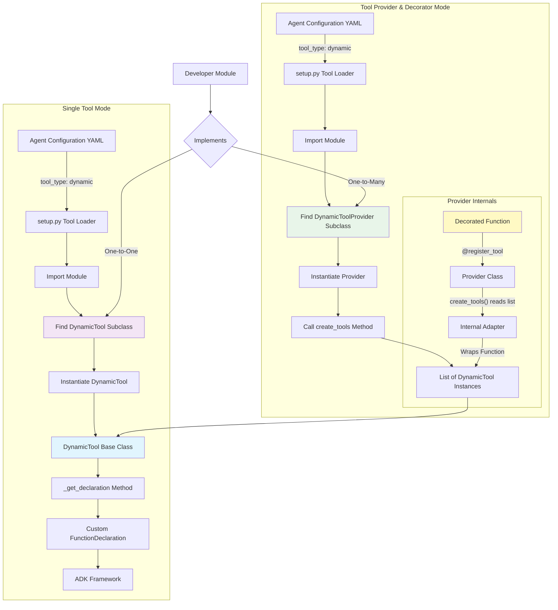

# Dynamic Tools Design Document for Solace Agent Mesh (SAM)

## Overview

This document describes the design for adding a new tool type called "dynamic" to the Solace Agent Mesh (SAM) system. Dynamic tools allow developers to create tools that define their own function names, descriptions, and parameter schemas programmatically, rather than having these inferred from Python function signatures.

This design supports three modes of operation:
1.  **Single Tool Mode**: A Python module defines a single class that inherits from `DynamicTool`, representing one tool. This is for simple, self-contained tools.
2.  **Tool Provider Mode**: A Python module defines a class that inherits from `DynamicToolProvider`. This class acts as a factory, capable of generating a list of multiple `DynamicTool` instances from a single configuration block. This is for advanced use cases where a set of related tools can be generated programmatically.
3.  **Decorator-Based Mode**: Within a `DynamicToolProvider`, developers can use a `@register_tool` decorator on standard Python functions to automatically convert them into tools, combining the ease of introspection with the power of the provider pattern.

## Problem Statement

Currently, SAM supports three main tool types:
- **Python tools**: Function name and parameters are inferred from the Python function signature.
- **MCP tools**: External tools that communicate via the Model Context Protocol.
- **Builtin tools**: Pre-registered tools in the SAM tool registry.

However, there's no way for a Python module to programmatically define multiple tools with custom names and parameter schemas without being constrained by Python function signatures or requiring verbose configuration. Dynamic tools fill this gap by allowing modules to define their tool interfaces programmatically, either individually or in bulk, with varying levels of abstraction.

## Architecture

### Core Components



### Key Classes

#### 1. `DynamicTool` Base Class
A new abstract base class that extends Google ADK's `BaseTool` and provides the interface for a single, programmatically defined dynamic tool.

**Location**: `src/solace_agent_mesh/agent/tools/dynamic_tool.py`

```python
from abc import ABC, abstractmethod
from typing import Optional, List
from google.adk.tools import BaseTool, ToolContext
from google.genai import types as adk_types

class DynamicTool(BaseTool, ABC):
    """
    Base class for dynamic tools that can define their own function names,
    descriptions, and parameter schemas programmatically.
    """
    
    def __init__(self, tool_config: Optional[dict] = None):
        # Initialize with a placeholder name, will be overridden by tool_name property
        super().__init__(name="dynamic_tool_placeholder")
        self.tool_config = tool_config or {}
    
    @property
    @abstractmethod
    def tool_name(self) -> str:
        """Return the function name that the LLM will call."""
        pass
    
    @property
    @abstractmethod
    def tool_description(self) -> str:
        """Return the description of what this tool does."""
        pass
    
    @property
    @abstractmethod
    def parameters_schema(self) -> adk_types.Schema:
        """Return the ADK Schema defining the tool's parameters."""
        pass
    
    def _get_declaration(self) -> Optional[adk_types.FunctionDeclaration]:
        """
        Generate the FunctionDeclaration for this dynamic tool.
        This follows the same pattern as PeerAgentTool and MCP tools.
        """
        # Update the tool name to match what the module defines
        self.name = self.tool_name
        
        return adk_types.FunctionDeclaration(
            name=self.tool_name,
            description=self.tool_description,
            parameters=self.parameters_schema,
        )
    
    @abstractmethod
    async def _run_async_impl(
        self, 
        args: dict, 
        tool_context: ToolContext, 
        credential: Optional[str] = None
    ) -> dict:
        """
        Implement the actual tool logic.
        Must return a dictionary response.
        """
        pass
```

#### 2. `DynamicToolProvider` Base Class
A new abstract base class for factories that can generate multiple `DynamicTool` instances. It also includes a decorator for converting standard functions into tools.

**Location**: `src/solace_agent_mesh/agent/tools/dynamic_tool.py`

```python
class DynamicToolProvider(ABC):
    """
    Base class for dynamic tool providers that can generate a list of tools
    programmatically from a single configuration block.
    """
    
    _decorated_tools: List[Callable] = []

    @classmethod
    def register_tool(cls, func: Callable) -> Callable:
        """
        A decorator to register a standard async function as a tool.
        The decorated function's signature and docstring will be used to
        create the tool definition.
        """
        if not hasattr(cls, '_decorated_tools') or cls._decorated_tools is DynamicToolProvider._decorated_tools:
            cls._decorated_tools = []
        cls._decorated_tools.append(func)
        return func

    def _create_tools_from_decorators(self, tool_config: Optional[dict] = None) -> List[DynamicTool]:
        """
        Internal helper to convert decorated functions into DynamicTool instances.
        This would be called inside the user's create_tools implementation.
        """
        tools = []
        for func in self._decorated_tools:
            # _FunctionAsDynamicTool is an internal adapter class that wraps the function.
            # It uses introspection to get name, description, and parameters.
            adapter = _FunctionAsDynamicTool(func, tool_config)
            tools.append(adapter)
        return tools

    @abstractmethod
    def create_tools(self, tool_config: Optional[dict] = None) -> List[DynamicTool]:
        """
        Generate and return a list of DynamicTool instances.
        
        Args:
            tool_config: The configuration dictionary from the agent's YAML file.
            
        Returns:
            A list of initialized DynamicTool objects.
        """
        pass
```

#### 3. Enhanced Tool Loading Logic
Modifications to `src/solace_agent_mesh/agent/adk/setup.py` remain the same as the previous design, as the complexity is handled within the provider. The loader's responsibility is to find either a `DynamicToolProvider` or a `DynamicTool`.

```python
elif tool_type == "dynamic":
    module_name = tool_config.get("component_module")
    base_path = tool_config.get("component_base_path")
    
    if not module_name:
        raise ValueError("'component_module' required for dynamic tool.")
    
    module = import_module(module_name, base_path=base_path)
    specific_tool_config = tool_config.get("tool_config")

    # Attempt to find a Tool Provider first (one-to-many)
    provider_class = _find_dynamic_tool_provider_class(module)
    if provider_class:
        provider_instance = provider_class()
        dynamic_tools = provider_instance.create_tools(tool_config=specific_tool_config)
        log.info(
            "%s Loaded %d tools from DynamicToolProvider '%s' in %s",
            component.log_identifier,
            len(dynamic_tools),
            provider_class.__name__,
            module_name,
        )
    else:
        # Fallback to finding a single Tool class (one-to-one)
        class_name = tool_config.get("class_name")
        if class_name:
            tool_class = getattr(module, class_name)
        else:
            tool_class = _find_dynamic_tool_class(module)
        
        if not tool_class or not issubclass(tool_class, DynamicTool):
            raise TypeError(f"Module '{module_name}' must contain a DynamicTool or DynamicToolProvider subclass.")
        
        tool_instance = tool_class(tool_config=specific_tool_config)
        dynamic_tools = [tool_instance]

    # Process all generated tools
    for tool in dynamic_tools:
        tool.origin = "dynamic"
        declaration = tool._get_declaration()
        if not declaration:
            log.warning(f"Dynamic tool '{tool.__class__.__name__}' from module '{module_name}' did not generate a valid declaration. Skipping.")
            continue
        
        _check_and_register_tool_name(declaration.name, f"dynamic:{module_name}")
        loaded_tools.append(tool)
        log.info(
            "%s Loaded dynamic tool: %s from %s",
            component.log_identifier,
            declaration.name,
            module_name,
        )
```

## Configuration Format

The YAML configuration remains simple and is identical for all modes of dynamic tool creation.

```yaml
tools:
  # Example 1: Single Tool Mode (auto-discovers WeatherTool class)
  - tool_type: dynamic
    component_module: my_tools.weather_api
    component_base_path: .
    tool_config:
      api_key: ${WEATHER_API_KEY}

  # Example 2: Tool Provider Mode (auto-discovers DatabaseToolProvider)
  # This single block will load all tools generated by the provider.
  - tool_type: dynamic
    component_module: my_tools.database_tools
    component_base_path: .
    tool_config:
      connection_string: ${DB_CONNECTION_STRING}
      max_rows: 1000
```

## Example Implementation

### Hybrid Tool Provider (Decorators + Programmatic)

This example shows how a single provider can generate tools from decorated functions and programmatic classes.

**File**: `my_tools/database_tools.py`

```python
from typing import Optional, Dict, Any, List
from google.genai import types as adk_types
from solace_agent_mesh.agent.tools.dynamic_tool import DynamicTool, DynamicToolProvider
import asyncpg

# --- Tool Provider Implementation ---

class DatabaseToolProvider(DynamicToolProvider):
    """A factory that creates all database-related tools."""
    
    def create_tools(self, tool_config: Optional[dict] = None) -> List[DynamicTool]:
        """
        Generates a list of all database tools, passing the shared
        configuration to each one.
        """
        # 1. Create tools from any decorated functions in this module
        tools = self._create_tools_from_decorators(tool_config)

        # 2. Programmatically create and add more complex tools
        if tool_config and tool_config.get("connection_string"):
            tools.append(DatabaseQueryTool(tool_config=tool_config))
            tools.append(DatabaseSchemaTool(tool_config=tool_config))
        
        return tools

# --- Decorated Tool Function ---

@DatabaseToolProvider.register_tool
async def get_database_server_version(tool_config: dict, **kwargs) -> dict:
    """Returns the version of the connected PostgreSQL server."""
    connection_string = tool_config.get("connection_string")
    if not connection_string:
        return {"status": "error", "message": "Database connection not configured"}
    
    try:
        conn = await asyncpg.connect(connection_string)
        version = await conn.fetchval('SELECT version()')
        await conn.close()
        return {"status": "success", "version": version}
    except Exception as e:
        return {"status": "error", "message": str(e)}

# --- Programmatic Tool Implementations ---

class DatabaseQueryTool(DynamicTool):
    """Dynamic tool for executing read-only database queries."""
    
    @property
    def tool_name(self) -> str: return "execute_database_query"
    
    @property
    def tool_description(self) -> str: return "Execute a read-only SQL query."
    
    @property
    def parameters_schema(self) -> adk_types.Schema:
        return adk_types.Schema(
            type=adk_types.Type.OBJECT,
            properties={"query": adk_types.Schema(type=adk_types.Type.STRING, description="The SQL SELECT query.")},
            required=["query"],
        )
    
    async def _run_async_impl(self, args: Dict[str, Any], **kwargs) -> Dict[str, Any]:
        # ... implementation to run query ...
        return {"status": "success", "rows": [{"id": 1}]}

class DatabaseSchemaTool(DynamicTool):
    """Dynamic tool for exploring database schema."""
    
    @property
    def tool_name(self) -> str: return "get_database_schema"
    
    @property
    def tool_description(self) -> str: return "Get schema information for database tables."
    
    @property
    def parameters_schema(self) -> adk_types.Schema:
        return adk_types.Schema(type=adk_types.Type.OBJECT, properties={}, required=[])
    
    async def _run_async_impl(self, args: Dict[str, Any], **kwargs) -> Dict[str, Any]:
        # ... implementation to get schema ...
        return {"status": "success", "schema": {"users": ["id", "name"]}}
```

## Integration with Existing Features

Dynamic tools, whether created via class or decorator, integrate seamlessly with all existing SAM features, including embed resolution, tool callbacks, artifact management, and security controls.

## Benefits

1.  **Flexibility**: Modules can define any tool name and parameter schema they want.
2.  **Scalability**: The Tool Provider pattern allows a single module to generate hundreds of tools from one configuration block.
3.  **Unified Abstraction**: The provider pattern supports both programmatic and declarative (decorator-based) tool creation in the same module.
4.  **Reduced Boilerplate**: For simple tools, the decorator approach is far more concise than writing a full class.
5.  **Encapsulation**: Tool generation logic is co-located with the tool implementation, not spread across YAML.
6.  **Runtime Configuration**: Tools can adapt their behavior, interface, and even their existence based on runtime configuration.
7.  **Type Safety**: Uses ADK's type system for parameter validation.

## Conclusion

Dynamic tools provide a powerful and flexible way to create custom tools in SAM. The dual-mode design supports both simple, self-contained tools and complex, programmatically generated toolsets via the `DynamicToolProvider` pattern. The addition of the `@register_tool` decorator provides a "best of both worlds" approach, combining the simplicity of function introspection with the scalability of a provider.

This bridges the gap between rigid Python function signatures and external MCP tools, giving developers a highly scalable and maintainable way to extend agent capabilities.
