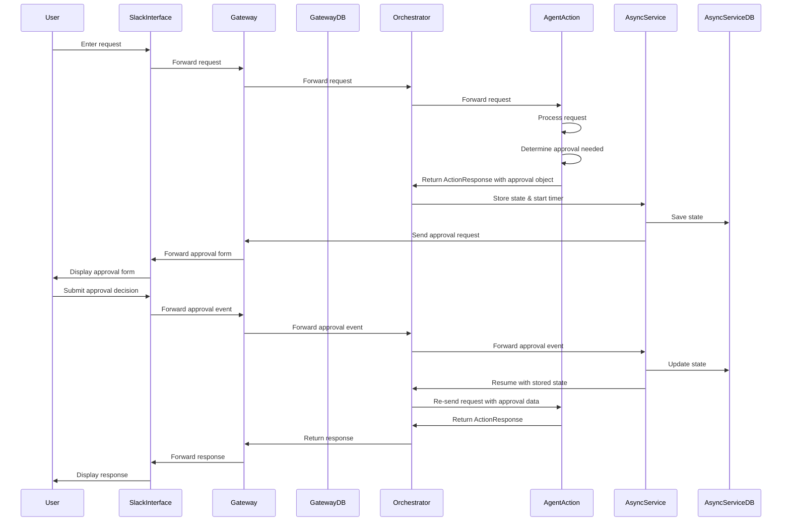

# Approval Flow Feature Architecture Plan

Based on the requirements and existing codebase, this document outlines a comprehensive architecture plan for implementing the approval flow feature. This feature will allow agent actions to request approval from the originator (user) before proceeding with certain operations.

## 1. System Components Overview

Here's a diagram showing the components involved in the approval flow:



## 2. Component Modifications

### 2.1 ActionResponse Class Modifications

We need to extend the `ActionResponse` class to include an approval object:

```python
class ApprovalRequest:
    def __init__(
        self,
        form_schema: dict,  # RJFS form schema
        approval_data: dict,  # Data to display in the form
        approval_type: str = "binary",  # binary (approve/reject) or custom
        timeout_seconds: int = 3600,  # Default 1 hour timeout
    ):
        self._form_schema = form_schema
        self._approval_data = approval_data
        self._approval_type = approval_type
        self._timeout_seconds = timeout_seconds

    @property
    def form_schema(self) -> dict:
        return self._form_schema

    @property
    def approval_data(self) -> dict:
        return self._approval_data

    @property
    def approval_type(self) -> str:
        return self._approval_type

    @property
    def timeout_seconds(self) -> int:
        return self._timeout_seconds

    def to_dict(self) -> dict:
        return {
            "form_schema": self._form_schema,
            "approval_data": self._approval_data,
            "approval_type": self._approval_type,
            "timeout_seconds": self._timeout_seconds,
        }
```

Then modify the `ActionResponse` class to include this approval request:

```python
class ActionResponse:
    def __init__(
        self,
        # ... existing parameters ...
        approval_request: ApprovalRequest = None,
    ):
        # ... existing initializations ...
        self._approval_request = approval_request

    @property
    def approval_request(self) -> ApprovalRequest:
        return self._approval_request

    def to_dict(self) -> dict:
        response = {}
        # ... existing code ...
        if self._approval_request:
            response["approval_request"] = self._approval_request.to_dict()
        # ... rest of existing code ...
        return response
```

### 2.2 Form Utility Functions

Create utility functions to generate RJFS form schemas from Python dictionaries:

```python
def create_approval_form(approval_data: dict, title: str = "Approval Request") -> dict:
    """
    Create an RJFS form schema from approval data
    
    Args:
        approval_data: Dictionary containing data to display in the form
        title: Form title
        
    Returns:
        RJFS form schema
    """
    form_schema = {
        "title": title,
        "type": "object",
        "properties": {},
        "required": []
    }
    
    # Add fields for each item in approval_data
    for key, value in approval_data.items():
        field_type = "string"
        if isinstance(value, bool):
            field_type = "boolean"
        elif isinstance(value, int):
            field_type = "integer"
        elif isinstance(value, float):
            field_type = "number"
            
        form_schema["properties"][key] = {
            "type": field_type,
            "title": key.replace("_", " ").title(),
            "default": value,
            "readOnly": True  # Make fields read-only for display purposes
        }
    
    # Add approve/reject buttons
    form_schema["properties"]["decision"] = {
        "type": "string",
        "title": "Decision",
        "enum": ["approve", "reject"],
        "enumNames": ["Approve", "Reject"]
    }
    form_schema["required"].append("decision")
    
    return form_schema
```

### 2.3 AsyncService Component

Create a new AsyncService component to manage asynchronous tasks:

```python
class AsyncService:
    def __init__(self, db_config):
        self.db = self._initialize_db(db_config)
        self.tasks = {}  # In-memory cache of tasks
        
    def _initialize_db(self, db_config):
        # Initialize database connection based on config
        # Support MySQL, PostgreSQL, SQLite, etc.
        db_type = db_config.get("type", "sqlite")
        if db_type == "mysql":
            from ..common.mysql_database import MySQLDatabase
            return MySQLDatabase(db_config)
        elif db_type == "postgres":
            from ..common.postgres_database import PostgresDatabase
            return PostgresDatabase(db_config)
        else:
            # Default to in-memory storage if no DB config
            return None
            
    def create_task(self, stimulus_id, session_state, stimulus_state, agent_list_state, timeout_seconds=3600):
        """Create a new async task"""
        task_id = str(uuid4())
        task = {
            "task_id": task_id,
            "stimulus_id": stimulus_id,
            "session_state": session_state,
            "stimulus_state": stimulus_state,
            "agent_list_state": agent_list_state,
            "created_at": datetime.now(),
            "timeout_at": datetime.now() + timedelta(seconds=timeout_seconds),
            "status": "pending",
            "approvals": {},
            "approval_decisions": {}
        }
        
        # Store in database
        if self.db:
            self.db.store_task(task)
        
        # Cache in memory
        self.tasks[task_id] = task
        
        return task_id
        
    def get_task(self, task_id):
        """Get task by ID"""
        if task_id in self.tasks:
            return self.tasks[task_id]
            
        if self.db:
            task = self.db.get_task(task_id)
            if task:
                self.tasks[task_id] = task
            return task
            
        return None
        
    def update_task(self, task_id, approval_id, decision, form_data):
        """Update task with approval decision"""
        task = self.get_task(task_id)
        if not task:
            return None
            
        task["approval_decisions"][approval_id] = {
            "decision": decision,
            "form_data": form_data,
            "timestamp": datetime.now()
        }
        
        # Check if all approvals are received
        all_approved = True
        for approval_id in task["approvals"]:
            if approval_id not in task["approval_decisions"]:
                all_approved = False
                break
                
        if all_approved:
            task["status"] = "approved"
            
        # Update in database
        if self.db:
            self.db.update_task(task)
            
        # Update in memory
        self.tasks[task_id] = task
        
        return task
        
    def check_timeouts(self):
        """Check for timed out tasks"""
        now = datetime.now()
        timed_out_tasks = []
        
        for task_id, task in self.tasks.items():
            if task["status"] == "pending" and now > task["timeout_at"]:
                task["status"] = "timeout"
                timed_out_tasks.append(task)
                
                # Update in database
                if self.db:
                    self.db.update_task(task)
        
        return timed_out_tasks
```

### 2.4 Database Schema

Create a database schema for storing async tasks:

```sql
CREATE TABLE async_tasks (
    task_id VARCHAR(36) PRIMARY KEY,
    stimulus_id VARCHAR(36) NOT NULL,
    created_at TIMESTAMP NOT NULL,
    timeout_at TIMESTAMP NOT NULL,
    status VARCHAR(20) NOT NULL,
    session_state TEXT,
    stimulus_state TEXT,
    agent_list_state TEXT
);

CREATE TABLE async_approvals (
    approval_id VARCHAR(36) PRIMARY KEY,
    task_id VARCHAR(36) NOT NULL,
    originator VARCHAR(255) NOT NULL,
    form_schema TEXT NOT NULL,
    approval_data TEXT NOT NULL,
    created_at TIMESTAMP NOT NULL,
    FOREIGN KEY (task_id) REFERENCES async_tasks(task_id)
);

CREATE TABLE async_decisions (
    decision_id VARCHAR(36) PRIMARY KEY,
    approval_id VARCHAR(36) NOT NULL,
    decision VARCHAR(20) NOT NULL,
    form_data TEXT NOT NULL,
    created_at TIMESTAMP NOT NULL,
    FOREIGN KEY (approval_id) REFERENCES async_approvals(approval_id)
);
```

## 3. Component Integration

### 3.1 Orchestrator Modifications

Modify the orchestrator action response component to handle approval requests:

```python
def invoke(self, message: Message, data):
    # ... existing code ...
    
    # Check if the action response contains an approval request
    if data.get("approval_request"):
        approval_request = data.get("approval_request")
        
        # Store session state, stimulus state, and agent list state
        session_state = self.orchestrator_state.get_session_state(session_id)
        stimulus_state = self.orchestrator_state.get_stimulus_state(session_id)
        agent_list_state = self.orchestrator_state.get_agent_list_state(session_id)
        
        # Create async task
        async_service = AsyncService(self.get_config("async_service_config", {}))
        task_id = async_service.create_task(
            stimulus_id=session_id,
            session_state=session_state,
            stimulus_state=stimulus_state,
            agent_list_state=agent_list_state,
            timeout_seconds=approval_request.get("timeout_seconds", 3600)
        )
        
        # Send approval request to gateway
        events.append({
            "topic": f"{os.getenv('SOLACE_AGENT_MESH_NAMESPACE')}solace-agent-mesh/v1/approval/request/{user_properties.get('gateway_id')}",
            "payload": {
                "task_id": task_id,
                "form_schema": approval_request.get("form_schema"),
                "approval_data": approval_request.get("approval_data"),
                "approval_type": approval_request.get("approval_type", "binary"),
                "identity": user_properties.get("identity"),
                "channel": user_properties.get("channel"),
                "thread_ts": user_properties.get("thread_ts"),
            }
        })
        
        # Clear orchestrator state
        self.orchestrator_state.clear_stimulus_state(session_id)
        self.orchestrator_state.clear_agent_list_state(session_id)
        
        # Return status message to user
        user_response["text"] = "Your request requires approval. Please check for an approval request."
    
    # ... rest of existing code ...
```

### 3.2 Gateway Modifications

Add a new flow to the gateway to handle approval requests and responses:

```yaml
# Flow to handle approval requests
- name: gateway_approval_request
  components:
    # Input from a Solace broker
    - component_name: solace_sw_broker
      component_module: broker_input
      component_config:
        <<: *broker_connection
        broker_queue_name: ${SOLACE_AGENT_MESH_NAMESPACE}gateway_approval_request
        broker_subscriptions:
          - topic: ${SOLACE_AGENT_MESH_NAMESPACE}solace-agent-mesh/v1/approval/request/${GATEWAY_ID}
            qos: 1
        payload_encoding: utf-8
        payload_format: json

    # Process the approval request with a custom component
    - component_name: approval_request_processor
      component_base_path: .
      component_module: src.gateway.components.gateway_approval_request_component
      component_input:
        source_expression: input.payload

    # Send to the interface (e.g., Slack)
    - component_name: broker_output
      component_module: broker_output
      component_config:
        <<: *broker_connection
        payload_encoding: utf-8
        payload_format: json
      component_input:
        source_expression: previous

# Flow to handle approval responses
- name: gateway_approval_response
  components:
    # Input from a Solace broker
    - component_name: solace_sw_broker
      component_module: broker_input
      component_config:
        <<: *broker_connection
        broker_queue_name: ${SOLACE_AGENT_MESH_NAMESPACE}gateway_approval_response
        broker_subscriptions:
          - topic: ${SOLACE_AGENT_MESH_NAMESPACE}solace-agent-mesh/v1/approval/response/${GATEWAY_ID}
            qos: 1
        payload_encoding: utf-8
        payload_format: json

    # Process the approval response with a custom component
    - component_name: approval_response_processor
      component_base_path: .
      component_module: src.gateway.components.gateway_approval_response_component
      component_input:
        source_expression: input.payload

    # Send to the orchestrator
    - component_name: broker_output
      component_module: broker_output
      component_config:
        <<: *broker_connection
        payload_encoding: utf-8
        payload_format: json
      component_input:
        source_expression: previous
```

### 3.3 Slack Interface Modifications

Create a component to render RJFS forms as Slack blocks:

```python
def rjfs_to_slack_blocks(form_schema, approval_data):
    """Convert RJFS form schema to Slack blocks"""
    blocks = []
    
    # Add title
    blocks.append({
        "type": "header",
        "text": {
            "type": "plain_text",
            "text": form_schema.get("title", "Approval Request"),
            "emoji": True
        }
    })
    
    # Add divider
    blocks.append({"type": "divider"})
    
    # Add fields for each property
    for key, prop in form_schema.get("properties", {}).items():
        if key == "decision":  # Skip decision field, we'll add buttons later
            continue
            
        value = approval_data.get(key, prop.get("default", ""))
        
        # Format value based on type
        if prop.get("type") == "boolean":
            value = "Yes" if value else "No"
        elif prop.get("type") in ["integer", "number"]:
            value = str(value)
        
        blocks.append({
            "type": "section",
            "fields": [
                {
                    "type": "mrkdwn",
                    "text": f"*{prop.get('title', key)}*"
                },
                {
                    "type": "mrkdwn",
                    "text": value
                }
            ]
        })
    
    # Add divider
    blocks.append({"type": "divider"})
    
    # Add approve/reject buttons
    blocks.append({
        "type": "actions",
        "elements": [
            {
                "type": "button",
                "text": {
                    "type": "plain_text",
                    "text": "Approve",
                    "emoji": True
                },
                "style": "primary",
                "value": "approve"
            },
            {
                "type": "button",
                "text": {
                    "type": "plain_text",
                    "text": "Reject",
                    "emoji": True
                },
                "style": "danger",
                "value": "reject"
            }
        ]
    })
    
    return blocks
```

## 4. AsyncService Component

Create a new AsyncService component to manage asynchronous tasks:

```python
"""This is the AsyncService component that manages asynchronous tasks"""

import os
from uuid import uuid4
from datetime import datetime, timedelta
import json

from solace_ai_connector.components.component_base import ComponentBase
from solace_ai_connector.common.log import log
from solace_ai_connector.common.message import Message
from solace_ai_connector.common.event import Event, EventType

from ...common.mysql_database import MySQLDatabase
from ...common.postgres_database import PostgresDatabase

info = {
    "class_name": "AsyncServiceComponent",
    "description": ("This component manages asynchronous tasks"),
    "config_parameters": [
        {
            "name": "db_config",
            "type": "object",
            "properties": {
                "type": {"type": "string", "enum": ["mysql", "postgres", "sqlite", "memory"]},
                "host": {"type": "string"},
                "port": {"type": "integer"},
                "username": {"type": "string"},
                "password": {"type": "string"},
                "database": {"type": "string"},
            },
            "description": "Database configuration for storing async tasks",
        },
        {
            "name": "default_timeout_seconds",
            "type": "integer",
            "description": "Default timeout for async tasks in seconds",
            "default": 3600
        }
    ],
    "input_schema": {
        "type": "object",
        "properties": {
            "task_id": {"type": "string"},
            "stimulus_id": {"type": "string"},
            "approval_id": {"type": "string"},
            "decision": {"type": "string"},
            "form_data": {"type": "object"},
        },
    },
    "output_schema": {
        "type": "object",
        "properties": {
            "topic": {"type": "string"},
            "payload": {"type": "object"},
        },
    },
}

class AsyncServiceComponent(ComponentBase):
    """This component manages asynchronous tasks"""
    
    def __init__(self, **kwargs):
        super().__init__(info, **kwargs)
        self.db = self._initialize_db()
        self.default_timeout_seconds = self.get_config("default_timeout_seconds", 3600)
        self.tasks = {}  # In-memory cache of tasks
        
    def _initialize_db(self):
        """Initialize database connection based on config"""
        db_config = self.get_config("db_config", {})
        db_type = db_config.get("type", "memory")
        
        if db_type == "mysql":
            return MySQLDatabase(db_config)
        elif db_type == "postgres":
            return PostgresDatabase(db_config)
        elif db_type == "sqlite":
            # Implement SQLite connection
            pass
        else:
            # Use in-memory storage
            return None
            
    def create_task(self, stimulus_id, session_state, stimulus_state, agent_list_state, timeout_seconds=None):
        """Create a new async task"""
        if timeout_seconds is None:
            timeout_seconds = self.default_timeout_seconds
            
        task_id = str(uuid4())
        task = {
            "task_id": task_id,
            "stimulus_id": stimulus_id,
            "session_state": session_state,
            "stimulus_state": stimulus_state,
            "agent_list_state": agent_list_state,
            "created_at": datetime.now(),
            "timeout_at": datetime.now() + timedelta(seconds=timeout_seconds),
            "status": "pending",
            "approvals": {},
            "approval_decisions": {}
        }
        
        # Store in database
        if self.db:
            self.db.store_task(task)
        
        # Cache in memory
        self.tasks[task_id] = task
        
        return task_id
        
    def get_task(self, task_id):
        """Get task by ID"""
        if task_id in self.tasks:
            return self.tasks[task_id]
            
        if self.db:
            task = self.db.get_task(task_id)
            if task:
                self.tasks[task_id] = task
            return task
            
        return None
        
    def update_task(self, task_id, approval_id, decision, form_data):
        """Update task with approval decision"""
        task = self.get_task(task_id)
        if not task:
            return None
            
        task["approval_decisions"][approval_id] = {
            "decision": decision,
            "form_data": form_data,
            "timestamp": datetime.now()
        }
        
        # Check if all approvals are received
        all_approved = True
        for approval_id in task["approvals"]:
            if approval_id not in task["approval_decisions"]:
                all_approved = False
                break
                
        if all_approved:
            task["status"] = "approved"
            
        # Update in database
        if self.db:
            self.db.update_task(task)
            
        # Update in memory
        self.tasks[task_id] = task
        
        return task
        
    def check_timeouts(self):
        """Check for timed out tasks"""
        now = datetime.now()
        timed_out_tasks = []
        
        for task_id, task in self.tasks.items():
            if task["status"] == "pending" and now > task["timeout_at"]:
                task["status"] = "timeout"
                timed_out_tasks.append(task)
                
                # Update in database
                if self.db:
                    self.db.update_task(task)
        
        return timed_out_tasks
        
    def invoke(self, message: Message, data):
        """Handle incoming messages"""
        if not data:
            log.error("No data received")
            self.discard_current_message()
            return None
            
        # Handle approval response
        if "task_id" in data and "approval_id" in data and "decision" in data:
            task_id = data["task_id"]
            approval_id = data["approval_id"]
            decision = data["decision"]
            form_data = data.get("form_data", {})
            
            task = self.update_task(task_id, approval_id, decision, form_data)
            if not task:
                log.error(f"Task {task_id} not found")
                self.discard_current_message()
                return None
                
            # If all approvals are received, resume the task
            if task["status"] == "approved":
                return {
                    "topic": f"{os.getenv('SOLACE_AGENT_MESH_NAMESPACE')}solace-agent-mesh/v1/stimulus/orchestrator/resume",
                    "payload": {
                        "task_id": task_id,
                        "stimulus_id": task["stimulus_id"],
                        "session_state": task["session_state"],
                        "stimulus_state": task["stimulus_state"],
                        "agent_list_state": task["agent_list_state"],
                        "approval_decisions": task["approval_decisions"]
                    }
                }
                
        # Handle task creation
        elif "stimulus_id" in data and "session_state" in data:
            stimulus_id = data["stimulus_id"]
            session_state = data["session_state"]
            stimulus_state = data.get("stimulus_state", {})
            agent_list_state = data.get("agent_list_state", {})
            timeout_seconds = data.get("timeout_seconds", self.default_timeout_seconds)
            
            task_id = self.create_task(
                stimulus_id=stimulus_id,
                session_state=session_state,
                stimulus_state=stimulus_state,
                agent_list_state=agent_list_state,
                timeout_seconds=timeout_seconds
            )
            
            return {
                "topic": f"{os.getenv('SOLACE_AGENT_MESH_NAMESPACE')}solace-agent-mesh/v1/approval/created",
                "payload": {
                    "task_id": task_id,
                    "stimulus_id": stimulus_id,
                    "timeout_at": task["timeout_at"].isoformat()
                }
            }
            
        # Handle timeout check
        elif "check_timeouts" in data:
            timed_out_tasks = self.check_timeouts()
            events = []
            
            for task in timed_out_tasks:
                events.append({
                    "topic": f"{os.getenv('SOLACE_AGENT_MESH_NAMESPACE')}solace-agent-mesh/v1/approval/timeout",
                    "payload": {
                        "task_id": task["task_id"],
                        "stimulus_id": task["stimulus_id"],
                        "gateway_id": task.get("gateway_id")
                    }
                })
                
            return events
            
        self.discard_current_message()
        return None
```

## 5. Implementation Plan

Here's a step-by-step implementation plan:

1. **Database Setup**
   - Create database schema for AsyncService
   - Implement database adapters for MySQL and PostgreSQL

2. **Core Components**
   - Modify ActionResponse class to include approval object
   - Create ApprovalRequest class
   - Implement form utility functions for RJFS

3. **AsyncService**
   - Implement AsyncService component
   - Create timer flow for checking timeouts

4. **Orchestrator Modifications**
   - Update orchestrator action response component to handle approval requests
   - Implement state storage and retrieval for paused stimuli

5. **Gateway Modifications**
   - Create gateway approval request component
   - Create gateway approval response component
   - Add new flows to gateway configuration

6. **Slack Interface**
   - Implement RJFS to Slack blocks converter
   - Create form renderer for Slack
   - Implement form submission handler

7. **Testing**
   - Unit tests for each component
   - Integration tests for the full flow
   - Timeout handling tests

## 6. Configuration Example

Here's an example configuration for the AsyncService:

```yaml
# AsyncService configuration
async_service:
  db_config:
    type: ${ASYNC_DB_TYPE, "memory"}  # memory, mysql, postgres, sqlite
    host: ${ASYNC_DB_HOST, "localhost"}
    port: ${ASYNC_DB_PORT, 3306}
    username: ${ASYNC_DB_USERNAME, "root"}
    password: ${ASYNC_DB_PASSWORD, ""}
    database: ${ASYNC_DB_NAME, "async_service"}
  default_timeout_seconds: ${ASYNC_DEFAULT_TIMEOUT, 3600}
```

## 7. Error Handling

The system should handle these error scenarios:

1. **Timeout Handling**
   - If a user doesn't respond within the timeout period, the AsyncService will mark the task as timed out
   - A timeout event will be sent to the gateway that originated the request
   - The user will be notified that their request has timed out

2. **Database Failures**
   - If the database is unavailable, the system will fall back to in-memory storage
   - Periodic attempts will be made to reconnect to the database

3. **Form Rendering Errors**
   - If there's an error rendering the form, a simplified form will be shown with just approve/reject buttons
   - The error will be logged for debugging

4. **Security Considerations**
   - Only the originator of the request can approve it
   - The system will validate the identity of the user before processing approval responses

## 8. Future Enhancements

For future consideration:

1. **Multiple Approvers**
   - Support for requiring approval from multiple users
   - Role-based approval workflows

2. **Custom Form Fields**
   - Allow actions to define custom form fields beyond simple approval/rejection
   - Support for collecting additional information during approval

3. **Approval Delegation**
   - Allow users to delegate approval authority to others
   - Support for approval chains or hierarchies

4. **Approval History**
   - Track and display approval history for audit purposes
   - Support for comments and justifications for approvals/rejections

5. **Notification System**
   - Send reminders for pending approvals
   - Notify stakeholders when approvals are completed or rejected