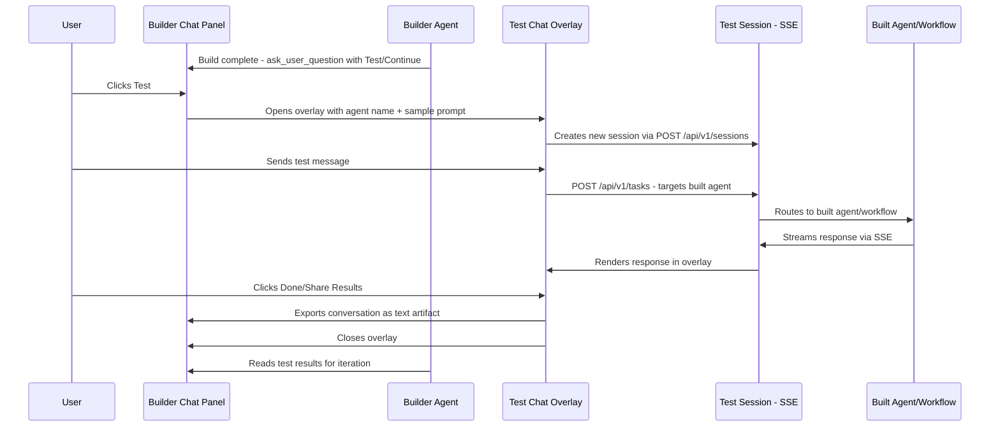
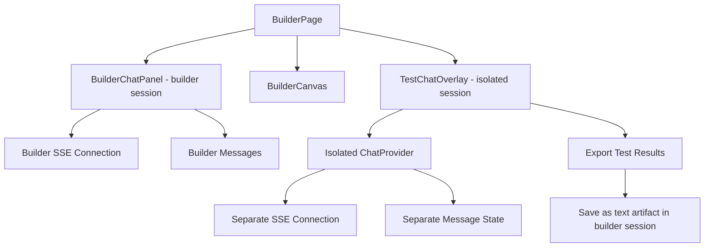

# In-Context Testing of Created Workflows/Agents — Architectural Design

## 1. Overview & Goals

After the Builder agent creates and validates all components (Phase 3 complete), users should be able to **test their workflow or agent without leaving the builder page**. Testing must happen in an **isolated session** so that tool calls, LLM internals, and test conversation history don't pollute the builder session.

### Acceptance Criteria

1. After deployment, user is prompted to test
2. Testing happens in an isolated session (overlay dialog, not inline)
3. Test results can be shared back to the builder agent as context
4. Builder session history is not polluted with test internals

### Design Principles

- **Session isolation**: Test chat runs in a completely separate session with its own SSE connection, task ID, and message history
- **Stay on page**: User never navigates away from the builder page — test chat is a modal overlay
- **Minimal backend changes**: Leverage existing session creation + SSE infrastructure
- **Result portability**: Test conversation is exportable as a text artifact that the builder agent can read for iteration context

---

## 2. Architecture

### High-Level Flow



### Component Architecture



---

## 3. Detailed Design

### 3.1 Test Trigger — Builder Agent Completion

The builder agent already has instructions (lines 517-532 of `builder_agent.yaml`) to present a "Test" button via `ask_user_question` after build completion. When the user clicks "Test":

1. The `ask_user_question` response returns `{ status: "answered", answers: { "...": "Test" } }`
2. The builder agent receives this and should emit a **test_session** signal — a special artifact or SSE event that tells the frontend to open the test overlay

**Approach**: The builder agent calls a new action — it saves a small JSON artifact with `mime_type: "application/vnd.sam-test-request+json"` containing:
```json
{
  "target_agent": "my-agent-name",
  "target_type": "agent",
  "sample_prompt": "Tell me a joke about programming",
  "display_name": "My Agent"
}
```

The frontend detects this artifact and opens the test overlay. This avoids any new SSE event types or backend changes.

**Alternative (simpler)**: Instead of a special artifact, the builder agent responds with a text message containing a structured marker that the frontend detects. But the artifact approach is cleaner and more extensible.

**Simplest approach (recommended)**: The frontend handles the "Test" button click directly in the `ask_user_question` response handler. When the user clicks "Test Workflow" or "Test Agent", the frontend:
1. Reads the manifest to get the target agent/workflow name
2. Opens the test overlay directly
3. No need for the builder agent to do anything special — the frontend knows what was built

### 3.2 TestChatOverlay Component

A modal dialog that renders a fully functional chat interface in an isolated session.

**Location**: 
- Enterprise: `sam-ent/.../builder/TestChatOverlay.tsx`
- Community: `sam/client/webui/frontend/src/lib/components/chat/TestChatOverlay.tsx`

**Props**:
```typescript
interface TestChatOverlayProps {
  isOpen: boolean;
  onClose: () => void;
  targetAgentName: string;
  targetType: "agent" | "workflow";
  displayName: string;
  samplePrompt?: string;
  builderSessionId: string;
  onTestComplete?: (conversationText: string) => void;
}
```

**Key implementation details**:

1. **Isolated session**: On mount, creates a new session via `POST /api/v1/sessions` with a generated UUID. This session is completely separate from the builder session.

2. **Pre-selected agent**: The chat input area pre-selects the target agent/workflow so messages are routed to it. Uses `selectedAgentName` state.

3. **Own SSE connection**: The overlay has its own `ChatProvider` instance (or a lightweight version) that manages its own EventSource, messages, and task state. This is the key isolation mechanism.

4. **Sample prompt**: Optionally pre-fills the input with a sample prompt the builder agent suggested.

5. **Minimal UI**: The overlay shows:
   - Header: "Testing: {displayName}" with a close button
   - Chat messages area (scrollable)
   - Chat input area (text input + send button)
   - Footer: "Share Results" button + "Done" button

6. **No side panel, no artifacts panel, no agent selector** — just a clean chat interface.

### 3.3 Session Isolation Strategy

**Option A: Nested ChatProvider (recommended)**

Wrap the overlay content in a new `ChatProvider` instance. Since `ChatProvider` manages its own state (messages, sessionId, EventSource, etc.), nesting it creates complete isolation.

```tsx
<Dialog open={isOpen}>
  <ChatProvider key={testSessionId}>
    <TestChatContent 
      targetAgent={targetAgentName}
      samplePrompt={samplePrompt}
    />
  </ChatProvider>
</Dialog>
```

The `key={testSessionId}` ensures React creates a fresh provider instance for each test session.

**Concern**: The outer `ChatProvider` (builder session) is still active. Two concurrent SSE connections are fine — the browser supports multiple EventSource connections, and the Go gateway handles them independently per task ID.

**Option B: Lightweight test-only provider**

Create a minimal `TestChatProvider` that only implements the subset of `ChatContextValue` needed for chat (submit, messages, SSE). This avoids the overhead of a full `ChatProvider` but requires duplicating some logic.

**Recommendation**: Option A is simpler and leverages existing infrastructure. The full `ChatProvider` is already well-tested.

### 3.4 Test Result Export

When the user clicks "Share Results" or closes the overlay:

1. **Serialize the conversation** to a human-readable text format:
   ```
   === Test Session: My Agent ===
   Date: 2026-04-08T19:30:00Z
   Target: my-agent (agent)
   
   [User] Tell me a joke about programming
   [My Agent] Why do programmers prefer dark mode? Because light attracts bugs!
   
   [User] Now tell me one about databases
   [My Agent] A SQL query walks into a bar, sees two tables, and asks... "Can I JOIN you?"
   ```

2. **Save as artifact** in the **builder session** (not the test session):
   - Filename: `test_results_{agent_name}_{timestamp}.txt`
   - MIME type: `text/plain`
   - Upload via `uploadArtifactFile()` using the builder session's `sessionId`

3. **Notify the builder agent**: After saving, send a message in the builder chat like:
   - Display: "Test results saved" (hidden message with `builder-hidden-message` class)
   - Or: Let the user manually tell the builder what they found

4. **Builder agent reads results**: In Phase 4 (Refinement), the builder agent can call `ListArtifacts` and `Read` to load the test results and understand what worked/didn't work.

### 3.5 Builder Agent Instructions Update

Update `builder_agent.yaml` Phase 3 completion section:

```yaml
#### Build completion — offer to test

When all components are validated and the build is complete, use
`ask_user_question` to present the user with options:
- **"Test {ComponentType}"** — the frontend will open an isolated test
  chat overlay where the user can interact with the built agent/workflow
  directly. The test runs in a separate session so it doesn't affect
  the builder conversation.
- **"Continue Building"** — returns to the conversation for further
  modifications.

After the user finishes testing, they may share test results back.
If test result artifacts exist (test_results_*.txt), read them to
understand what worked and what needs improvement. Use this feedback
to suggest refinements in Phase 4.
```

### 3.6 Frontend Trigger Mechanism

The cleanest approach is to handle the test trigger **entirely in the frontend**:

1. **In the `ask_user_question` response handler** (A2UIRenderer submit action), detect when the answer contains "Test" for a builder context question.

2. **Better approach**: Add a custom action type to the A2UI surface. The builder agent's `ask_user_question` includes a button with a special `event.context` field:
   ```json
   {
     "action": "open_test_overlay",
     "target_agent": "my-agent",
     "target_type": "agent"
   }
   ```

3. **Simplest approach (recommended)**: The `BuildPlanCard` / `InlineCreationProgress` component already knows the manifest. After all components are validated, render a "Test" button directly in the UI (similar to how we render "Build & Activate"). When clicked, it opens the overlay using manifest data. No builder agent involvement needed for the trigger.

**Recommended implementation**: Render the test button in the `InlineCreationProgress` component (enterprise) and `BuilderProgressCard` (community) when `allSettled === true`. The button reads the manifest to determine the target agent/workflow.

---

## 4. Implementation Plan

### Phase 1: TestChatOverlay Component

1. Create `TestChatOverlay.tsx` in enterprise builder directory
2. Uses a Dialog/Sheet component as the container
3. Wraps content in an isolated `ChatProvider` with a fresh session
4. Renders minimal chat UI: messages + input
5. Pre-selects the target agent
6. Handles session creation on open, cleanup on close

### Phase 2: Trigger Integration

1. Add "Test" button to `InlineCreationProgress` when build is complete
2. Add "Test" button to community `BuilderProgressCard` / `BuildPlanCard` when build is complete
3. Wire button click to open `TestChatOverlay` with manifest-derived target info
4. Also handle the builder agent's `ask_user_question` "Test" response to open the overlay

### Phase 3: Test Result Export

1. Add "Share Results" button to overlay footer
2. Serialize conversation to text
3. Upload as artifact to builder session
4. Optionally send a hidden message to builder chat indicating results are available

### Phase 4: Builder Agent Instructions

1. Update `builder_agent.yaml` to reference test result artifacts in Phase 4
2. Add instructions for reading and acting on test feedback

---

## 5. Files to Create/Modify

### New Files
| File | Description |
|------|-------------|
| `sam-ent/.../builder/TestChatOverlay.tsx` | Enterprise test chat overlay component |
| `sam/client/.../chat/TestChatOverlay.tsx` | Community test chat overlay component (shared) |

### Modified Files
| File | Change |
|------|--------|
| `sam-ent/.../builder/InlineCreationProgress.tsx` | Add "Test" button when all components settled |
| `sam-ent/.../builder/BuilderPage.tsx` | State for test overlay open/close + target info |
| `sam-ent/.../builder/useBuilderPageState.ts` | Test overlay state management |
| `sam/client/.../chat/artifact/BuildPlanCard.tsx` | Add "Test" button in community completed state |
| `sam/client/.../chat/artifact/BuilderProgressCard.tsx` | Add "Test" button when all done |
| `solace-agent-mesh-go/.../builder_agent.yaml` | Update Phase 3 completion + Phase 4 test result reading |

### No Backend Changes Required
The existing session creation (`POST /api/v1/sessions`), task submission (`POST /api/v1/tasks`), and SSE subscription (`/api/v1/sse/subscribe/{taskId}`) endpoints are sufficient. The test overlay creates a standard session and uses standard task/SSE flows.

---

## 6. Key Decisions

| Decision | Choice | Rationale |
|----------|--------|-----------|
| Overlay vs popup window | Modal overlay dialog | Stays on same page, no window management issues, consistent UX |
| Session isolation | Nested ChatProvider | Reuses existing infrastructure, complete isolation, well-tested |
| Test trigger | Frontend button in progress card | No backend changes, manifest already has all needed info |
| Result format | Plain text artifact | Human-readable, LLM-readable, no special parsing needed |
| Concurrent SSE | Two EventSource connections | Browser supports multiple SSE; Go gateway handles independently |
| Agent pre-selection | Set selectedAgentName in test provider | Standard mechanism, routes messages to correct agent |

---

## 7. Open Questions

1. **Should the test overlay support file uploads?** Probably not for v1 — keep it simple with text-only chat.
2. **Should test results auto-share or require explicit action?** Recommend explicit "Share Results" button — user controls what goes back to builder.
3. **Should the overlay persist across builder chat interactions?** No — closing the overlay ends the test session. User can re-open to start a new test.
4. **What about workflow testing that requires specific input formats?** The builder agent can suggest sample input in the `samplePrompt` field based on the workflow's expected input schema.
