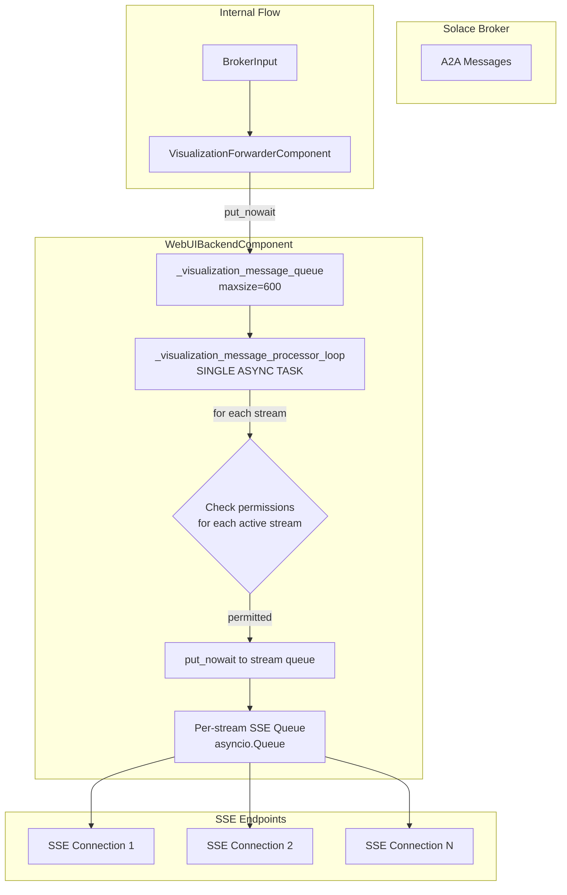
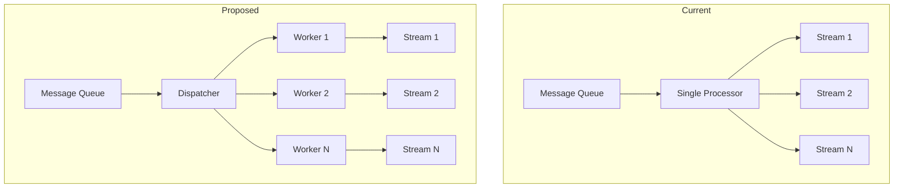
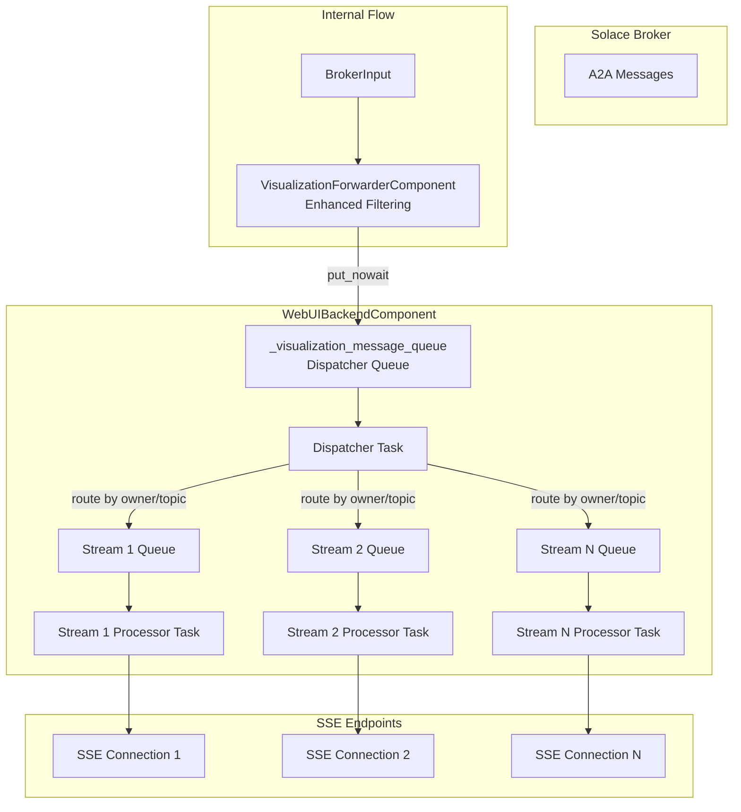

# SSE Queue Full Issue - Architecture Analysis and Fix Plan

## Problem Statement

The WebUI backend is experiencing SSE queue overflow, causing visualization messages to be dropped:
```
[VizMsgProcessor] SSE queue full for stream viz-stream-xxx. Visualization message dropped.
```

This occurs at [`component.py:921`](../src/solace_agent_mesh/gateway/http_sse/component.py:921) when the per-stream SSE queue reaches capacity.

## Current Architecture



## Bottleneck Analysis

### 1. Single-Threaded Consumer
The [`_visualization_message_processor_loop`](../src/solace_agent_mesh/gateway/http_sse/component.py:730) is a **single async task** that:
- Reads from `_visualization_message_queue` one message at a time
- For EACH message, iterates through ALL active visualization streams
- Checks permissions for each stream
- Puts message on each permitted streams queue

**Complexity**: O(messages × streams × permission_checks)

### 2. Lock Contention
At line 817, the processor acquires `_get_visualization_lock()` for the entire stream iteration:
```python
async with self._get_visualization_lock():
    for stream_id, stream_config in self._active_visualization_streams.items():
        # ... process each stream
```

This lock is also used by:
- `_add_visualization_subscription` - when new SSE connections are established
- `_remove_visualization_subscription` - when SSE connections close

### 3. Queue Overflow Points

**Point 1**: VisualizationForwarderComponent → _visualization_message_queue
- When forwarder puts faster than processor consumes
- Current size: 600 messages

**Point 2**: Processor → Per-stream SSE Queue  
- When processor puts faster than SSE endpoint consumes
- This is where the current error occurs

## Root Cause

The single-threaded processor cannot keep up with message throughput when:
1. Many concurrent users have active visualization streams
2. High message volume from agents
3. SSE clients are slow to consume or disconnected but not cleaned up

## Proposed Solutions

### Option A: Parallel Stream Processing - RECOMMENDED

Replace single processor with worker pool that processes streams in parallel:



**Implementation**:
1. Create per-stream message queues instead of single global queue
2. Dispatcher routes messages to appropriate stream queues based on topic/owner
3. Each stream has its own async task consuming from its queue

**Pros**:
- Scales with number of streams
- No lock contention between streams
- Slow streams dont block fast streams

**Cons**:
- More complex implementation
- Memory overhead for per-stream queues

### Option B: Batch Processing

Process messages in batches instead of one at a time:

```python
async def _visualization_message_processor_loop(self):
    while not self.stop_signal.is_set():
        # Collect batch of messages
        batch = []
        while len(batch) < BATCH_SIZE:
            try:
                msg = await asyncio.wait_for(queue.get(), timeout=0.1)
                batch.append(msg)
            except asyncio.TimeoutError:
                break
        
        if batch:
            # Process entire batch under single lock acquisition
            async with self._get_visualization_lock():
                for msg in batch:
                    self._process_message(msg)
```

**Pros**:
- Simpler change
- Reduces lock acquisition overhead

**Cons**:
- Still single-threaded
- Doesnt solve fundamental scaling issue

### Option C: Increase Queue Sizes - QUICK FIX

Increase queue sizes to handle burst traffic:

```yaml
visualization_queue_size: 2000  # was 600
task_logger_queue_size: 2000   # was 600
```

**Pros**:
- Zero code changes
- Immediate relief

**Cons**:
- Doesnt solve root cause
- Just delays the problem
- Higher memory usage

### Option D: Backpressure to Broker

Instead of dropping messages, apply backpressure to the Solace broker:

```python
# In VisualizationForwarderComponent
def invoke(self, message, data):
    try:
        self.target_queue.put(forward_data, timeout=5.0)  # Block with timeout
        message.call_acknowledgements()
    except queue.Full:
        message.call_negative_acknowledgements()  # NACK to broker
        # Broker will redeliver later
```

**Pros**:
- No message loss
- Broker handles buffering

**Cons**:
- May cause broker queue buildup
- Increases latency

## Recommended Approach

### Phase 1: Quick Wins - Immediate
1. **Increase queue sizes** to 2000 via config
2. **Add metrics** for queue depth monitoring
3. **Improve filtering** in VisualizationForwarderComponent to drop more noise

### Phase 2: Parallel Processing - Short Term
1. Implement per-stream queues with dedicated async tasks
2. Remove global lock from message processing
3. Add stream-level backpressure

### Phase 3: Architecture Improvements - Long Term
1. Consider moving visualization to separate microservice
2. Implement WebSocket instead of SSE for bidirectional flow control
3. Add Redis/message queue for horizontal scaling

## Implementation Plan for Phase 2

### Files to Modify

1. **[`component.py`](../src/solace_agent_mesh/gateway/http_sse/component.py)**
   - Add `_stream_message_queues: Dict[str, asyncio.Queue]`
   - Add `_stream_processor_tasks: Dict[str, asyncio.Task]`
   - Modify `_visualization_message_processor_loop` to dispatch to stream queues
   - Add `_stream_processor_loop(stream_id)` for per-stream processing
   - Update `_add_visualization_subscription` to create stream queue/task
   - Update `_remove_visualization_subscription` to cleanup stream queue/task

2. **[`visualization_forwarder_component.py`](../src/solace_agent_mesh/gateway/http_sse/components/visualization_forwarder_component.py)**
   - Add more aggressive filtering for high-volume message types
   - Add metrics for dropped messages

### New Architecture



## Metrics to Add

1. `visualization_queue_depth` - Current size of main queue
2. `visualization_queue_drops` - Messages dropped due to full queue
3. `stream_queue_depth` - Per-stream queue sizes
4. `stream_processing_latency` - Time from queue entry to SSE send
5. `active_visualization_streams` - Number of active streams

## Testing Plan

1. Load test with 50+ concurrent visualization streams
2. Simulate slow SSE consumers
3. Verify no message loss under normal load
4. Verify graceful degradation under overload
5. Memory usage profiling with many streams
