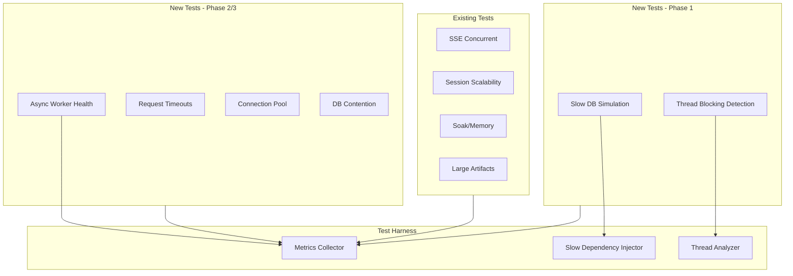
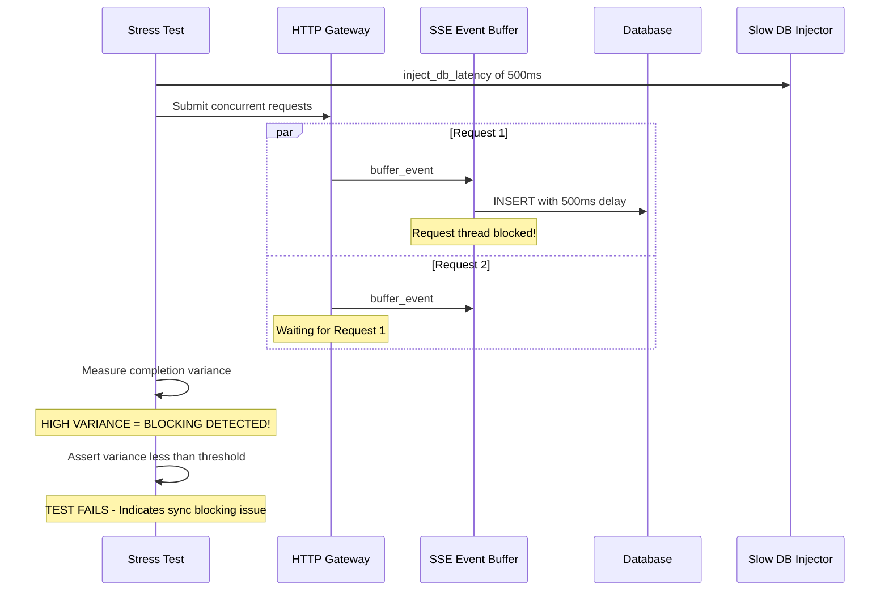

# Comprehensive Stress Testing Strategy

## Executive Summary

This document outlines a strategy to improve our stress testing to catch production issues (like the recent 504 timeout caused by synchronous database writes) before they reach production.

## Root Cause Analysis: What We Missed

The 504 Gateway Timeout incident was caused by:
1. **Synchronous database writes** in `PersistentSSEEventBuffer.buffer_event()` blocking the SSE request thread
2. **PostgreSQL row-level locks** causing write contention under concurrent load
3. **No detection** that request threads were being blocked by background operations

**Key Insight:** Our existing stress tests focus on throughput and latency but don't detect when operations that SHOULD be fast are being blocked by slow dependencies.

## Current Stress Test Coverage Analysis

### Existing Coverage (tests/stress/)

| Test File | Coverage | Gap |
|-----------|----------|-----|
| `test_sse_concurrent.py` | Concurrent SSE connections | Doesn't simulate slow DB |
| `test_session_scalability.py` | Session/DB load | Doesn't inject DB latency |
| `test_large_artifacts.py` | Artifact operations | Missing DB contention |
| `test_soak.py` | Memory leaks, long-running | No blocking detection |
| `test_webui_a2a_isolation.py` | WebUI vs A2A isolation | Doesn't test DB contention |

### Critical Gaps Identified

1. **No slow dependency simulation** - Tests assume database/external services respond quickly
2. **No thread blocking detection** - Can't detect when request threads are blocked
3. **No connection pool exhaustion testing** - Don't test behavior when DB pool is full
4. **No timeout validation** - Don't verify requests complete within expected timeframes
5. **No async worker health monitoring** - Don't verify background workers are healthy

## Proposed New Test Scenarios

### 1. Slow Database Simulation Tests (`test_slow_db_simulation.py`)

**Purpose:** Detect when synchronous operations block request threads due to slow database

```
scenarios/
└── test_slow_db_simulation.py
    ├── test_request_latency_with_slow_db_writes
    ├── test_sse_events_delivered_during_slow_db
    ├── test_request_threads_not_blocked_by_db_writes
    └── test_db_connection_pool_under_load
```

**Key Metrics:**
- Request thread utilization during slow DB
- SSE event delivery latency independent of DB write latency
- Request completion rate with injected DB latency

**Implementation Approach:**
```python
# Inject artificial latency into DB operations
class SlowDBContextManager:
    def __init__(self, latency_ms: float):
        self.latency_ms = latency_ms
    
    def mock_commit(self, original_commit):
        def slow_commit(*args, **kwargs):
            time.sleep(self.latency_ms / 1000)
            return original_commit(*args, **kwargs)
        return slow_commit
```

**Would Have Caught the 504:** YES - This test would show that request latency increases proportionally to DB write latency, indicating synchronous blocking.

---

### 2. Thread Blocking Detection Tests (`test_thread_blocking.py`)

**Purpose:** Verify that request-handling threads are not blocked by background operations

```
scenarios/
└── test_thread_blocking.py
    ├── test_request_thread_not_blocked_by_event_buffer
    ├── test_concurrent_requests_complete_independently
    ├── test_thread_dump_shows_no_blocked_request_threads
    └── test_request_completion_time_variance
```

**Key Metrics:**
- Thread state distribution (RUNNING vs BLOCKED)
- Request completion time variance (should be low if not blocked)
- Thread dump analysis for blocked patterns

**Implementation Approach:**
```python
async def test_request_thread_not_blocked(test_gateway, metrics):
    """
    Submit concurrent requests and verify completion times are independent.
    If request threads are blocked, completion times will show high variance.
    """
    # Submit N concurrent requests
    tasks = [submit_request() for _ in range(50)]
    results = await asyncio.gather(*tasks)
    
    # Calculate completion time variance
    times = [r.completion_time for r in results]
    variance = statistics.variance(times)
    
    # Low variance means independent completion
    # High variance indicates thread blocking
    assert variance < threshold, "Request threads may be blocked"
```

**Would Have Caught the 504:** YES - This test would detect that some requests take much longer than others due to DB write blocking.

---

### 3. Connection Pool Exhaustion Tests (`test_connection_pool.py`)

**Purpose:** Test behavior when database connection pool is exhausted

```
scenarios/
└── test_connection_pool.py
    ├── test_graceful_handling_of_pool_exhaustion
    ├── test_request_queueing_when_pool_full
    ├── test_timeout_when_waiting_for_connection
    └── test_pool_recovery_after_exhaustion
```

**Key Metrics:**
- Connection pool utilization
- Request queue depth
- Wait time for connections
- Recovery time after exhaustion

**Implementation Approach:**
```python
async def test_pool_exhaustion(gateway, db_engine):
    """
    Exhaust connection pool and verify requests are handled gracefully.
    """
    pool = db_engine.pool
    
    # Hold all connections
    connections = []
    for _ in range(pool.size() + pool.overflow()):
        connections.append(pool.connect())
    
    # Attempt requests - should fail gracefully or queue
    try:
        response = await submit_request(timeout=5.0)
        # Should either succeed with queuing or fail with clear error
        assert response.status_code in [200, 503]
    finally:
        for conn in connections:
            conn.close()
```

---

### 4. Request Timeout Validation Tests (`test_request_timeouts.py`)

**Purpose:** Ensure all request paths complete within expected timeframes

```
scenarios/
└── test_request_timeouts.py
    ├── test_task_submit_completes_within_timeout
    ├── test_sse_event_delivery_within_timeout
    ├── test_db_operations_have_timeouts
    └── test_external_service_calls_have_timeouts
```

**Key Metrics:**
- P99 completion times vs. gateway timeout (60s)
- Percentage of requests completing within various time buckets
- Operations that exceed expected duration

**Implementation Approach:**
```python
@pytest.mark.parametrize("operation,max_time_ms", [
    ("task_submit", 500),
    ("event_buffer", 100),
    ("db_write", 200),
    ("session_create", 300),
])
async def test_operation_within_timeout(operation, max_time_ms, gateway):
    """Verify operation completes within expected time."""
    start = time.monotonic()
    result = await perform_operation(operation)
    elapsed_ms = (time.monotonic() - start) * 1000
    
    assert elapsed_ms < max_time_ms, (
        f"{operation} took {elapsed_ms:.0f}ms, expected < {max_time_ms}ms"
    )
```

---

### 5. Async Worker Health Tests (`test_async_worker_health.py`)

**Purpose:** Verify background workers (like async write queue) remain healthy under load

```
scenarios/
└── test_async_worker_health.py
    ├── test_async_write_queue_processes_under_load
    ├── test_worker_thread_not_stuck
    ├── test_queue_backpressure_handling
    └── test_worker_recovery_after_error
```

**Key Metrics:**
- Queue depth over time (should not grow unbounded)
- Worker processing rate
- Time from queue to commit
- Worker error rate

**Implementation Approach:**
```python
async def test_async_queue_health(buffer, metrics):
    """
    Verify async write queue processes events without backing up.
    """
    # Submit many events quickly
    for i in range(1000):
        buffer.buffer_event(task_id, event)
        
        # Sample queue stats periodically
        if i % 100 == 0:
            stats = buffer.get_stats()
            metrics.record_gauge("queue_depth", stats["queue_depth"])
    
    # Wait for processing
    await asyncio.sleep(5.0)
    
    # Queue should be nearly empty
    final_stats = buffer.get_stats()
    assert final_stats["queue_depth"] < 100, "Queue not draining"
```

---

### 6. Database Contention Tests (`test_db_contention.py`)

**Purpose:** Test behavior under PostgreSQL row-level lock contention

```
scenarios/
└── test_db_contention.py
    ├── test_concurrent_writes_to_same_row
    ├── test_row_lock_timeout_handling
    ├── test_session_writes_dont_block_each_other
    └── test_event_buffer_writes_isolated
```

**Key Metrics:**
- Lock wait times
- Deadlock occurrence rate
- Write throughput under contention
- Request latency during contention

**Would Have Caught the 504:** PARTIALLY - Would have shown that concurrent writes cause lock contention, but the root cause was synchronous blocking.

---

## Implementation Architecture

### Slow Dependency Injection Framework

Create a reusable framework for injecting slow dependencies:

```python
# tests/stress/harness/slow_dependency.py

class SlowDependencyInjector:
    """
    Inject artificial latency into dependencies to test
    how the system behaves when things are slow.
    """
    
    def __init__(self, metrics_collector):
        self.metrics = metrics_collector
        self.active_injections = {}
    
    def inject_db_latency(self, latency_ms: float, operations: list = None):
        """
        Inject latency into database operations.
        
        Args:
            latency_ms: Latency to add in milliseconds
            operations: List of operations to slow (commit, query, etc.)
        """
        pass
    
    def inject_network_latency(self, latency_ms: float, endpoints: list = None):
        """
        Inject latency into HTTP/network calls.
        """
        pass
    
    def remove_all_injections(self):
        """Clean up all injected latencies."""
        pass
```

### Thread Analysis Utilities

```python
# tests/stress/harness/thread_analyzer.py

class ThreadAnalyzer:
    """
    Analyze thread states to detect blocking issues.
    """
    
    def capture_thread_dump(self) -> dict:
        """Get current thread states."""
        import sys
        import traceback
        
        threads = {}
        for thread_id, frame in sys._current_frames().items():
            threads[thread_id] = {
                "stack": traceback.format_stack(frame),
                "is_blocked": self._is_blocked_pattern(frame),
            }
        return threads
    
    def detect_blocked_patterns(self, thread_dump: dict) -> list:
        """
        Look for patterns indicating thread blocking:
        - Waiting on locks
        - Stuck in database operations
        - Waiting for network I/O
        """
        blocked = []
        for thread_id, info in thread_dump.items():
            if info["is_blocked"]:
                blocked.append(thread_id)
        return blocked
    
    def _is_blocked_pattern(self, frame) -> bool:
        """Check if frame indicates a blocking pattern."""
        stack = "".join(traceback.format_stack(frame))
        blocking_patterns = [
            "sqlalchemy",
            "psycopg2",
            "socket.recv",
            "threading.Lock.acquire",
        ]
        return any(p in stack for p in blocking_patterns)
```

---

## Updated Stress Test Configuration

Add new configuration options for the new test scenarios:

```python
# tests/stress/conftest.py additions

@dataclass
class StressTestConfig:
    # ... existing fields ...
    
    # Slow dependency simulation
    db_latency_injection_ms: float = 0.0  # Default no injection
    network_latency_injection_ms: float = 0.0
    
    # Thread blocking thresholds
    max_request_completion_variance_ms: float = 500.0
    max_blocked_thread_count: int = 0
    
    # Connection pool testing
    min_pool_utilization_before_exhaustion: float = 0.8
    pool_exhaustion_timeout_ms: float = 5000.0
    
    # Async worker health
    max_queue_depth: int = 1000
    max_queue_wait_time_ms: float = 1000.0
    
    # Request timeout validation
    task_submit_timeout_ms: float = 500.0
    event_buffer_timeout_ms: float = 100.0
    db_operation_timeout_ms: float = 200.0
```

---

## CI/CD Integration Plan

### Pipeline Stages

```yaml
# .github/workflows/stress-tests.yml

name: Stress Tests

on:
  pull_request:
    paths:
      - 'src/solace_agent_mesh/gateway/**'
      - 'tests/stress/**'
  schedule:
    - cron: '0 2 * * *'  # Nightly at 2 AM

jobs:
  stress-smoke:
    name: Smoke Stress Tests
    runs-on: ubuntu-latest
    steps:
      - uses: actions/checkout@v4
      - name: Run smoke stress tests
        run: |
          uv run pytest tests/stress/scenarios/ \
            --stress-scale=smoke \
            --stress-report=stress-smoke-report.json \
            -v --timeout=300
      - name: Upload report
        uses: actions/upload-artifact@v4
        with:
          name: stress-smoke-report
          path: stress-smoke-report.json

  stress-full:
    name: Full Stress Tests
    runs-on: ubuntu-latest
    needs: stress-smoke
    if: github.event_name == 'schedule'
    steps:
      - uses: actions/checkout@v4
      - name: Run full stress tests
        run: |
          uv run pytest tests/stress/scenarios/ \
            --stress-scale=medium \
            --stress-report=stress-full-report.json \
            -v --timeout=1800
      - name: Upload report
        uses: actions/upload-artifact@v4
        with:
          name: stress-full-report
          path: stress-full-report.json

  stress-blocking-detection:
    name: Thread Blocking Detection
    runs-on: ubuntu-latest
    steps:
      - uses: actions/checkout@v4
      - name: Run blocking detection tests
        run: |
          uv run pytest tests/stress/scenarios/test_thread_blocking.py \
            tests/stress/scenarios/test_slow_db_simulation.py \
            --stress-scale=small \
            -v --timeout=600
```

---

## Priority Implementation Order

Based on impact and likelihood of catching future issues:

### Phase 1: High Priority (Would Have Caught 504)
1. **test_slow_db_simulation.py** - Inject DB latency, verify request threads not blocked
2. **test_thread_blocking.py** - Detect when request threads are blocked

### Phase 2: Medium Priority (Prevent Related Issues)
3. **test_async_worker_health.py** - Verify async write queue health
4. **test_request_timeouts.py** - Validate all operations complete within timeout

### Phase 3: Comprehensive Coverage
5. **test_connection_pool.py** - Handle pool exhaustion gracefully
6. **test_db_contention.py** - Handle PostgreSQL lock contention

---

## Success Metrics

The stress testing strategy is successful when:

1. **Detection Rate:** New tests would have caught the 504 timeout issue
2. **False Positive Rate:** < 5% flaky test rate on identical code
3. **CI/CD Integration:** Smoke tests run on every PR affecting gateway code
4. **Coverage:** All critical paths have timeout validation
5. **Performance:** Smoke suite completes in < 10 minutes

---

## Appendix: Mermaid Diagrams

### Test Coverage Architecture



### 504 Detection Flow



---

## References

- [Existing Stress Tests](../tests/stress/README.md)
- [504 Timeout Root Cause](./504-timeout-analysis.md) - Synchronous DB writes blocking request threads
- [Async Write Queue Fix](./async-write-queue.md) - PR implementing the fix
